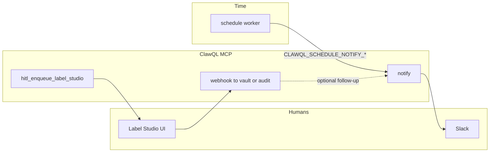

# Schedule and **`notify`** for synthetics and Slack

**`schedule`** persists **time-based jobs** (cron, interval, one-shot) whose v1 action is **`synthetic`** HTTP probes with **assertions** and run history in **SQLite**. **`notify`** posts **human-readable** updates to **Slack** via **`chat.postMessage`**. Used **separately**, each solves a different problem; used **together**, they form the project’s pattern for **“probe in the background, page humans when something breaks (or recovers)”** without bundling a third-party APM. For **Human-in-the-loop (HITL)** review queues, add **`hitl_enqueue_label_studio`** and webhooks, then use **`notify`** to **signal** reviewers in Slack. {{ className: 'lead' }}

**Canonical references:** [schedule-synthetic-checks.md](https://github.com/danielsmithdevelopment/ClawQL/blob/main/docs/mcp/schedule-synthetic-checks.md) · [mcp-tools.md § schedule](https://github.com/danielsmithdevelopment/ClawQL/blob/main/docs/mcp/mcp-tools.md#schedule-optional) · [notify-tool.md](https://github.com/danielsmithdevelopment/ClawQL/blob/main/docs/mcp/notify-tool.md) · [mcp-tools.md § notify](https://github.com/danielsmithdevelopment/ClawQL/blob/main/docs/mcp/mcp-tools.md#notify-optional) · [hitl-label-studio.md](https://github.com/danielsmithdevelopment/ClawQL/blob/main/docs/mcp/hitl-label-studio.md). Site hubs: [Schedule synthetic checks](/schedule), [Slack notify](/notify), [HITL — Label Studio](/hitl-label-studio). **Streams context:** [Streams getting started — hands-on labs](/learn/streams-getting-started#hands-on-labs). Skills: [clawql-schedule-workflows](https://docs.clawql.com/.well-known/agent-skills/clawql-schedule-workflows/SKILL.md), [clawql-notify-workflows](https://docs.clawql.com/.well-known/agent-skills/clawql-notify-workflows/SKILL.md).

## What schedule and notify are

| Tool           | Role                                                                                                                                                                                                                                                                                                                                                                         |
| -------------- | ---------------------------------------------------------------------------------------------------------------------------------------------------------------------------------------------------------------------------------------------------------------------------------------------------------------------------------------------------------------------------- |
| **`schedule`** | **`operation`**: **`create` \| `list` \| `get` \| `delete` \| `trigger`**. Persists **frequency** + **`action.kind: "synthetic"`** + **`synthetic_test`** (HTTP request, limits, assertions). A **background worker** (default poll **`CLAWQL_SCHEDULE_POLL_MS`**, 5000 ms) runs due jobs automatically ([#76](https://github.com/danielsmithdevelopment/ClawQL/issues/76)). |
| **`notify`**   | Thin **`execute`** wrapper for Slack **`chat_postMessage`** — **`channel`**, **`text`**, optional **`thread_ts`**, Block Kit **`blocks`** as JSON string, etc. Fails fast if Slack auth is missing; maps Slack **`ok: false`** to a structured tool **`error`** ([#77](https://github.com/danielsmithdevelopment/ClawQL/issues/77)).                                         |

Both are **default off — opt in** (feature tier diagram in [configuration](https://github.com/danielsmithdevelopment/ClawQL/blob/main/docs/readme/configuration.md#feature-tiers-architecture-diagram)): **`CLAWQL_ENABLE_SCHEDULE=1`**, **`CLAWQL_ENABLE_NOTIFY=1`**, plus their respective prerequisites (**Slack** in the merged spec for **`notify`**).

## Using schedule alone

- **Create** jobs with **`operation: "create"`**, **`schedule.frequency`**, and **`action`** (see [Schedule](/schedule) for interval / cron / one-shot JSON).
- **Validate** with **`operation: "trigger"`**, **`job_id`**, **`dry_run: true`** — runs assertion logic **without** persisting a live run row (same as [clawql-schedule-workflows](https://docs.clawql.com/.well-known/agent-skills/clawql-schedule-workflows/SKILL.md)).
- **Inspect** with **`list`** / **`get`** and **`include_runs`** to read **pass/fail**, latency, **`http_status`**, **`error_text`**, **`response_excerpt`**.
- **Safety:** **`CLAWQL_SCHEDULE_URL_ALLOWLIST_PREFIXES`**, localhost/private blocking unless allowlisted, caps under **`CLAWQL_SCHEDULE_SYNTHETIC_*`** ([schedule-synthetic-checks.md § Safety](https://github.com/danielsmithdevelopment/ClawQL/blob/main/docs/mcp/schedule-synthetic-checks.md#safety-required-for-any-url-based-probe)).

You can operate **entirely inside SQLite + MCP** (or Grafana dashboards elsewhere) with **no** Slack — useful in air-gapped or chat-less environments.

## Using notify alone

Use **`notify`** whenever a **human channel** should see **milestones** that are **not** tied to the schedule worker: deploy finished, batch import complete, “needs approval” pings, thread updates on a long-running investigation ([Slack notify](/notify), [notify-tool.md](https://github.com/danielsmithdevelopment/ClawQL/blob/main/docs/mcp/notify-tool.md)).

Patterns from [clawql-notify-workflows](https://docs.clawql.com/.well-known/agent-skills/clawql-notify-workflows/SKILL.md):

- One **Slack thread** per workflow run (**`thread_ts`**) so replies stay grouped.
- **`text`** carries **status**, **owner**, **next action**, and **links** (Onyx, Paperless, GitHub, internal wiki).
- Pair with **`audit`** / **`memory_ingest`** for durable traceability.

**`notify`** does **not** require **`schedule`** — any agent step can call it after **`execute`**, **`knowledge_search_onyx`**, or vault writes.

## Built-in schedule to Slack notifications

When **`CLAWQL_ENABLE_NOTIFY=1`** and Slack auth is configured, the **schedule worker** can call the same internal path as **`notify`** **after** a synthetic run:

| Env                                        | Effect                                                                                                     |
| ------------------------------------------ | ---------------------------------------------------------------------------------------------------------- |
| **`CLAWQL_SCHEDULE_NOTIFY_CHANNEL`**       | Target **`channel`** (ID like **`C…`** or **`#name`**). If unset, no automatic Slack posts.                |
| **`CLAWQL_SCHEDULE_NOTIFY_ON_FAILURE=1`**  | Post on **`fail`** runs (assertion or HTTP failure).                                                       |
| **`CLAWQL_SCHEDULE_NOTIFY_ON_RECOVERY=1`** | Post **only** when the **latest** run is **`pass`** and the **previous** was **`fail`** (recovery signal). |

The message body is a compact summary (**job name**, **`job_id`**, **`http_status`**, **`latency_ms`**, **`error_text`**). Failures in Slack delivery are **swallowed** so the schedule loop never breaks ([`src/clawql-schedule.ts`](https://github.com/danielsmithdevelopment/ClawQL/blob/main/src/clawql-schedule.ts) **`maybeSendScheduleNotification`**).

This is **best-effort automation** — not a replacement for paging policies — but it is the **simplest end-to-end** “synthetic → human” path with **no** extra cron scripts.

## Agent-orchestrated schedule plus notify

Agents often combine tools explicitly:

1. **`schedule` `create`** — register the recurring probe.
2. **`schedule` `trigger` `dry_run: true`** — prove URL + assertions before leaving it enabled.
3. **`notify`** — richer message than the built-in template (e.g. **@oncall**, runbook links, **Block Kit**).
4. **`memory_ingest`** — snapshot job id, channel, and operator decisions.

The **built-in** env bridge (previous section) covers **machine-generated** failure/recovery lines; **agent-authored** **`notify`** adds **context** and **routing** (threads, mentions, formatted blocks) the worker does not know about.

## Human-in-the-loop with Label Studio and Slack

**HITL** here means **humans approve or correct** model outputs (or extracted fields) before downstream systems trust them.

1. **`hitl_enqueue_label_studio`** ( **`CLAWQL_ENABLE_HITL_LABEL_STUDIO=1`** ) — push **review tasks** into [Label Studio](https://labelstud.io/) with **`clawql_hitl`** metadata (confidence, correlation id). See [HITL — Label Studio](/hitl-label-studio) and [hitl-label-studio.md](https://github.com/danielsmithdevelopment/ClawQL/blob/main/docs/mcp/hitl-label-studio.md).
2. **`notify`** — post to **`#ml-review`** (or a DM) with **project link**, **task count**, and **deadline** so reviewers know work is waiting (**human notification**).
3. **Label Studio webhook** → **`POST /hitl/label-studio/webhook`** on **`clawql-mcp-http`** — persists outcomes via **`memory_ingest`** (vault) or **`audit`** when the vault is unavailable.
4. **`notify` again** (agent or small automation) — “**Review complete**” with correlation id and summary, optionally in the **same thread** as step 2.

Slack is the **attention layer**; Label Studio is the **work queue**; vault / audit is the **record**.



## Full example env job flow and thread

**1 — Environment (schedule + notify + optional worker Slack bridge)**

```bash
CLAWQL_ENABLE_SCHEDULE=1
CLAWQL_ENABLE_NOTIFY=1
# Slack token vars per notify-tool.md / .env.example
CLAWQL_SCHEDULE_URL_ALLOWLIST_PREFIXES=https://api.example.com,https://status.example.com
CLAWQL_SCHEDULE_NOTIFY_CHANNEL=C0123456789
CLAWQL_SCHEDULE_NOTIFY_ON_FAILURE=1
CLAWQL_SCHEDULE_NOTIFY_ON_RECOVERY=1
```

**2 — Create synthetic job** (`schedule` tool — same shape as [Schedule § interval](https://docs.clawql.com/schedule)):

```json
{
  "operation": "create",
  "schedule": {
    "frequency": {
      "type": "interval",
      "seconds": 300
    }
  },
  "action": {
    "kind": "synthetic",
    "synthetic_test": {
      "name": "api-health",
      "request": {
        "method": "GET",
        "url": "https://api.example.com/health",
        "headers": { "accept": "application/json" },
        "body": null
      },
      "limits": {
        "timeout_ms": 10000,
        "max_response_bytes": 1048576,
        "max_redirects": 3
      },
      "assert": {
        "status_in": [200],
        "latency_ms_max": 2000,
        "body_contains": "\"ok\":true"
      }
    }
  }
}
```

**3 — Dry-run before trusting it**

```json
{
  "operation": "trigger",
  "job_id": "<id from create response>",
  "dry_run": true
}
```

**4 — Rich human message in Slack** (separate from the worker’s compact failure line):

```json
{
  "channel": "C0123456789",
  "thread_ts": "1713898000.000100",
  "text": "*Synthetic `api-health` registered* — job_id `<uuid>`\n• Allowlist: `https://api.example.com`\n• On failure/recovery this channel also receives worker summaries (env bridge).\n• Next: HITL batch queued in Label Studio project `42`."
}
```

Replace **`thread_ts`** with a real parent message timestamp from an earlier **`notify`** post.

## Safety and operations

- **Redact** secrets in **`notify`** text and in stored schedule **`error_text`** / excerpts ([schedule-synthetic-checks.md](https://github.com/danielsmithdevelopment/ClawQL/blob/main/docs/mcp/schedule-synthetic-checks.md#notifications)).
- **Webhook auth:** production **`CLAWQL_HITL_WEBHOOK_TOKEN`** requirements for Label Studio — see [hitl-label-studio.md § 4.3](https://github.com/danielsmithdevelopment/ClawQL/blob/main/docs/mcp/hitl-label-studio.md#43-webhook-authentication).
- **Scope:** v1 **`schedule`** actions are **`synthetic`** only; other kinds (e.g. **`sandbox_exec`**) stay separate and need their own security review ([mcp-tools.md § schedule](https://github.com/danielsmithdevelopment/ClawQL/blob/main/docs/mcp/mcp-tools.md#schedule-optional)).

## Related guides and references

- [Audit tool & observability](/learn/audit-tool-and-observability) — breadcrumbs alongside scheduled and HITL events.
- [Using search and execute](/learn/search-and-execute-mcp) — APIs your synthetics may guard.
- [Onyx enterprise search](/learn/knowledge-search-onyx) — optional evidence before posting conclusions to Slack.
- Issues [#76](https://github.com/danielsmithdevelopment/ClawQL/issues/76), [#77](https://github.com/danielsmithdevelopment/ClawQL/issues/77), [#228](https://github.com/danielsmithdevelopment/ClawQL/issues/228).
