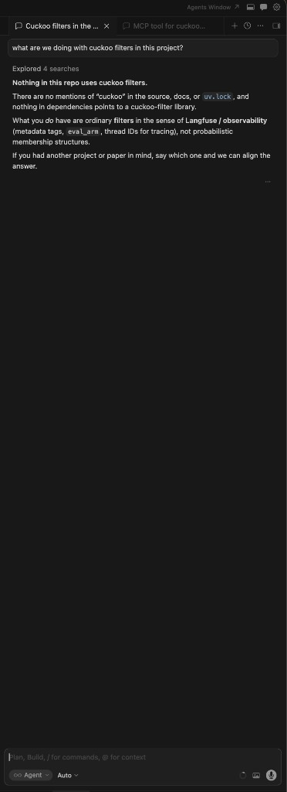
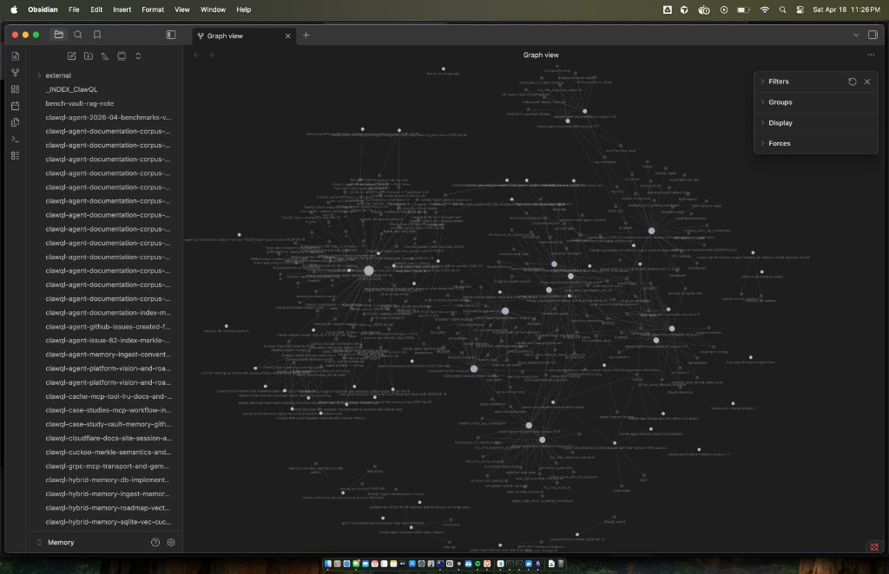
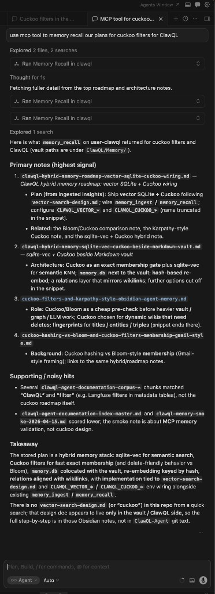
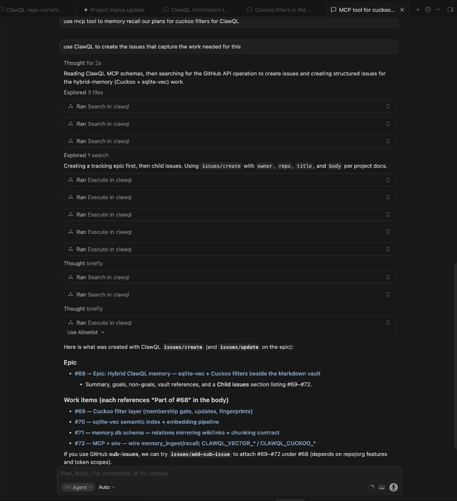

# Case study: cross-thread recall — why the repo is not enough (Cuckoo / hybrid memory)

This case study contrasts **two ways** an assistant can answer a question about **your** plans:

1. **Repository + editor context only** — search **`src/`**, **`docs/`**, lockfiles. If the design never landed in git, the honest answer is “nothing here.”
2. **`memory_recall()` over an Obsidian vault** populated by **`memory_ingest()`** — durable notes, **`[[wikilinks]]`**, indexes, and optional vector / membership sidecars so recall can surface **relevant pages** even when they are **not** in the current thread or repo.

The concrete example: **Cuckoo filters** and **hybrid `memory.db`** work discussed in vault notes **before** equivalent code or docs existed in the tree. A **third** beat in the same workflow: after **`memory_recall`** synthesizes the plan, **`search()`** + **`execute()`** on the **bundled GitHub API** can **file tracking issues** from that context — no manual copy-paste into github.com. Screenshots below are from a real vault and Cursor sessions (**April 2026**).

---

## 1. Problem: conversation context is ephemeral

Assistants are bounded by **context windows** and **session boundaries**. A detailed plan you agreed on last week in **another** chat (or with **another** product) is usually **gone** from the model’s view unless:

- you **paste** it again,
- it lives in **git**, or
- it was **persisted** somewhere the tool chain can **retrieve**.

That is not a failure of the model; it is how the system is wired by default.

---

## 2. Negative control: ask the repo alone

**User question (paraphrased):** “What are we doing with **Cuckoo filters** in this project?”

If the assistant only searches the **current repository** and dependency manifests, it may correctly report: **no** references to “cuckoo,” **no** filter library wired in, **no** design doc checked in yet — and distinguish that from **generic** “filters” used for observability or tracing.

That answer is **accurate for the repo** and **misleading for your intent** if the real plan lives in **vault notes** from earlier conversations.

---

## 3. What a week of `memory_ingest` can look like (Obsidian graph)

If you **`memory_ingest`** summaries of sessions — including chats with **other** assistants — into one **Obsidian vault**, the **graph view** becomes a map of **topics, links, and hubs**. After roughly **one week** of steady ingest, a vault can show **dense clusters** (hybrid memory, gRPC, benchmarks, GitHub issues, case studies) without you hand-maintaining every edge.

Typical filenames in such a vault (examples) include roadmap notes, **`_INDEX_*`** provider hubs, and cross-linked architecture pages — the graph is not decorative; it reflects **`[[wikilinks]]`** and backlink structure Obsidian (and ClawQL recall) can traverse.

---

## 4. Positive control: `memory_recall()` surfaces vault-only plans

**Same question**, but the assistant is instructed to use **ClawQL MCP** **`memory_recall`** (and optionally a second pass with a **narrower query** after seeing titles).

The tool returns **ranked** notes from **`CLAWQL_OBSIDIAN_VAULT_PATH`**, optionally using **graph depth** (`maxDepth`) so linked notes participate, not only raw keyword hits. For Cuckoo-related work, recall may surface notes such as:

- hybrid **`sqlite-vec`** + **Cuckoo** wiring beside the Markdown vault,
- **Merkle** / membership semantics,
- env toggles like **`CLAWQL_CUCKOO_*`** / **`CLAWQL_MERKLE_*`** as **planned or in-flight** configuration,
- comparisons (Bloom vs Cuckoo, “Karpathy-style” agent memory sketches).

The assistant can then **synthesize** an answer that matches **your** roadmap language — even when that roadmap is **not** yet represented as files in **`main`**.

---

## 5. Follow-up: `search` + `execute` to create GitHub issues

**Same session**, new user request (paraphrased): _“Use ClawQL to create the issues that capture the work for this.”_

Once **`memory_recall`** has returned vault roadmaps, the assistant holds a **synthesized** description of the hybrid-memory effort — Cuckoo membership layer, **sqlite-vec** / embeddings, **`memory.db`** schema, MCP env wiring (**`CLAWQL_VECTOR_*`**, **`CLAWQL_CUCKOO_*`**), etc. The next step is **not** another vault tool: it is the **core** ClawQL surface against **OpenAPI-backed** providers:

1. **`search`** — find the GitHub REST operation ids (e.g. issue create / update) and required path/body fields.
2. **`execute`** — call those operations with a valid **`CLAWQL_GITHUB_TOKEN`** (or PAT) on the MCP process.

In practice the assistant created an **epic** first, then **child issues**, then updated the epic body to link children — mirroring what you would click through in the UI, but **driven by the recalled plan**.

Example outcome in this repository (Apr 2026): epic **[#68](https://github.com/danielsmithdevelopment/ClawQL/issues/68)** and work items **[#69](https://github.com/danielsmithdevelopment/ClawQL/issues/69)**–**[72](https://github.com/danielsmithdevelopment/ClawQL/issues/72)**. Numbers may change in other forks; the **pattern** is **recall → synthesize → `search` / `execute`**.

---

## 6. Vault graph: ingest, wikilinks, and recall

| Mechanism                    | Role                                                                                                                                                                                                |
| ---------------------------- | --------------------------------------------------------------------------------------------------------------------------------------------------------------------------------------------------- |
| **`memory_ingest`**          | Writes Markdown under the vault; supports **structured `insights`**, optional **`conversation`** capture, **`toolOutputs`**, and **`wikilinks`** so new notes **link** to related pages.            |
| **Frontmatter + provenance** | Ingest sections can carry provenance metadata so you know **what** was captured and **when**.                                                                                                       |
| **`[[wikilinks]]`**          | Becomes Obsidian’s graph; **`memory_recall`** can use **link hops** (`maxDepth`) so recall is not “single-file grep.”                                                                               |
| **Tags in prose**            | You can ask for **consistent tagging** in `insights` (see project skill for vault memory) so later **`query`** terms hit the right theme clusters.                                                  |
| **Optional sidecars**        | With hybrid memory enabled, **vector** stores and **Cuckoo**-style membership checks can **narrow** candidate chunks before the model sees them — “relevant pages and chunks,” not the whole vault. |

Important: treat **`cache()`** as **ephemeral** session scratch; treat **`memory_ingest`** as **durable** narrative you want **recall** to find next month.

---

## 7. Session workflows: pause, summarize, resume

A practical loop:

1. **While working:** use the repo and tests as usual.
2. **Before you context-switch:** run **`memory_ingest`** with a **stable title** (append-friendly) summarizing decisions, open questions, and links to issues or PRs.
3. **When you return (any thread):** run **`memory_recall`** with a **concrete query** (e.g. “Cuckoo filter hybrid memory sqlite vec”) and tune **`limit`** / **`maxDepth`**.
4. **Merge:** the assistant combines **recalled** vault text with **current** repo state (`git`, new PRs) and avoids contradicting either.
5. **Optional — file the work:** with **`CLAWQL_GITHUB_TOKEN`** on the MCP process, use **`search`** / **`execute`** so the synthesized plan becomes GitHub issues (epic + children), as in §5.

That is how you recover **cross-thread** intent without pasting megabytes of old chat.

---

## 8. Token and relevance

Blindly dumping the whole vault would be expensive and noisy. ClawQL’s recall path is designed to return **topically relevant** material (and graph-neighbor context when configured), so the **assistant** receives **enough** of the right pages — not **every** note you ever wrote.

For rough sizing, the repo’s benchmark notes often use **`ceil(bytes / 4)`** token estimates; the win here is **precision of context**, not raw token count.

---

## 9. Reproduction checklist

1. Install ClawQL MCP and set **`CLAWQL_OBSIDIAN_VAULT_PATH`** to an Obsidian vault (see [`memory-obsidian.md`](../memory-obsidian.md)).
2. Ingest at least one roadmap note (via chat or automation) that **only** exists in the vault — e.g. a design not yet in git.
3. In a **fresh** chat with **no** pasted history, ask a question that **only** that note answers.
4. Compare **repo-only** search vs **`memory_recall`** — you should see the same pattern as this case study.
5. (Optional) With **`CLAWQL_GITHUB_TOKEN`** set on the MCP process, ask the assistant to **`search`** / **`execute`** GitHub issue operations so the recalled plan becomes **tracked work** on the repo.

---

## 10. References

- [`docs/mcp-tools.md`](../mcp-tools.md) — **`memory_ingest`**, **`memory_recall`**, **`cache`**
- [`docs/memory-obsidian.md`](../memory-obsidian.md) — vault layout, hybrid DB
- [`docs/cursor-vault-memory.md`](../cursor-vault-memory.md) — Cursor + vault workflow
- [`docs/case_studies/README.md`](README.md) — other case studies

**Website (readable layout with figures):** **`/case-studies/cross-thread-vault-recall`** on [docs.clawql.com](https://docs.clawql.com).
