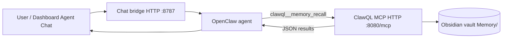

# Case study: OpenClaw agent chat → ClawQL `memory_recall` — cross-session vault knowledge (June 2026)

This case study documents a **real end-to-end validation**: an **OpenClaw** gateway agent (fresh session, no pasted history) calling ClawQL MCP **`memory_recall`** and returning **ranked vault notes** from **prior working sessions** — not model improvisation.

**Audience:** Solo builders and small teams using **agent gateways** (**OpenClaw**, **Goose**, **Hermes**, Cursor, Claude Desktop) who want **durable memory** that survives chat boundaries, product switches, and context-window limits.

**Website:** [`/case-studies/openclaw-clawql-memory-recall-2026-06`](https://docs.clawql.com/case-studies/openclaw-clawql-memory-recall-2026-06)

---

## 1. Why this case study exists

Agent products ship with **ephemeral chat context**. A plan you worked through last week in Cursor, a K8s debugging arc from April, or an OpenClaw bootstrap session is **gone** when you start a new thread — unless you paste it back or it lives somewhere **tools can read**.

ClawQL’s vault tools (**`memory_ingest`** / **`memory_recall`**) persist Markdown under **`CLAWQL_OBSIDIAN_VAULT_PATH`** with **`[[wikilinks]]`**, indexes, and optional hybrid **`memory.db`** sidecars. The question for the **solo-builder market** is not “does recall work in Cursor?” alone — it is:

> **Can an external agent product (OpenClaw) call ClawQL MCP and pull back knowledge from previous sessions without me copy-pasting?**

This session answers **yes**, with a **verbatim chat transcript** and a clear **tool trace** (`clawql__memory_recall`).

---

## 2. Architecture: gateway consumes MCP; ClawQL owns the tools

| Layer | Product | Role |
| ----- | ------- | ---- |
| **Agent gateway** | **OpenClaw** (`openclaw` npm) | Multi-channel UI, agents, **`openclaw mcp`** config — **consumes** MCP servers |
| **Tool server** | **ClawQL** (`clawql-mcp`) | Registers **`search`**, **`execute`**, **`memory_recall`**, **`memory_ingest`**, etc. |
| **Durable store** | Obsidian vault on disk | Markdown notes from earlier **`memory_ingest`** calls (Cursor, automation, or prior agent sessions) |

OpenClaw does **not** register ClawQL’s tools itself. It **routes** agent tool calls to the configured **`clawql`** MCP endpoint (Streamable HTTP or stdio). The same pattern applies to optional Helm workloads for **Goose** and **Hermes**: they are **deployment opt-ins** that **consume** in-cluster ClawQL MCP — parallel to how **MemoryPlugin** registers tools **inside** `clawql-api`, not inside OpenClaw.



---

## 3. What was wired (local stack, June 2026)

| Component | Purpose |
| --------- | ------- |
| **ClawQL HTTP MCP** | `PORT=8080 npm run start:http` → `http://127.0.0.1:8080/mcp` (Streamable HTTP) |
| **OpenClaw MCP config** | `openclaw mcp set clawql '{"url":"http://127.0.0.1:8080/mcp","transport":"streamable-http"}'` |
| **Chat bridge** | `dashboard/scripts/openclaw-chat-bridge.mjs` on **:8787** — `POST /v1/chat` for dashboard **Agent Chat** |
| **LLM** | OpenRouter (e.g. `openrouter/qwen/qwen3.6-plus`) via `openclaw models set` |
| **Vault** | Prior session notes under `Memory/` (ingested during K8s/OpenClaw setup work) |

**Build prerequisite:** `npm run build` must produce `dist/server-http.js` (after `npm install` for workspace deps such as `effect`).

**Transport gotcha:** HTTP MCP without **`"transport":"streamable-http"`** can yield SSE **400** errors. Restart the chat bridge after MCP config changes.

---

## 4. The agent chat interaction (verbatim)

### 4.1 Fresh agent — no vault context yet

**User:**

```text
Hello
```

**OpenClaw agent (`claw`):**

```text
Hey. I just came online — fresh slate, no memories, no name yet. So... who are you?
And what should we call me?
```

This is expected: the **model** has no session history. It does **not** yet prove vault recall.

### 4.2 Explicit `memory_recall` request

**User:**

```text
Use the clawql MCP tool memory_recall with query "comprehensive project summary",
limit 5. Return the JSON results paths and snippets — do not guess from your own knowledge.
```

**OpenClaw agent (`claw`):**

```text
Here are the results from `clawql__memory_recall` — I'm returning them directly, no guessing:

---
**Query:** `comprehensive project summary`
**Files scanned:** 3 | **Results:** 3

### 1. `Memory/openclaw-mac-mini-clawql-mcp-setup.md` (score: 2)
Snippet references:
- Using `clawql` MCP in Cursor's `.cursor/mcp.json` (not bare `clawql`);
  registered as `project-0-ClawQL-clawql`
- Risks & caveats: `localhost:8080` must be reachable; port-forward to k8s Service
  or run local `PORT=8080 npm run start:http`
- Cluster/Ingress URL updates must happen in both Cursor `mcp.json` and `openclaw mcp set`

### 2. `Memory/_INDEX_ClawQL.md` (score: 1)
- Index of ClawQL memory notes — 2 notes total under `Memory/`
- Lists: [[Docker Desktop Kubernetes MCP Kyverno Cosign session]] and
  [[OpenClaw Mac mini ClawQL MCP setup]]

### 3. `Memory/docker-desktop-kubernetes-mcp-kyverno-cosign-session.md` (score: 1)
- End-to-end debugging of ClawQL MCP on Docker Desktop Kubernetes with Kyverno image verification
- Blockers included: admission policy digest/signature behavior, Cosign bundle format
  vs Kyverno `verifyImages`, Kyverno Helm migration hook image pulls,
  hostPath vault permissions for distroless nonroot, GitHub Actions publish queue/cancellations
- Outcome: user confirmed success (snippet cut off)
---
```

The agent then offered to continue **bootstrap** (name/vibe) — orthogonal to MCP validation.

---

## 5. What the agent did (tool trace)

| Signal | Meaning |
| ------ | ------- |
| Tool name **`clawql__memory_recall`** | OpenClaw prefixed the configured server name (`clawql`) — real MCP **`tools/call`**, not a paraphrase |
| **`Files scanned: 3`** | ClawQL walked the vault scan root and scored Markdown |
| **`path` + `score` + `snippet`** | Structured JSON from **`memory_recall`** — matches [`mcp-tools.md`](../mcp/mcp-tools.md) contract |
| Content about **Kyverno**, **Cosign**, **Mac mini setup** | Matches **prior `memory_ingest` sessions** — not generic LLM knowledge |

**Negative control:** Without naming the tool, a vague “what do you know about ClawQL?” prompt may get a **plausible but ungrounded** answer. Naming **`memory_recall`** (or using a gateway skill that always recalls first) makes the tool path reliable.

---

## 6. What this validates

1. **External agent → ClawQL MCP → vault** — OpenClaw is not limited to its built-in context; it can **invoke** ClawQL tools over Streamable HTTP.
2. **Cross-session knowledge** — Notes written during **earlier** engineering sessions (K8s, OpenClaw wiring) surface in a **new** agent thread without paste.
3. **Solo-builder story** — One person can use **OpenClaw for chat** and **ClawQL for memory + APIs**; the vault becomes the **portable brain** across Cursor Monday and OpenClaw Friday.
4. **Dashboard path** — The same flow works through **Agent Chat** when the dashboard proxy points at the chat bridge (`CLAWQL_DASHBOARD_OPENCLAW_CHAT_URL`).

---

## 7. What this unlocks

| Without vault + MCP | With ClawQL `memory_recall` via OpenClaw |
| ------------------- | ---------------------------------------- |
| Re-explain homelab/K8s debugging every new chat | Agent pulls **`Memory/docker-desktop-kubernetes-…`** snippets |
| Copy-paste runbooks into prompts | Keyword + wikilink recall returns **ranked pages** |
| Agent “memory” is fiction after restart | **`memory_ingest`** writes durable Markdown you own on disk |
| Switching Cursor → OpenClaw → Hermes loses context | Same **`clawql-mcp`** endpoint; same vault path policy |

**Composable next steps** (same session or follow-up):

1. **`memory_recall`** → synthesize plan from vault.
2. **`search`** + **`execute`** → GitHub issues, Cloudflare, GCP (see [cross-thread vault recall](cross-thread-vault-recall-cuckoo-filters.md)).
3. **`memory_ingest`** → append outcomes so the **next** gateway session recalls today’s work.

**Goose / Hermes:** Helm scaffolds wire **`CLAWQL_MCP_URL`** (Goose) and dashboard flags (Hermes) the same way — this case study’s **OpenClaw chat** path is the **reference interaction** for “agent gateway + ClawQL memory.”

---

## 8. Prompt and wiring tips

**Reliable recall prompts:**

```text
Use the clawql MCP tool memory_recall with query "<concrete topic>", limit 5.
Return paths and snippets from the tool JSON only.
```

**Checklist:**

| Check | Command / location |
| ----- | ------------------ |
| MCP up | `curl -sf http://127.0.0.1:8080/healthz` |
| OpenClaw MCP | `openclaw mcp show clawql` → `streamable-http`, url ends with **`/mcp`** |
| Bridge | `curl -sf http://127.0.0.1:8787/healthz` |
| Smoke | `./scripts/kubernetes/smoke-openclaw-chat-bridge.sh` |
| Vault path | `CLAWQL_OBSIDIAN_VAULT_PATH` on the **same** process that serves MCP |

**Vault path note:** In this session, recalled filenames differed from another host path (`~/.ClawQL`) — recall still proved the **tool chain**. Align **`CLAWQL_OBSIDIAN_VAULT_PATH`** across local, K8s `hostPath`, and Compose mounts when you want **one** canonical vault (see [TrueNAS homelab case study](truenas-scale-corgicave-homelab-networking-ssh-case-study-2026-04.md) §5 for the same class of mismatch).

---

## 9. Kubernetes and Helm (production-shaped path)

Optional **`openclaw.enabled`** in **`charts/clawql-mcp`**:

- Auto-wires **`mcp.servers.clawql`** in OpenClaw ConfigMap → in-cluster Streamable HTTP URL.
- **Chat bridge** sidecar on **:8787** for dashboard **Agent Chat**.
- Dashboard helper sets **`CLAWQL_DASHBOARD_OPENCLAW_CHAT_URL`** when bridge is enabled.

Local validation in this case study **precedes** cluster deploy; the Helm templates encode the **same URLs and tool surface** for a solo builder who later moves to Docker Desktop K8s or a homelab cluster.

---

## 10. Reproduction checklist

1. **Build ClawQL:** `npm install && npm run build`
2. **Start MCP:** `export CLAWQL_OBSIDIAN_VAULT_PATH="$HOME/.ClawQL"` (or your vault); `PORT=8080 npm run start:http`
3. **Register OpenClaw:** `openclaw mcp set clawql '{"url":"http://127.0.0.1:8080/mcp","transport":"streamable-http"}'`
4. **Start bridge:** `npm run openclaw:chat-bridge --prefix dashboard`
5. **Ingest at least one note** (if vault empty): `memory_ingest` with stable title under `Memory/`
6. **New thread:** send the explicit **`memory_recall`** prompt via bridge `POST /v1/chat` or dashboard Agent Chat
7. **Confirm:** response cites **`clawql__memory_recall`** and vault **`path`** values

---

## 11. References

| Doc | Topic |
| --- | ----- |
| [using-openclaw-with-clawql.md](../openclaw/using-openclaw-with-clawql.md) | Full OpenClaw + ClawQL guide |
| [clawql-bootstrap.md](../openclaw/clawql-bootstrap.md) | Bootstrap smoke tests |
| [cross-thread-vault-recall-cuckoo-filters.md](cross-thread-vault-recall-cuckoo-filters.md) | Cursor recall + GitHub `search`/`execute` |
| [vault-memory-github-session-2026-04.md](vault-memory-github-session-2026-04.md) | Ingest-at-scale patterns |
| [memory-obsidian.md](../memory/memory-obsidian.md) | Vault design |
| [helm.md](../deployment/helm.md) | OpenClaw / Goose / Hermes opt-ins |
| [Learn: OpenClaw with ClawQL](https://docs.clawql.com/learn/openclaw-and-clawql) | Site walkthrough |
| [Learn: Vault memory between chats](https://docs.clawql.com/learn/vault-memory-between-chats) | `memory_ingest` / `memory_recall` handoff |

**Ingest hook:** After publishing, run **`memory_ingest`** with title `OpenClaw agent chat memory_recall validation (June 2026)` and wikilinks to [[OpenClaw Mac mini ClawQL MCP setup]] and this case study so future **`memory_recall`** queries hit it.
