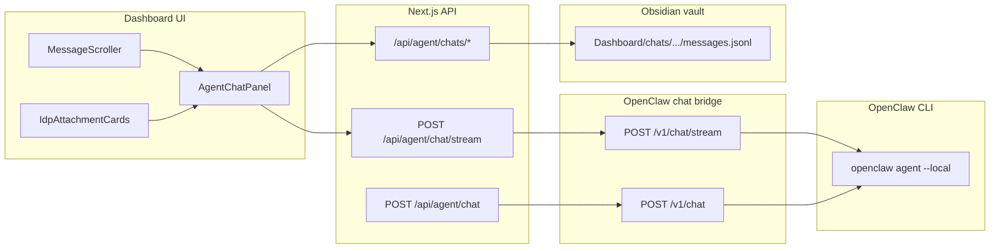

# ClawQL Dashboard — Agent Chat

**Status:** Shipped (June 2026)  
**Audience:** Operators, OpenClaw integrators, and agents that drive the [IDP stack](../vision/clawql-idp-stack.md) from the dashboard UI.

**Related:** [Dashboard README](../../dashboard/README.md) · [OpenClaw + ClawQL](../openclaw/using-openclaw-with-clawql.md) · [OpenClaw IDP skill profile](../openclaw/openclaw-idp-skill-profile.md) · [Design notes (implementation history)](../design/dashboard-shadcn-chat-integration.md)

---

## 1. Role in the platform

The **Agent Chat** panel (`dashboard/` Next.js app, route `/`) is the human-facing control plane for ClawQL IDP workflows. Operators and agents converse in natural language; the dashboard:

1. Persists threads in the **Obsidian vault** (same root as `memory_ingest` / `memory_recall`).
2. Proxies messages to **OpenClaw** via an HTTP **chat bridge** (`openclaw agent --local` per request).
3. Renders **streaming replies** with shadcn/ui **MessageScroller** scroll engineering.
4. Displays **structured IDP artifacts** — Paperless documents, Onyx citations, Coneshare links, pipeline/Merkle badges — when agents return rich JSON.

Agents using ClawQL MCP (`search` / `execute`, Ouroboros, Onyx) should format final responses so the dashboard can show cards, not only plain text.

---

## 2. Architecture



| Hop | Protocol | Notes |
| --- | -------- | ----- |
| Browser → Next.js | SSE (`text/event-stream`) or JSON | Streaming **on** by default (`CLAWQL_DASHBOARD_CHAT_STREAM=1`) |
| Next.js → bridge | HTTP POST JSON | Base URL from `CLAWQL_DASHBOARD_OPENCLAW_CHAT_URL` |
| Bridge → OpenClaw | CLI subprocess | One `openclaw agent` invocation per user message |
| Next.js → vault | File I/O | Debounced client save → `PUT /api/agent/chats/[threadId]` |

**Source files**

| Area | Path |
| ---- | ---- |
| UI container | [`dashboard/src/components/dashboard/AgentChatPanel.tsx`](../../dashboard/src/components/dashboard/AgentChatPanel.tsx) |
| Conversation + scroll | [`dashboard/src/components/agent-chat/AgentConversation.tsx`](../../dashboard/src/components/agent-chat/AgentConversation.tsx) |
| IDP attachment cards | [`dashboard/src/components/agent-chat/IdpAttachmentCards.tsx`](../../dashboard/src/components/agent-chat/IdpAttachmentCards.tsx) |
| Types | [`dashboard/src/components/dashboard/types.ts`](../../dashboard/src/components/dashboard/types.ts) |
| JSON proxy | [`dashboard/src/app/api/agent/chat/route.ts`](../../dashboard/src/app/api/agent/chat/route.ts) |
| SSE proxy | [`dashboard/src/app/api/agent/chat/stream/route.ts`](../../dashboard/src/app/api/agent/chat/stream/route.ts) |
| Vault store | [`dashboard/src/lib/chat-vault-store.server.ts`](../../dashboard/src/lib/chat-vault-store.server.ts) |
| Bridge (local + Helm copy) | [`dashboard/scripts/openclaw-chat-bridge.mjs`](../../dashboard/scripts/openclaw-chat-bridge.mjs) |

---

## 3. UI stack (shadcn conversation primitives)

The chat panel uses [shadcn/ui June 2026 chat components](https://ui.shadcn.com/docs/changelog/2026-06-chat-components):

| Primitive | Purpose |
| --------- | ------- |
| **MessageScroller** | Auto-follow at live edge; respects manual scroll-up; jump-to-latest button |
| **Message** / **Bubble** | User vs agent rows, alignment, avatars |
| **Attachment** | IDP document/citation/share cards |
| **Marker** | Streaming shimmer (“Generating response…”) |

Initialized via `npx shadcn@latest init` in `dashboard/`; headless scroll logic from `@shadcn/react/message-scroller`.

**Theme:** zinc/orange dashboard palette; shadcn `--primary` overridden to orange in `.dark` ([`dashboard/src/styles/tailwind.css`](../../dashboard/src/styles/tailwind.css)).

---

## 4. HTTP API

### 4.1 Send message (JSON)

**`POST /api/agent/chat`**

Request:

```json
{
  "message": "Process Q1 invoices and archive to Paperless",
  "threadId": "thread-1719420000123",
  "threadTitle": "Q1 invoices"
}
```

Response (`200`):

```json
{
  "reply": "Processed 3 invoices. Archived to Paperless.",
  "steps": [{ "label": "execute paperless::documents_create", "state": "done" }],
  "attachments": [
    {
      "kind": "document",
      "id": "doc-1",
      "title": "invoice-q1-001.pdf",
      "provider": "paperless",
      "paperlessId": 42
    }
  ]
}
```

Demo mode (`CLAWQL_DASHBOARD_OPENCLAW_CHAT_URL` unset): `{ "demo": true, "reply": "…" }`.

Errors: `{ "error": "…" }` with 4xx/5xx.

### 4.2 Send message (SSE streaming)

**`POST /api/agent/chat/stream`**

Same JSON body. Response: **`text/event-stream`**.

Events:

| Event | Payload | When |
| ----- | ------- | ---- |
| `delta` | `{ "type": "delta", "text": "<chunk>" }` | Token/chunk of reply text |
| `done` | `{ "type": "done", …AgentChatApiResponse }` | Final structured payload |

Example stream:

```
event: delta
data: {"type":"delta","text":"Processed 3 "}

event: delta
data: {"type":"delta","text":"invoices…"}

event: done
data: {"type":"done","reply":"Processed 3 invoices…","attachments":[…],"steps":[…]}
```

**Disable streaming:** `CLAWQL_DASHBOARD_CHAT_STREAM=0` → route returns `404`; UI falls back to JSON.

**Config probe:** `GET /api/agent/config` → `{ "openclawConfigured": true, "chatStream": true }`.

### 4.3 Thread CRUD

| Method | Path | Purpose |
| ------ | ---- | ------- |
| `GET` | `/api/agent/chats` | List threads + vault status |
| `POST` | `/api/agent/chats` | Create thread |
| `PUT` | `/api/agent/chats` | Import legacy localStorage batch |
| `GET` | `/api/agent/chats/[threadId]` | Load `messages.jsonl` |
| `PUT` | `/api/agent/chats/[threadId]` | Save messages |
| `PATCH` | `/api/agent/chats/[threadId]` | Update title / `updatedAt` |

---

## 5. OpenClaw chat bridge

OpenClaw exposes **`openclaw agent`** (CLI), not HTTP. The bridge adapts dashboard JSON to CLI and back.

| Endpoint | Maps to |
| -------- | ------- |
| `POST /v1/chat` | Full JSON response after CLI completes |
| `POST /v1/chat/stream` | SSE: chunk `reply` text, then `done` with full body |
| `GET /healthz` | Liveness |

Request body (both):

```json
{ "message": "…", "threadId": "thread-…", "threadTitle": "…" }
```

- **`threadId`** → OpenClaw **`--session-id`** (continuity across turns).
- **`threadTitle`** prepended to prompt as `[Thread: …]` context.

**Run locally:**

```bash
cd dashboard && npm run openclaw:chat-bridge
# → http://127.0.0.1:8787/v1/chat
```

**Helm:** bridge runs as OpenClaw sidecar; dashboard gets `CLAWQL_DASHBOARD_OPENCLAW_CHAT_URL` from `dashboard.openclawChatUrl` or auto-wiring (see [`docs/deployment/helm.md`](../deployment/helm.md)).

---

## 6. Vault persistence

Root: **`$CLAWQL_OBSIDIAN_VAULT_PATH`** (default `~/.ClawQL`).

```
Dashboard/
  chats/
    index.json
    threads/
      <storageKey>/           # digits only; UI id = thread-<storageKey>
        meta.json
        messages.jsonl        # one JSON object per line (+ optional "at" timestamp)
        activity.jsonl        # chat_request, chat_response, chat_error
  logs/
    agent-chat.jsonl
```

### 6.1 Message line format

Each line in `messages.jsonl` is a **`ChatMessage`**:

**User:**

```json
{ "kind": "user", "id": "u-1719420001000", "text": "Process these invoices" }
```

**Agent:**

```json
{
  "kind": "agent",
  "id": "a-1719420002000",
  "status": "done",
  "intro": "Processed 3 invoices…",
  "steps": [{ "label": "execute tika::…", "state": "done" }],
  "attachments": [{ "kind": "document", "id": "d1", "title": "inv.pdf", "provider": "paperless", "paperlessId": 42 }],
  "citations": [{ "kind": "onyx_citation", "id": "c1", "title": "Pricing policy", "snippet": "…", "score": 0.91 }],
  "toolCalls": [{ "name": "execute", "args": { "operationId": "paperless::documents_create" }, "resultPreview": "id: 42" }],
  "pipelineStatus": { "workflowId": "ouro-seed-abc", "phases": ["tika", "gotenberg", "stirling", "paperless"] }
}
```

**Backward compatibility:** lines missing new fields load normally; unknown fields on save are preserved in JSON.

---

## 7. Agent response contract (rich IDP UI)

Canonical TypeScript: [`dashboard/src/components/dashboard/types.ts`](../../dashboard/src/components/dashboard/types.ts) (`AgentChatApiResponse`).

### 7.1 Top-level fields

| Field | Type | Required | UI effect |
| ----- | ---- | -------- | --------- |
| `reply` | string | Yes* | Main agent bubble text (*or `error`) |
| `error` | string | No | Shown as agent message on failure |
| `demo` | boolean | No | Triggers demo-mode banner |
| `steps` | `ChatToolStep[]` | No | Tool execution panel |
| `attachments` | `ChatAttachment[]` | No | IDP cards below reply |
| `citations` | `ChatAttachment[]` | No | Same renderer (Onyx-heavy) |
| `toolCalls` | `ChatToolCall[]` | No | Persisted; future UI |
| `pipelineStatus` | `{ workflowId?, phases? }` | No | Phase chips under reply |

### 7.2 `ChatToolStep`

```json
{ "label": "execute stirling::redactPdfAuto", "state": "done" }
```

`state`: `"done"` | `"active"` | `"pending"`.

### 7.3 Attachment kinds

#### `document` — Paperless / Nextcloud

```json
{
  "kind": "document",
  "id": "unique-id",
  "title": "invoice-q1-001.pdf",
  "provider": "paperless",
  "paperlessId": 42,
  "url": "https://paperless.example/documents/42/"
}
```

| Field | Notes |
| ----- | ----- |
| `provider` | `"paperless"` or `"nextcloud"` |
| `paperlessId` | Shown when `url` absent |
| `url` | Optional deep link |

#### `onyx_citation` — Enterprise knowledge

```json
{
  "kind": "onyx_citation",
  "id": "cite-1",
  "title": "FY26 pricing matrix",
  "snippet": "Enterprise tier starts at…",
  "score": 0.87,
  "documentId": "onyx-doc-abc"
}
```

Populate from `knowledge_search_onyx` results or post-Paperless ingest citations ([#130](https://github.com/danielsmithdevelopment/ClawQL/issues/130)).

#### `coneshare` — Secure share / VDR

```json
{
  "kind": "coneshare",
  "id": "share-1",
  "title": "Q1 investor data room",
  "roomUrl": "https://share.example/rooms/abc",
  "linkId": "link-xyz"
}
```

Roadmap: bundled Coneshare provider; agents can emit cards today for custom integrations.

#### `pipeline` — Stage + Merkle audit

```json
{
  "kind": "pipeline",
  "id": "pipe-1",
  "title": "Stirling redaction",
  "stage": "stirling-redact",
  "status": "done",
  "merkleRoot": "a1b2c3…"
}
```

| `status` | Badge color |
| -------- | ----------- |
| `running` | Orange (processing) |
| `done` | Green |
| `failed` | Red |

Emit after Stirling document redaction, Ouroboros phases, or audit tool Merkle roots ([#114](https://github.com/danielsmithdevelopment/ClawQL/issues/114)).

### 7.4 Full example (IDP invoice run)

```json
{
  "reply": "Processed 3 Q1 invoices: redacted PII via Stirling, archived to Paperless (#42–44), indexed in Onyx. Coneshare room ready for external review.",
  "steps": [
    { "label": "execute tika::analyze", "state": "done" },
    { "label": "execute gotenberg::post_forms_libreoffice_convert", "state": "done" },
    { "label": "execute stirling::redactPdfAuto", "state": "done" },
    { "label": "execute paperless::documents_create", "state": "done" },
    { "label": "execute onyx::onyx_ingest_document", "state": "done" }
  ],
  "attachments": [
    {
      "kind": "pipeline",
      "id": "p-redact",
      "stage": "stirling-redact",
      "status": "done",
      "merkleRoot": "e3b0c44298fc1c149afbf4c8996fb92427ae41e4649b934ca495991b7852b855"
    },
    {
      "kind": "document",
      "id": "d-42",
      "title": "invoice-001-redacted.pdf",
      "provider": "paperless",
      "paperlessId": 42
    }
  ],
  "citations": [
    {
      "kind": "onyx_citation",
      "id": "c-pricing",
      "title": "Approved vendor rates 2026",
      "snippet": "Line item must match contract schedule B…",
      "score": 0.93
    }
  ],
  "pipelineStatus": {
    "workflowId": "thread-1719420000123",
    "phases": ["tika", "gotenberg", "stirling", "paperless", "onyx"]
  }
}
```

---

## 8. OpenClaw / agent authoring guide

### 8.1 Structured JSON (shipped)

The chat bridge **automatically enriches** responses after each `openclaw agent --json` run:

1. **Session audit** — reads `meta.agentMeta.sessionFile` (OpenClaw session JSONL), scopes to the **last user turn**, and maps `clawql__*` tool calls → `steps`, `toolCalls`, `attachments`, `citations`, and `pipelineStatus.phases`.
2. **Agent override** — if the assistant reply contains a fenced ` ```json ` block (or bare JSON with `attachments` / `steps`), those fields **override** session-derived values for the same keys.

Disable enrichment with `CLAWQL_DASHBOARD_CHAT_ENRICH=0` on the bridge process.

Implementation: [`dashboard/scripts/openclaw-chat-enrich.mjs`](../../dashboard/scripts/openclaw-chat-enrich.mjs) (Helm chart copy under `charts/clawql-mcp/files/`).

**Mapped tool patterns:**

| ClawQL tool | Dashboard fields |
|-------------|------------------|
| `clawql__execute` with `paperless::*` | `attachments[]` document card, `pipelineStatus.phases` |
| `clawql__execute` with `stirling::*` + Merkle | `attachments[]` pipeline card |
| `clawql__execute` with `onyx::*` | `citations[]` |
| `clawql__execute` with `nextcloud::*` | `attachments[]` document card (`provider: nextcloud`) |
| `clawql__execute` with `coneshare::*` | `attachments[]` Coneshare card (`kind: coneshare`) |
| `clawql__memory_recall` | `citations[]` (vault paths) |
| `clawql__knowledge_search_onyx` | `citations[]` |
| Any `clawql__*` in the turn | `steps[]` + `toolCalls[]` |

For automation that bypasses OpenClaw, POST the full envelope directly to `/api/agent/chat` or `/api/agent/chat/stream`.

### 8.2 System prompt snippet (OpenClaw)

Add to agent system instructions when targeting dashboard operators:

```markdown
When completing an IDP task invoked from the ClawQL dashboard:

1. Summarize outcomes in plain language in your main reply.
2. For each archived document, cite Paperless id and filename.
3. For each Onyx cross-reference, include title and relevance.
4. After Stirling redaction, mention Merkle root if the audit tool returned one.
5. If creating external shares, include Coneshare room URL.

Prefer short paragraphs; the dashboard renders structured cards when the HTTP layer supplies JSON attachments (see docs/dashboard/agent-chat.md).
```

Full IDP workflow steps: [OpenClaw IDP skill profile](../openclaw/openclaw-idp-skill-profile.md).

### 8.3 Mapping MCP tools → UI fields

| MCP action | Suggested UI field |
| ---------- | ------------------ |
| `execute` on Tika/Gotenberg/Stirling/Paperless | `steps[]` with `operationId` as label |
| Successful Paperless create | `attachments[]` kind `document` |
| `knowledge_search_onyx` hit | `citations[]` kind `onyx_citation` |
| Stirling redact + Merkle | `attachments[]` kind `pipeline` |
| Ouroboros seed id | `pipelineStatus.workflowId` |
| Coneshare API (future) | `attachments[]` kind `coneshare` |
| `memory_ingest` | Mention in `reply`; vault note linked by thread |

---

## 9. Environment variables

| Variable | Default | Purpose |
| -------- | ------- | ------- |
| `CLAWQL_DASHBOARD_OPENCLAW_CHAT_URL` | — | Bridge base, e.g. `http://127.0.0.1:8787/v1/chat` |
| `CLAWQL_DASHBOARD_CHAT_STREAM` | `1` | Set `0` to disable SSE |
| `CLAWQL_OBSIDIAN_VAULT_PATH` | `~/.ClawQL` | Chat persistence root |
| `OPENCLAW_CHAT_BRIDGE_PORT` | `8787` | Bridge listen port |
| `CLAWQL_OPENCLAW_AGENT_ID` | `main` | OpenClaw agent id |
| `OPENCLAW_AGENT_TIMEOUT_SEC` | `120` | CLI timeout |

Helm (`values.yaml`):

```yaml
dashboard:
  enabled: true
  openclawChatUrl: ""      # auto-wired to sidecar when empty
  chatStream: true         # → CLAWQL_DASHBOARD_CHAT_STREAM
```

---

## 10. Local development

```bash
# Terminal 1 — bridge
cd dashboard && npm run openclaw:chat-bridge

# Terminal 2 — dashboard
cd dashboard
CLAWQL_DASHBOARD_OPENCLAW_CHAT_URL=http://127.0.0.1:8787/v1/chat npm run dev
```

Open [http://localhost:3040](http://localhost:3040) → **Agent Chat** → **New chat** (+).

**OpenRouter / models:** [`using-openclaw-with-clawql.md`](../openclaw/using-openclaw-with-clawql.md) §5.6.

---

## 11. Testing

```bash
cd dashboard
npm run build
npx playwright install chromium   # once
npm run test:e2e -- e2e/agent-chat.spec.ts
```

K8s integration (vault from UI): `CLAWQL_DASHBOARD_E2E=1 npm run test:e2e`.

Cluster smoke (bridge + proxy): [`scripts/kubernetes/smoke-openclaw-chat-bridge.sh`](../../scripts/kubernetes/smoke-openclaw-chat-bridge.sh).

---

## 12. Troubleshooting

| Symptom | Check |
| ------- | ----- |
| Demo banner, no real replies | `CLAWQL_DASHBOARD_OPENCLAW_CHAT_URL` unset; bridge not running |
| No streaming | `CLAWQL_DASHBOARD_CHAT_STREAM=0`; use `/v1/chat/stream` on bridge |
| Thread not continuing | Same `threadId` sent to bridge (`--session-id`) |
| Messages not persisted | Vault writable at `CLAWQL_OBSIDIAN_VAULT_PATH`; browser console for save errors |
| Plain text only, no cards | Upstream JSON lacks `attachments` / `steps` — check bridge enrichment (§8) and that ClawQL MCP tools ran |
| 502 from bridge | `openclaw` on PATH, model auth, `OPENCLAW_AGENT_TIMEOUT_SEC` |

---

## 13. Roadmap

| Item | Tracking |
| ---- | -------- |
| Bridge auto-maps MCP tool audit → `steps` + attachments | Dashboard + OpenClaw glue |
| Coneshare bundled provider → native share cards | IDP stack §8 |
| Ouroboros live phase sidebar | [#110](https://github.com/danielsmithdevelopment/ClawQL/issues/110) area |
| OpenClaw native token streaming → bridge passthrough | Upstream OpenClaw |

---

## 14. Document index

| Doc | Content |
| --- | ------- |
| **This page** | Canonical Agent Chat reference |
| [IDP stack](../vision/clawql-idp-stack.md) | Full document pipeline vision |
| [IDP requirements matrix](../roadmap/idp-master-requirements-matrix.md) | Shipped vs gap tracking |
| [OpenClaw IDP profile](../openclaw/openclaw-idp-skill-profile.md) | MCP workflow + dashboard JSON contract |
| [Design / implementation notes](../design/dashboard-shadcn-chat-integration.md) | shadcn integration history |
