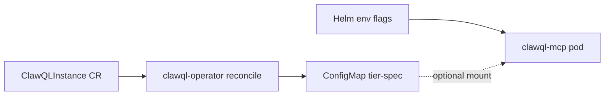

# ClawQL Operator (opt-in scaffold)

**Tracking:** [#255](https://github.com/danielsmithdevelopment/ClawQL/issues/255)

The operator is an **additive** deployment path. Helm `charts/clawql-mcp`, `make local-k8s-up`, and env-based `CLAWQL_ENABLE_*` flags remain the default and are unchanged when the operator is not installed.

## Architecture (phase 1)



1. Platform engineer applies a `ClawQLInstance` (see `examples/operator/clawqlinstance-minimal.yaml`).
2. Operator validates `spec` and writes `{name}-tier-spec` ConfigMap with `horizontalTierSpec.json`.
3. MCP continues to use Helm/env flags by default.
4. When `instanceSpec.enabled: true` on the MCP chart, the pod mounts the ConfigMap and `resolvePluginCompositionFlags()` overlays tier toggles on top of env defaults.

## Install

```bash
# CRD (once per cluster)
kubectl apply -f deploy/crd/clawqlinstances.clawql.io.yaml

# Operator reconcile job (optional namespace)
helm upgrade --install clawql-operator ./charts/clawql-operator \
  --namespace clawql-system \
  --create-namespace

# Example instance
kubectl apply -f examples/operator/clawqlinstance-minimal.yaml -n clawql
```

## MCP integration (explicit opt-in)

```yaml
# values overlay for charts/clawql-mcp — default is enabled: false
instanceSpec:
  enabled: true
  configMapName: clawql-tier-spec
  mountPath: /etc/clawql/instance
```

## Local development

```bash
npm run build -w clawql-operator
node packages/clawql-operator/dist/cli.cjs --once --namespace=clawql --instance=clawql
```

## Roadmap

See [operator-target-architecture.md](../design/operator-target-architecture.md) for full tier/vertical/auth reconciliation. Phase 1 intentionally avoids managing MCP Deployments so existing installs keep working.
