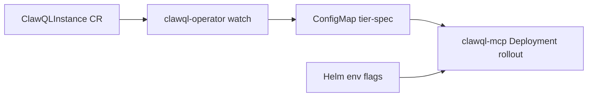

# ClawQL Operator (opt-in scaffold)

**Tracking:** [#255](https://github.com/danielsmithdevelopment/ClawQL/issues/255)

The operator is an **additive** deployment path. Helm `charts/clawql-mcp`, `make local-k8s-up`, and env-based `CLAWQL_ENABLE_*` flags remain the default when the operator is not installed.

## Architecture (phase 2)



1. Platform engineer applies a `ClawQLInstance` (see `examples/operator/clawqlinstance-minimal.yaml`).
2. Operator validates `spec`, applies **tier presets** (`local` / `standard` / `enterprise`), and writes `{name}-tier-spec` ConfigMap (with owner reference).
3. Optional **`spec.mcp.rolloutOnTierSpecChange`** triggers MCP Deployment restart when tier spec changes.
4. When `instanceSpec.enabled: true` on the MCP chart, the pod mounts the ConfigMap and `resolvePluginCompositionFlags()` overlays tier toggles on env defaults.

## Install

```bash
# CRD (once per cluster) — or use chart crd.install: true
kubectl apply -f deploy/crd/clawqlinstances.clawql.io.yaml

# Operator (continuous reconcile — default mode: deployment)
helm upgrade --install clawql-operator ./charts/clawql-operator \
  --namespace clawql-system \
  --create-namespace

# Example instance
kubectl apply -f examples/operator/clawqlinstance-minimal.yaml -n clawql
```

### Local desktop (full stack)

`make local-k8s-up` installs the operator automatically when `CLAWQL_LOCAL_K8S_FULL_STACK=1` (default). Skip with `CLAWQL_INSTALL_OPERATOR=0`.

```bash
make local-k8s-up
npx -p clawql-mcp clawql operator status
```

## MCP integration (explicit opt-in)

```yaml
# values overlay for charts/clawql-mcp — default is enabled: false
instanceSpec:
  enabled: true
  configMapName: clawql-tier-spec
  mountPath: /etc/clawql/instance
```

## Tier presets

| Tier | Default horizontal profile |
| ---- | -------------------------- |
| `local` | Memory only |
| `standard` | Memory + documents (Onyx off) |
| `enterprise` | Memory + documents + Onyx + IDP pipeline + schedule/notify/workflow |

Explicit `spec` fields override preset defaults.

## Local development

```bash
npm run build -w clawql-operator
node packages/clawql-operator/dist/cli.cjs --once --namespace=clawql --instance=clawql
```

## Roadmap

Phase 3+: auth reconciliation, vertical toggles, admission webhooks, NL → CRD patches — see [operator-target-architecture.md](../design/operator-target-architecture.md).
