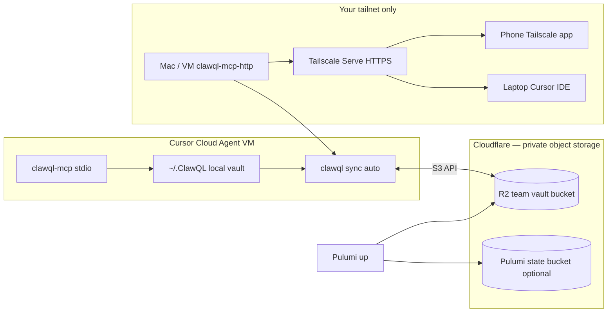

# Cloud Agent + Pulumi R2 + Tailscale (private MCP)

Run **ClawQL Cloud Agents** with a **durable memory vault on Cloudflare R2**, provision the bucket with **Pulumi**, and expose a **phone-reachable MCP endpoint** only on your **Tailscale tailnet** — not on the public internet.

**Related:** [Team vault sync (R2)](../getting-started/getting-started-for-teams.md#team-vault-sync) · [Pulumi provision](../../infra/pulumi/README.md) · [Tailscale beginner guide](./tailscale-and-headscale-for-clawql.md) · [ADR 0007](../adr/0007-pulumi-provisioning-managed-tiers.md)

---

## Architecture (two layers)

Cloud Agents and private phone access solve **different** problems. Use both:

| Layer                  | What                                                                     | Who can reach it                                         |
| ---------------------- | ------------------------------------------------------------------------ | -------------------------------------------------------- |
| **A — Cloud Agent**    | Cursor VM runs `clawql-mcp` (stdio) + R2 sync                            | You (via Cursor app / web); MCP runs inside the agent VM |
| **B — Tailscale host** | Your machine or golden host runs `clawql-mcp-http` + **Tailscale Serve** | Only devices on **your tailnet** (laptop, phone)         |



**Important:** Cursor Cloud Agents **cannot** use HTTP MCP URLs on `100.x` tailnet addresses — HTTP MCP is proxied through Cursor’s backend, which is **not** on your tailnet. For phone + private URL, use **Layer B** (Tailscale Serve on a host you control). Layer A gives you **durable memory in R2** while the agent VM is ephemeral.

---

## Phase 1 — Cloudflare R2 + Pulumi (team vault bucket)

### 1a. Prerequisites (your Cloudflare account)

1. **R2** enabled on the account.
2. **R2 S3 API token** — prefer **Admin Read & Write** so `clawql sync ensure` can create
   `clawql-team-vault` for you. Object Read & Write alone is enough after the bucket exists.
3. Optional: **Cloudflare API token** with **Workers R2 Storage Write** — alternate path for
   `sync ensure` / Pulumi when S3 keys cannot CreateBucket.
4. Optional second bucket `clawql-pulumi-state` for Pulumi stack state (ADR 0007).

Create R2 S3 credentials in: Cloudflare Dashboard → R2 → Manage R2 API tokens.
Day-one without Pulumi: set Cursor Secrets → run Cloud Agent install → `clawql sync ensure`.

### 1b. Pulumi state backend (one-time, your laptop or Cloud Agent)

```bash
export AWS_ACCESS_KEY_ID="<r2-access-key>"
export AWS_SECRET_ACCESS_KEY="<r2-secret>"
pulumi login 's3://clawql-pulumi-state?region=auto&endpoint=https://<accountid>.r2.cloudflarestorage.com&awssdk=v2'
```

Set a passphrase when prompted — store it as **`PULUMI_CONFIG_PASSPHRASE`** in Cursor Secrets.

### 1c. Provision the team vault bucket

```bash
cd infra/pulumi
cp Pulumi.cloudflare.example.yaml Pulumi.dev-r2.yaml
pulumi stack init dev-r2

pulumi config set cloudflare:apiToken --secret    # Cloudflare API token
pulumi config set cloudflare:accountId <account-id>
pulumi config set clawql:cloud cloudflare
pulumi config set clawql:tier dedicated
pulumi config set clawql:tenantId <your-handle>
pulumi config set clawql:syncBucket clawql-team-vault

pulumi preview
pulumi up
```

Outputs: `bucketName`, `syncPrefix` (e.g. `tenant/<your-handle>/`).

**Note:** Pulumi creates the **bucket only** — not R2 API tokens. Create sync credentials manually (step 1a) and store them in Cursor Secrets.

### 1d. Verify from a Cloud Agent

Ask the agent:

> Run `cd infra/pulumi && pulumi stack output` and confirm `bucketName` matches the R2 bucket.

Or run `pulumi preview` in the agent after configuring secrets (Phase 2).

---

## Phase 2 — Cursor Cloud Agent configuration

This repo ships:

| File                                                                                     | Purpose                                                   |
| ---------------------------------------------------------------------------------------- | --------------------------------------------------------- |
| [`.cursor/environment.json`](../../.cursor/environment.json)                             | Build ClawQL + Pulumi; init `~/.ClawQL`; optional R2 pull |
| [`.cursor/scripts/cloud-agent-install.sh`](../../.cursor/scripts/cloud-agent-install.sh) | Idempotent install script                                 |

### 2a. Cursor Secrets (Dashboard → Cloud Agents → Secrets)

Add these **runtime** secrets (names must match — the install script and MCP child read them):

| Secret                          | Example / notes                                            |
| ------------------------------- | ---------------------------------------------------------- |
| `CLAWQL_HOME`                   | `/home/ubuntu/.ClawQL` (optional; install script defaults) |
| `CLAWQL_R2_ACCOUNT_ID`          | Cloudflare account id                                      |
| `CLAWQL_SYNC_BUCKET`            | `clawql-team-vault` (or Pulumi output name)                |
| `CLAWQL_SYNC_PREFIX`            | `tenant/your-handle/` (from Pulumi `syncPrefix`)           |
| `CLAWQL_SYNC_ACCESS_KEY_ID`     | R2 S3 access key                                           |
| `CLAWQL_SYNC_SECRET_ACCESS_KEY` | R2 S3 secret                                               |
| `PULUMI_CONFIG_PASSPHRASE`      | Pulumi stack encryption passphrase                         |
| `AWS_ACCESS_KEY_ID`             | Same R2 key (for Pulumi S3 state backend + AWS SDK)        |
| `AWS_SECRET_ACCESS_KEY`         | Same R2 secret                                             |
| `CLOUDFLARE_API_TOKEN`          | For `pulumi up` from the agent (optional)                  |

**Provider API tokens** (GitHub, Cloudflare API execute, etc.): use `clawql secrets set` inside the agent session, or add recognized keys to the vault — never commit to git. See [local provider vault](../getting-started/local-provider-vault.md).

### 2b. MCP server (Dashboard → Integrations & MCP)

Add a **stdio** server (runs inside the Cloud Agent VM). After this repo’s install hook builds ClawQL, prefer the **workspace binary** (avoids monorepo `npx -p clawql-mcp` → `clawql-mcp: not found` when `node_modules/.bin/clawql-mcp` is missing):

| Field   | Value                                                        |
| ------- | ------------------------------------------------------------ |
| Name    | `clawql`                                                     |
| Command | `node`                                                       |
| Args    | `["/workspace/bin/clawql-mcp.mjs"]`                          |
| Env     | `CLAWQL_HOME=/home/ubuntu/.ClawQL` (match your VM user)      |

Template: [`.cursor/mcp.json.example`](../../.cursor/mcp.json.example). Install also links **`node_modules/.bin/clawql-mcp`** so a baked `npx -p clawql-mcp clawql-mcp` config still works.

Enable **clawql** in the MCP dropdown when starting each agent run. Full Cursor iOS walkthrough: [Agent setup — Cursor iOS / Cloud Agent](../getting-started/agent-setup.md#cursor-i-os-cloud-agent).

Optional feature flags (add to Secrets or `~/.ClawQL/clawql.env`):

```bash
CLAWQL_ENABLE_OUROBOROS=1
CLAWQL_ENABLE_MEMORY=1
CLAWQL_BUNDLED_OFFLINE=1
```

### 2c. Start an agent

1. Open [cursor.com/agents](https://cursor.com/agents) → select this repo.
2. Confirm environment snapshot built (first run runs `install`; later runs reuse snapshot).
3. Enable **clawql** MCP.
4. Prompt example:

   > Run `clawql doctor --smoke`, then `memory_ingest` a test note, then `memory_recall` for it. Confirm `clawql sync push` uploaded to R2.

### 2d. Pulumi login inside the agent (for provision tests)

If you want the **agent** to run `pulumi up`, also set in Secrets:

```bash
PULUMI_BACKEND_URL=s3://clawql-pulumi-state?region=auto&endpoint=https://<accountid>.r2.cloudflarestorage.com&awssdk=v2
```

Then in the agent session:

```bash
cd infra/pulumi && pulumi stack select dev-r2 && pulumi preview
```

---

## Phase 3 — Tailscale + phone (private MCP URL)

Use this when you want **`https://…/mcp`** reachable from your **phone** without public exposure.

### 3a. Managed Tailscale (fastest)

1. Install [Tailscale](https://tailscale.com/download) on:
   - The host running MCP (Mac, Linux VM, or Pulumi AWS/GCP golden host later)
   - Your **phone**
   - Your laptop
2. Admin console → enable **MagicDNS**.
3. On the MCP host, run HTTP MCP:

   ```bash
   PORT=8080 CLAWQL_OBSIDIAN_VAULT_PATH=~/.ClawQL npx -p clawql-mcp clawql-mcp-http
   ```

4. Expose with **Tailscale Serve** (HTTPS on tailnet only):

   ```bash
   tailscale serve --bg --https=443 http://127.0.0.1:8080
   ```

   Your MCP URL becomes something like:

   `https://<hostname>.<tailnet>.ts.net/mcp`

5. Point **local Cursor** (laptop) MCP at that URL via `~/.cursor/mcp.json`:

   ```json
   {
     "mcpServers": {
       "clawql": {
         "url": "${env:CLAWQL_MCP_URL}"
       }
     }
   }
   ```

   Set `CLAWQL_MCP_URL` in your shell to the Serve URL.

6. **Phone:** install Tailscale, stay on tailnet. Use a browser or HTTP client on the phone to hit `https://<host>.<tailnet>.ts.net/healthz` — you should see `{"status":"ok"…}`. (Cursor mobile uses the cloud agent UI; direct MCP from phone is for health checks or future clients.)

### 3b. Lock down to only you (ACL)

In Tailscale admin → **Access controls**, replace open defaults with a single-user policy:

```json
{
  "tagOwners": {
    "tag:clawql-mcp": ["your-tailscale-login@example.com"]
  },
  "acls": [
    {
      "action": "accept",
      "src": ["your-tailscale-login@example.com"],
      "dst": ["tag:clawql-mcp:443,8080"]
    }
  ]
}
```

Enroll the MCP host with `--advertise-tags=tag:clawql-mcp` (see [headscale ACL starter](./headscale-acls-clawql.hujson) for the multi-user pattern).

**Result:** only identities you list can reach MCP ports. Everyone else — including the public internet — has no route.

### 3c. Cloudflare’s role

| Service                                         | Use                                                | Public?                                                |
| ----------------------------------------------- | -------------------------------------------------- | ------------------------------------------------------ |
| **R2**                                          | Durable vault + Pulumi state                       | **No** — S3 API with private keys only                 |
| **Cloudflare Worker** (`cloudflare/mcp-proxy/`) | Optional CORS edge in front of a **remote** origin | Only if you deploy it; **not** needed for tailnet-only |
| **Tailscale Serve**                             | Private HTTPS MCP                                  | **Tailnet only**                                       |

Do **not** expose `clawql-mcp-http` on a public Cloudflare Worker without **Cloudflare Access** or equivalent — Tailscale is the simpler “only me” path.

---

## Phase 4 — End-to-end test checklist

| Step              | Command / action                                          | Pass                           |
| ----------------- | --------------------------------------------------------- | ------------------------------ |
| Pulumi R2 bucket  | `pulumi up` (cloudflare stack)                            | `bucketName` in outputs        |
| R2 sync push      | `clawql sync push` after `memory_ingest`                  | Object visible in R2 dashboard |
| Cloud Agent MCP   | `clawql doctor --smoke` in agent                          | Core tools OK                  |
| Memory round-trip | `memory_recall` after new agent run                       | Note from R2 pull              |
| Tailscale health  | `curl https://<host>.<tailnet>.ts.net/healthz` from phone | `status: ok`                   |
| ACL               | Second Tailscale user / unauthenticated host              | Connection denied              |

---

## Troubleshooting

| Symptom                                 | Fix                                                                            |
| --------------------------------------- | ------------------------------------------------------------------------------ |
| MCP tools missing in Cloud Agent        | Enable **clawql** in MCP dropdown; confirm stdio server in dashboard           |
| `sync pull` skipped                     | Set `CLAWQL_SYNC_*` + `CLAWQL_R2_ACCOUNT_ID` in Cursor Secrets                 |
| `pulumi up` fails on cloudflare         | Set `cloudflare:apiToken` + `cloudflare:accountId`; no `goldenImageId` needed  |
| Phone cannot reach MCP                  | Tailscale on phone must be **Connected**; use Serve HTTPS URL, not `localhost` |
| Cloud Agent cannot use tailnet HTTP MCP | Expected — use stdio MCP in agent; tailnet URL is for laptop/phone direct      |

---

## Related issues

- Epic [#556](https://github.com/danielsmithdevelopment/ClawQL/issues/556) — Ouroboros upstream sync (optional with `CLAWQL_ENABLE_OUROBOROS=1`)
- [#206](https://github.com/danielsmithdevelopment/ClawQL/issues/206) / [#211](https://github.com/danielsmithdevelopment/ClawQL/issues/211) / [#213](https://github.com/danielsmithdevelopment/ClawQL/issues/213) — Tailscale / Headscale
