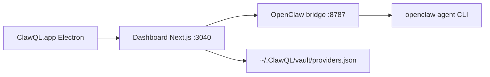

# ClawQL Desktop (macOS)

**Status:** Shipped scaffold in **7.0.0** · **July 2026**  
**Package:** `desktop/` (Electron + dashboard standalone)

ClawQL Desktop is a downloadable macOS app that wraps the existing **dashboard** with local-first provider secrets and **Agent Chat** — the primary solo-dev differentiator vs browser-only or CLI-only flows.

## Architecture



| Layer       | Technology                                         |
| ----------- | -------------------------------------------------- |
| Shell       | Electron 35                                        |
| UI          | `dashboard/` Next.js 16 (standalone bundle)        |
| Secrets     | `CLAWQL_DESKTOP_MODE=1` → `/api/local/providers`   |
| Chat        | `openclaw-chat-bridge.mjs` → `openclaw agent`      |
| Persistence | `CLAWQL_OBSIDIAN_VAULT_PATH` (default `~/.ClawQL`) |

## Desktop vs Helm dashboard

| Capability       | Desktop                                   | K8s dashboard                |
| ---------------- | ----------------------------------------- | ---------------------------- |
| Provider secrets | Local JSON vault (MCP parity)             | Vault KV + `kubectl` sync    |
| Agent Chat       | Bundled bridge                            | Helm sidecar or external URL |
| Prerequisites    | Node bundled in app; **OpenClaw on PATH** | Cluster + Vault + ESO        |

## Build & release

```bash
cd desktop && npm install && npm run dist:mac
```

Artifacts land in `desktop/dist/`. Site distribution requires **Apple code signing + notarization** (not automated in CI yet).

## Security notes

- Renderer uses **context isolation** (no Node in the webview).
- Provider tokens live in **`~/.ClawQL/vault/providers.json`** mode `0600` — same as `clawql init`.
- Do not expose the embedded dashboard server beyond `127.0.0.1`.

## Roadmap (post-7.0)

- Keychain-backed secret storage (optional upgrade from JSON file)
- First-run wizard aligned with `clawql onboard`
- Auto-update (electron-updater + signed feed)
- Windows build
- Bundle or bootstrap OpenClaw when missing

## Related

- [dashboard/README.md](../../dashboard/README.md)
- [local-provider-vault.md](../getting-started/local-provider-vault.md)
- [Migration guide](https://docs.clawql.com/resources/migration) · [ClawQL Desktop](https://docs.clawql.com/getting-started/clawql-desktop)
- [desktop/README.md](../../desktop/README.md)
