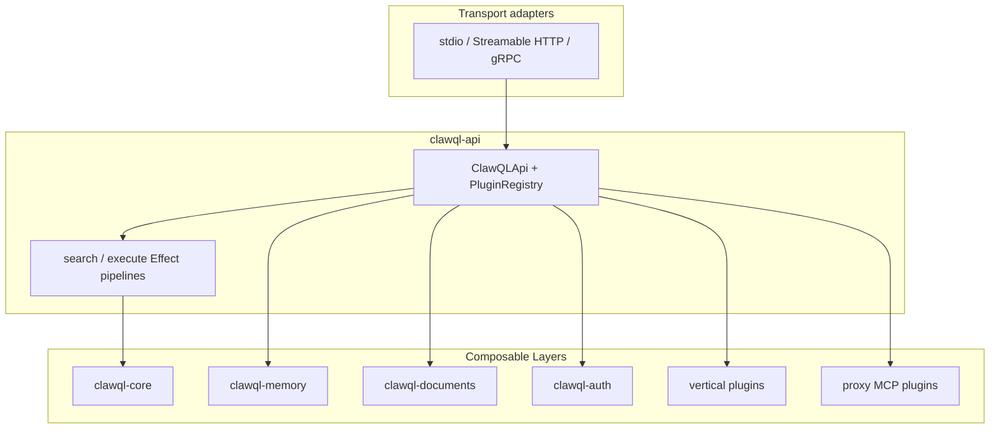

# Effect-TS + modularization + plugin rearchitecture plan

**Status:** In progress (June 2026) — extraction **phases 1–9** merged ([#401](https://github.com/danielsmithdevelopment/ClawQL/pull/401)–[#430](https://github.com/danielsmithdevelopment/ClawQL/pull/430)); Effect foundation partial. See [`modularization-implementation-status.md`](./modularization-implementation-status.md). **Plugin model (horizontal packages):** [`clawql-plugin-model.md`](./clawql-plugin-model.md).
**Canonical vision:** [`docs/vision/clawql-master-enablement-guide.md`](../vision/clawql-master-enablement-guide.md) (§5–§6, plugin interface, execute pipeline)  
**Package checklist companion:** [`docs/vision/clawql-modularization-v2.md`](../vision/clawql-modularization-v2.md) · epic [#306](https://github.com/danielsmithdevelopment/ClawQL/issues/306)

This document plans the **three coupled changes** that reshape the server: **Effect-TS** as the runtime/composition model, **npm package modularization** as the boundary graph, and the **plugin + intelligent gateway** model as the extension surface. Treat them as one program, not three independent refactors.

---

## 1. Why these three belong together

| Pillar                | What it solves                                                            | Without the others                                                |
| --------------------- | ------------------------------------------------------------------------- | ----------------------------------------------------------------- |
| **Effect-TS**         | Typed errors, resources, concurrency, **Layer DI**, testable substitution | Package splits devolve into `async` singletons and hidden imports |
| **Modularization**    | Enforceable dependency graph, publishable units, smaller deploy profiles  | Effect Layers have nowhere clean to live                          |
| **Plugins / gateway** | Opt-in verticals, proxy MCP backends, zero footprint when off             | Monolith `tools.ts` keeps growing; env flags alone do not scale   |

**Composition rule (from enablement):** horizontal and vertical packages export **Effect `Layer`s**; `clawql-api` is the **only merge root**; MCP is a **thin transport adapter** that never owns business logic.



---

## 2. Locked program decisions (May 2026)

| Topic                  | Decision                                                                                                                                                                                                                                   |
| ---------------------- | ------------------------------------------------------------------------------------------------------------------------------------------------------------------------------------------------------------------------------------------ |
| **Monorepo tooling**   | **Turborepo now** — introduce `turbo.json` with the first `packages/clawql-core` workspace (Phase 0), not after `clawql-api`.                                                                                                              |
| **Merkle / Cuckoo**    | **Inside `clawql-core`** — `merkle/` and `cuckoo/` (or equivalent) as internal modules; **no** separate `@clawql/merkle` / `@clawql/cuckoo` npm workspaces.                                                                                |
| **`clawql-ouroboros`** | **Effect rewrite now** — do not long-term Layer-wrap legacy `async` internals; port package to Effect as part of Phase 1–2 (parallel to memory plugin work).                                                                               |
| **Panguard**           | **First-class proxy `Plugin`** in `clawql-api` — migrate `panguard-mcp-bridge` behavior into the gateway plugin model (`ProviderSpec` `kind: "mcp-proxy"` / policy hook), not a permanent sidecar-only process.                            |
| **Release policy**     | **Incremental minors** with documented deprecations (`@deprecated`, changelog, migration notes). **Major semver** when a breaking MCP contract, config, or default behavior change is unavoidable — no “platform v2” big-bang requirement. |

---

## 3. Current state (`main` today)

| Area         | Today (June 2026)                                                                                                                                              | Target                                                                                   |
| ------------ | -------------------------------------------------------------------------------------------------------------------------------------------------------------- | ---------------------------------------------------------------------------------------- |
| **Layout**   | Workspaces: `clawql-core`, `clawql-api`, `clawql-memory`, `clawql-documents`, `clawql-automation`, `clawql-ouroboros`, transports; `src/` shims + MCP handlers | Turborepo; transport-only `clawql-mcp`; remove shims when imports migrate                |
| **Runtime**  | Effect for `search`/`execute` + plugins; **async** in memory/documents/automation packages; Zod at MCP boundary                                                | Effect programs + Layers in all extracted packages; Schema inward over time              |
| **Entry**    | `server.ts` → `tools.ts` (core + HITL) → `getClawqlApi().run(Effect…)`; optional tools via **`buildMcpPlugins()`** + **`onRegister`**                          | Handlers delegate to **`Plugin.onRegister`** + **`createClawQLApi({ layers })`**         |
| **Features** | `CLAWQL_ENABLE_*` gates optional tools                                                                                                                         | Same flags → **include or omit Layers** at startup                                       |
| **Effect**   | Pinned in `clawql-api`; `AuditLive`, `SearchService`, `ExecuteService`, `PluginRegistry`                                                                       | Layer composition for memory/documents/automation; `@effect/schema` at stable boundaries |
| **Plugins**  | **`PanguardProxyPlugin`** + horizontal **`onRegister`** plugins (Memory, Documents, Automation, Sandbox, Ouroboros); HITL inline                               | Effect **`Layer`** per horizontal package; third-party npm plugins                       |

**Ground truth:** [`modularization-implementation-status.md`](./modularization-implementation-status.md).

**Non-negotiable during migration:** MCP tools **`search`** and **`execute`** (plus Core **`audit`** / **`cache`**) stay registered and behavior-compatible unless a major version explicitly documents a break.

---

## 4. Target architecture (summary)

Detailed types and hooks are in enablement **§5.4 Plugin interface**, **§5.5 ProviderSpec**, **§6.2–6.7**. Implementation plan highlights:

### 4.1 `clawql-core` (Effect-native, no MCP, no OpenAPI)

- **Schemas:** `EntityNode`, `ATRClaims`, `AuditEvent`, `ProviderSpec`, `Plugin` metadata — prefer `@effect/schema` (align with enablement examples).
- **Errors:** `ClawQLError` as tagged union (`Data.TaggedError`), not string throws.
- **Services (Context.Tag):** `AuditService`, `CacheService`, `ConfigService`, `Clock`, later `MerkleService`.
- **Pure utilities:** `normalizeOperationId`, **Merkle + Cuckoo** (internal modules under `clawql-core`, not separate workspaces).
- **No:** spec loading, HTTP, MCP SDK, Postgres pools.

### 4.2 `clawql-api` (composition root + gateway)

- **`ClawQLApi` service:** `registerPlugin`, `registerTools`, `registerSpecs`, `execute`, `search`.
- **`PluginRegistry`:** built from merged plugin Layers; validates `requiredSpecs` at startup.
- **Execute pipeline (Effect.gen):** ATR → policy (Panguard hook) → Presidio → router → provider → Merkle/audit — enablement §6.7.
- **Proxy plugins (v2 companion):** `registerMcpProxy` / **`PanguardProxyPlugin`** — first-class gateway plugins wrapping downstream MCP with ATR/audit/memory enrichment; same execute pipeline.
- **MCP adapter package (optional split):** `clawql-mcp` becomes transport-only: map MCP tool calls → `api.search` / `api.execute` Effect entrypoints.

### 4.3 Horizontal / vertical packages

Each ships **`XxxLayer = Layer.effect(...)`** registering a `Plugin` implementation. Operator/CRD toggles map to **Layer list at bootstrap** (enablement §6.5).

---

## 5. Strangler migration (recommended phases)

Do **not** freeze `main` for a rewrite. Extract and convert **by vertical slice** on the hot path first (`search` / `execute`), then memory/documents, then optional tools.

### Phase 0 — Foundation spike ✅ (merged)

**Goal:** Prove Effect fits the repo without moving MCP.

**Shipped:**

- `effect` pinned in root + `clawql-api`; **Turborepo** (`turbo.json`) and **`packages/clawql-core`** exist.
- Merkle + Cuckoo modules inside **`clawql-core`** (not separate npm workspaces).
- **Audit ring buffer** on Effect (`AuditService` + `AuditLive` Layer).
- **Runtime bridge** pattern documented and used by MCP handlers:

```typescript
// MCP handler (stays sync/async-friendly for SDK)
const result = await Effect.runPromise(program.pipe(Effect.provide(AppLayer)));
```

**Exit criteria:** CI green; no user-visible behavior change; one service fully on Effect.

### Phase 1 — `clawql-core` + `clawql-api` skeleton ✅ (merged)

**Goal:** Packages exist; MCP still in `clawql-mcp` but calls into `clawql-api`.

**Shipped:** `clawql-core` + `clawql-api` workspaces; `createClawQLApi()`; `SearchService` / `ExecuteService` Effect Layers; MCP `search`/`execute` via `getClawqlApi().run(Effect…)`; `PanguardProxyPlugin`; extraction phases 2–9 (memory, documents, automation packages).

**Remaining from original Phase 1 table:**

| Deliverable                                     | Notes                                                                                              |
| ----------------------------------------------- | -------------------------------------------------------------------------------------------------- |
| `tools.ts` thins to registration + `runPromise` | Partial — core + HITL in `tools.ts`; optional tools via **`buildMcpPlugins()`** + **`onRegister`** |

**Exit criteria:** All existing integration tests pass; `search`/`execute` latency within agreed budget (profile before/after).

### Phase 2 — Plugin registry + feature tiers as Layers (in progress)

**Goal:** Optional tools are plugins, not `if` branches in `tools.ts`.

**Shipped:** `PluginRegistry`, `PanguardProxyPlugin`, `McpProxyPipeline`, **`MemoryPlugin`**, **`DocumentsPlugin`**, **`AutomationPlugin`** (schedule / notify / workflow / argocd), **`SandboxPlugin`**, **`OuroborosPlugin`** — MCP tools register via **`onRegister`**. **Not shipped:** Effect **`Layer`** wrappers per horizontal package; **`Layer.mergeAll`** at `createApi()`.

| Current module cluster                  | Plugin / Layer                                                                                                 |
| --------------------------------------- | -------------------------------------------------------------------------------------------------------------- |
| `memory-ingest`, `memory-recall`, vault | `MemoryPlugin` / `clawql-memory`                                                                               |
| `external-ingest`, providers            | `DocumentsPlugin` / `clawql-documents`                                                                         |
| `clawql-schedule`, `clawql-notify`      | `AutomationPlugin`                                                                                             |
| `sandbox-*`                             | `SandboxPlugin` ✅ (registration); Layer 📋                                                                    |
| `ouroboros-mcp`                         | **`OuroborosPlugin`** ✅ (registration); **`clawql-ouroboros` Effect rewrite** 📋 (no long-term async wrapper) |
| `knowledge-search-onyx`                 | Sub-plugin under documents or api                                                                              |

**Env mapping:** `getClawqlOptionalToolFlags()` → `Layer.mergeAll(...enabledLayers)` at `createApi()` (replaces scattered `if (enableSchedule)` in `server.ts`).

**Exit criteria:** Disabling a flag omits Layer **and** MCP tool registration; tree-shaking story documented for bundled builds.

### Phase 3 — Auth, routing, proxy gateway (Week 3–6)

**Goal:** Enterprise hooks and v2 gateway direction without changing MCP tool names.

- `clawql-auth` Layer: apiKey → OIDC (modularization roadmap).
- **Router `Effect`:** `router.select(action, input)` for native GraphQL/gRPC/REST/proxy MCP.
- **`PanguardProxyPlugin`:** first-class proxy plugin; fold `packages/panguard-mcp-bridge` gateway behavior into `clawql-api` registration (deprecate sidecar-only deployment path over minors).

### Phase 4 — Operator + dynamic Layer composition (later)

- CRD `spec.enabledPackages` → Layer list passed to API process (enablement §13).
- Admission webhook rejects missing `requiredSpecs` for enabled verticals.

### Phase 5 — Verticals (parallel track)

- Only after horizontal Layers stable: `clawql-lending`, etc. as **plugins**, not imports from `src/`.
- Epic [#306](https://github.com/danielsmithdevelopment/ClawQL/issues/306) vertical issues stay **non-blocking** for platform closure.

---

## 6. Mapping `src/` → packages (first extraction order)

Priority = **dependency order** + **test coverage** + **user impact**.

| Order | Current `src/` (representative)                                                          | Target package                                        | Extracted? (June 2026)                      | Effect-first?                   |
| ----- | ---------------------------------------------------------------------------------------- | ----------------------------------------------------- | ------------------------------------------- | ------------------------------- |
| 1     | `clawql-audit.ts`, `clawql-cache.ts`                                                     | `clawql-core`                                         | ✅ (shims remain)                           | Yes                             |
| 2     | `spec-loader.ts`, `spec-search.ts`, `graphql-in-process-execute.ts`, `rest-operation.ts` | `clawql-api`                                          | ✅                                          | Yes (execute path)              |
| 3     | `merkle-tree.ts`, `memory-cuckoo-metrics.ts`                                             | `clawql-core` (`merkle/`, `cuckoo/`)                  | ✅                                          | Yes                             |
| 4     | `memory-*.ts`, `vault-*`, `vector-store/`                                                | `clawql-memory`                                       | ✅                                          | Layer plugin 📋                 |
| 5     | `external-ingest.ts`, `provider-registry.ts`, `providers/`                               | `clawql-documents` + `clawql-api`                     | 🔨 ingest only; registry in api             | Mixed → Effect                  |
| 6     | `clawql-schedule.ts`, `clawql-notify.ts`                                                 | `clawql-automation`                                   | ✅                                          | Layer plugin 📋                 |
| 7     | `sandbox-*.ts`                                                                           | `clawql-sandbox`                                      | ✅ package + **`SandboxPlugin`**            | Bridge heavy (OS/process)       |
| 8     | `ouroboros/`, `packages/clawql-ouroboros`                                                | `clawql-ouroboros` (Effect rewrite) + MCP glue in api | ✅ **`OuroborosPlugin`**; Effect rewrite 📋 | Yes — rewrite package, not wrap |
| 9     | `server.ts`, `server-http.ts`, `mcp-server-factory.ts`                                   | `clawql-mcp` transport only                           | 📋                                          | Thin adapter                    |

**Keep in transport:** MCP SDK types, stdio/HTTP session lifecycle, OTEL wrap at boundary (`wrapMcpToolHandler` → span around `runPromise`).

---

## 7. Effect conventions (repo-wide)

1. **All new code in extracted packages is Effect-first** — no new `async` business logic in `clawql-api` / `clawql-core`.
2. **Legacy interop:** `Effect.tryPromise` / `Effect.promise` at IO edges only; shrink over time.
3. **Errors:** never throw across Layer boundaries; map to `ClawQLError` with `Effect.catchTag`.
4. **Resources:** pools (Postgres, pgvector) via `Effect.acquireRelease` scoped services.
5. **Concurrency:** fibers for schedule worker, ingest parallelism; document supervision strategy.
6. **Testing:** prefer `TestLayer` over mocking modules; keep existing HTTP parity tests until transport moves.
7. **Observability:** `Effect.withSpan` on pipeline steps; align with existing OTEL (`otel-tracing.ts`).

**Zod → Schema:** keep Zod at MCP tool schema boundary initially; duplicate or generate from Schema for new tools; migrate when touch points stabilize.

---

## 8. Plugin model (implementation checklist)

Align with enablement §5.4:

- [x] `Plugin` interface in `clawql-core` (Effect signatures for hooks; minimal surface).
- [x] `registerPlugin` idempotent (`PluginRegistry` in `clawql-api`).
- [ ] `onRegister` registers MCP tools **and** internal operations (today: `tools.ts` still registers memory/schedule/etc.).
- [ ] `requiredSpecs` / `recommendedSpecs` validated at `createApi()` startup.
- [ ] `onIngestHook` / `onRecallFilter` chained for memory/documents pipeline.
- [ ] `onTeardown` on shutdown hooks (pools, workers) via `Effect.addFinalizer`.
- [ ] Cross-vertical only via `clawql-api.execute` + `cross_vertical` ATR (§5.6).
- [x] **Panguard** `mcp-proxy` plugin (`PanguardProxyPlugin`) — sidecar deprecation path remains per §10.

**Gateway / proxy plugins (v2 companion):** each downstream MCP (including **Panguard**) is a `Plugin` with `kind: "mcp-proxy"` in `ProviderSpec`; routing table in `clawql-api`, not in `tools.ts` or a permanent external bridge binary.

---

## 9. Governance & CI

| Check                            | Purpose                                                      |
| -------------------------------- | ------------------------------------------------------------ |
| ESLint `no-restricted-imports`   | Package layering (enablement §5.3)                           |
| TypeScript project references    | Physical monorepo boundaries                                 |
| Turborepo `dependsOn`            | Build order                                                  |
| **Effect Layer cycle detection** | Custom script or test that fails on circular `Layer.provide` |
| madge / arch diagram diff        | Same as modularization doc                                   |
| Parity test suite                | MCP stdio + HTTP + gRPC unchanged                            |

Pin **one** Effect version across workspaces; Renovate/group bump.

---

## 10. Release & deprecation policy

- **Default:** ship modularization + Effect milestones as **minor** releases (`clawql-mcp` semver minors) with changelog entries and migration notes.
- **Deprecations:** mark APIs/env vars with runtime warnings where practical; keep at least **one minor** of overlap before removal unless security-critical.
- **Major bump when:** MCP tool schema/behavior break, removed env vars without replacement, or default-on → default-off tier changes that break unattended configs. Document in `CHANGELOG.md` and website release notes.
- **No** requirement to align all packages on a single “platform 2.0” tag; publish extracted packages on their own cadence once [#306](https://github.com/danielsmithdevelopment/ClawQL/issues/306) items complete.

---

## 11. GitHub tracking (suggested)

Keep [#306](https://github.com/danielsmithdevelopment/ClawQL/issues/306) for **package extraction**. Add a **hub issue or sub-epic** (suggested title: _Effect-TS foundation + server rearchitecture_) linking:

| Track                     | Example issues                                                                      |
| ------------------------- | ----------------------------------------------------------------------------------- |
| `effect-foundation`       | Pin deps; `clawql-core` scaffold; AuditService port                                 |
| `effect-api`              | Execute/search pipeline in Effect; `createApi()`                                    |
| `effect-plugins`          | Memory/documents/automation as Layers                                               |
| `effect-gateway`          | `PanguardProxyPlugin` + proxy router                                                |
| `effect-ouroboros`        | `clawql-ouroboros` Effect rewrite                                                   |
| `modularization-platform` | npm publish per [#306](https://github.com/danielsmithdevelopment/ClawQL/issues/306) |

Label cross-cutting PRs with both `effect-foundation` and `modularization-platform` when they touch extraction.

---

## 12. Risks and mitigations

| Risk                           | Mitigation                                                      |
| ------------------------------ | --------------------------------------------------------------- |
| Learning curve                 | Phase 0 spike; bridge pattern; pair on reviews                  |
| Execute path regression        | Strangler + parity tests; benchmark suite                       |
| MCP SDK friction               | Keep SDK outside Effect; only business logic inside             |
| Double schema (Zod + Schema)   | Temporary; codegen or single source later                       |
| Scope coupling with verticals  | Freeze vertical breadth until Phase 2 plugins done              |
| “Big bang” rewrite pressure    | Explicit rule: every PR must ship behavior                      |
| Ouroboros Effect rewrite scope | Dedicated `effect-ouroboros` track; parity tests before cutover |
| Panguard migration             | Proxy plugin first; deprecate sidecar path over minors per §10  |

---

## 13. Recommended next steps (post-extraction)

1. **Docs:** keep [`modularization-implementation-status.md`](./modularization-implementation-status.md) updated as features merge.
2. **Transport:** continue slim toward transport-only `clawql-mcp` packaging.
3. **Third-party plugins:** document npm package template + `CLAWQL_PLUGINS` / Operator toggle.
4. **Optional later:** `@effect/schema` at boundaries.

**Completed:** Turborepo scaffold; `clawql-core` + `AuditService`; execute/search Effect services; `PanguardProxyPlugin`; extraction **phases 1–9**; horizontal Plugin Layers; **Effect hot-path migration** for memory/documents/automation/sandbox/ouroboros + opt-in tools (pageindex, Onyx, HITL) + MCP audit bridge; **fiber workers** for schedule / ouroboros seeds poller / inference pipeline; **ManagedRuntime dispose** + pool/NATS `acquireRelease` helpers; workflow audit via `AuditService`; **`Effect.withSpan`** on search/execute cores; **`@effect/opentelemetry` Tracer bridge** (`src/effect-otel-bridge.ts`) so Effect spans export via the existing OTLP/`mcp.tool.*` path; **pluginLayers owned by ManagedRuntime Scope** (eager warm-up; Layer finalizers run on `dispose`) (IO remains `tryPromise`). Ouroboros Effect rewrite landed on the `effect-ouroboros` track.
---

## 14. References

- Enablement: §2.3, §5.3–5.6, §6, §13 (Operator Layer composition)
- Modularization v2: §12 phases (calendar = illustrative; **Effect Phase 0–2 should lead or overlap Week 1–2**)
- Shipped surface: [`docs/mcp/mcp-tools.md`](../mcp/mcp-tools.md), [`docs/readme/configuration.md`](../readme/configuration.md)
- Entry points: `src/server.ts`, `src/server-http.ts`, `src/mcp-server-factory.ts`, `src/tools.ts`
