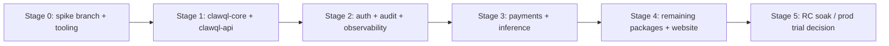

# Effect v4 RC migration spike (ClawQL)

**Status:** Tracking — spike not started  
**Created:** 2026-09-02  
**Tracking issue:** [#TBD](https://github.com/danielsmithdevelopment/ClawQL/issues/TBD)  
**Baseline (production today):** `effect@3.22.1` (root pin), `^3.21.4` in workspace packages  
**Target (spike):** `effect@rc` (currently `4.0.0-rc.*`) + matching `@effect/*@rc` where still separate

---

## Why this doc exists

ClawQL’s marketing claim **“Effect everywhere”** is satisfied on **v3** (every `packages/*` workspace declares `effect` and ships a `Context.Tag` service; enforced by `npm run check:effect-every-package` since [#1031](https://github.com/danielsmithdevelopment/ClawQL/pull/1031)).

**Effect v4** is in **Release Candidate** (not stable GA). The Effect team invites production workload validation before `4.0.0` ([RC recap](https://www.effect.website/blog/effect-v4-rc-august-recap)). This spike tracks a **staged, reversible** path to v4 without blocking current production on v3.

**Do not merge a repo-wide v4 bump to `main` until:** stable `effect@4.0.0` **or** explicit sign-off to run RC in production with documented rollback.

---

## Current ClawQL Effect inventory (v3)

| Area | Today |
|------|--------|
| **Core runtime** | `effect@3.22.1` (root overrides) |
| **Workspace packages with `effect`** | 29 / 29 (`packages/*`) |
| **`Context.Tag` services** | ~120+ files (payments, auth, api, core, …) |
| **`@effect/*` in root `package.json`** | `@effect/opentelemetry@^0.64.0`, `@effect/platform@^0.97.0` |
| **Direct TS imports from `@effect/*`** | `@effect/opentelemetry` only — `src/effect-otel-bridge.ts` |
| **`@effect/platform`** | Transitive via opentelemetry; not directly imported in app TS |
| **Schema** | `effect/Schema` in search/execute/cache/audit/memory/documents MCP boundaries (~6 modules); Zod remains at MCP plugin edges (~35 files) |
| **Tagged errors** | Widespread `Data.TaggedError` across packages |
| **CI guard** | `scripts/check-effect-every-package.mjs` |

### v4 migration surface (high level)

From [Effect MIGRATION.md](https://github.com/Effect-TS/effect/blob/main/MIGRATION.md):

1. **Unified versioning** — `effect@4.x` and `@effect/sql-pg@4.x` (etc.) share one version line.
2. **Package consolidation** — much of `@effect/platform`, RPC, cluster merged into `effect`; platform/sql/ai/opentelemetry remain separate at matching `@rc` versions.
3. **Service declarations** — v3 `Context.Tag("…")` → v4 class-based `Context.Service` (codemod + LSP `outdatedApi` rule).
4. **Schema** — significant API reshaping; unstable modules under `effect/unstable/*`.
5. **Config** — PascalCase constructors (`Config.String`, …), `mapOrFail` → `mapEffect`.
6. **OTEL bridge** — `@effect/opentelemetry@rc` API + layer path review against `src/effect-otel-bridge.ts`.

---

## Spike strategy (staged)



| Stage | Scope | Exit criterion |
|-------|--------|----------------|
| **0** | Branch, `@effect/tsgo` / migration skill, CI job (non-blocking) | Tooling runs; inventory frozen |
| **1** | `clawql-core`, `clawql-api`, root server OTEL bridge | `typecheck`, `test`, `check:effect-every-package` green on RC |
| **2** | `clawql-auth`, `clawql-audit`, `clawql-observability` | Same + OTEL spans still nest under MCP |
| **3** | `clawql-payments`, `clawql-inference` | Largest Tag surface; payment tests green |
| **4** | All other `packages/*`, `website` | Full monorepo build + CI |
| **5** | Soak | Team decision: stay v3 / adopt RC prod / wait for 4.0.0 GA |

**Spike branch naming:** `cursor/effect-v4-rc-spike-611b` (this doc); implementation slices can use `cursor/effect-v4-stage-N-611b`.

---

## Checklist

### Stage 0 — Tooling & branch setup

- [ ] Create long-lived spike branch from `main` (or rebase weekly)
- [ ] Install RC in spike only: `npm install effect@rc` + `@effect/opentelemetry@rc` + `@effect/platform@rc` (if still required)
- [ ] Add optional CI workflow `effect-v4-spike.yml` ( **`continue-on-error: true`** on `main` until ready)
- [ ] Run `@effect/tsgo setup` on spike branch; enable `outdatedApi` + `serviceNotAsClass` warnings
- [ ] Run [v3→v4 migration skill](https://skills.sh) on **one** package dry-run; capture diff size
- [ ] Document rollback: revert spike merge / pin `effect@3.22.1` overrides

### Stage 1 — Core + API vertical

**Packages:** `clawql-core`, `clawql-api`, root `src/effect-otel-bridge.ts`

- [ ] Bump `effect` to `@rc` in stage-1 workspaces + root overrides
- [ ] Migrate `Context.Tag` → class services in:
  - [ ] `packages/clawql-core/src/config/config-service.ts`
  - [ ] `packages/clawql-core/src/cache/cache-service.ts`
  - [ ] `packages/clawql-core/src/audit/audit-service.ts`
  - [ ] `packages/clawql-api/src/clawql-api-service.ts`
  - [ ] `packages/clawql-api/src/search-service.ts` / `execute-service.ts`
- [ ] Review `effect/Schema` modules:
  - [ ] `packages/clawql-api/src/schema/search-execute-schema.ts`
  - [ ] `packages/clawql-core/src/cache/cache-input-schema.ts`
  - [ ] `packages/clawql-core/src/audit/audit-input-schema.ts`
- [ ] Port `src/effect-otel-bridge.ts` to `@effect/opentelemetry@rc`
- [ ] Verify `Effect.withSpan` + MCP OTEL nesting unchanged
- [ ] Tests: `npm run test -w clawql-core -w clawql-api`
- [ ] `npm run check:effect-every-package` (update script if v4 Tag detection changes)

### Stage 2 — Auth, audit, observability

**Packages:** `clawql-auth`, `clawql-audit`, `clawql-observability`

- [ ] ~25 `Context.Tag` modules in `clawql-auth` (policy, oauth, oidc, gateway, …)
- [ ] `clawql-audit` trail + HTTP server services
- [ ] `clawql-observability` registry + query transport services
- [ ] Confirm WORM / audit Effect programs still compose with API runtime

### Stage 3 — Payments + inference

**Packages:** `clawql-payments`, `clawql-inference`

- [ ] ~50+ Tag services in payments (credits, stripe, x402, …)
- [ ] Inference fallback, cache, entitlements, escalation services
- [ ] Run payments integration tests / stripe mock suite
- [ ] No accidental Zod ↔ Schema regression at MCP boundaries

### Stage 4 — Remaining packages

- [ ] `clawql-memory`, `clawql-documents` (+ Schema input modules)
- [ ] `clawql-automation`, `clawql-sandbox`, `clawql-ouroboros`
- [ ] Horizontal: network, web, tee, harness, agents, analytics, data, codegraph, ontology
- [ ] Infra-adjacent: operator, release, merkle, pageindex, openbench-dataset
- [ ] Transports: `mcp-grpc-transport`, `mcp-api-adapter`, `panguard-mcp-bridge`
- [ ] `website` (`effect@rc` in docs/examples if any)

### Stage 5 — RC soak & production decision

- [ ] Full `npm run build` + `npm run test` on spike
- [ ] Run spike deploy to staging (if available) for 1+ week
- [ ] Monitor for RC breaking changes ([Effect releases](https://github.com/Effect-TS/effect/releases))
- [ ] **Decision matrix:**
  - [ ] **Stay on v3** until `4.0.0` GA (default for prod marketing)
  - [ ] **Adopt RC in prod** with pinned RC version + weekly bump discipline
  - [ ] **Merge to main** only after stable `4.0.0` + green CI

---

## Risk register

| Risk | Mitigation |
|------|------------|
| RC breaking changes mid-spike | Pin exact RC version; read release notes before bump |
| `effect/unstable/*` API drift | Avoid unstable imports unless required; document any use |
| Service migration volume (~120 Tags) | Stage by package; codemod + tsgo LSP |
| `@effect/opentelemetry` layer drift | Stage 1 focuses on OTEL bridge; compare span export |
| Zod + Schema dual validation | Keep Zod at MCP edge until Standard Schema path clear; migrate Schema modules in Stage 1–2 |
| Marketing claim overreach | Say **“Effect everywhere (v3)”** until GA; **“v4 RC trial”** only when true |

---

## Commands (spike branch)

```bash
# Install RC (spike only — do not run on main without team sign-off)
npm install effect@rc @effect/opentelemetry@rc @effect/platform@rc

# Language service / migration hints
npx @effect/tsgo setup

# Verify package guard
npm run check:effect-every-package

# Stage 1 tests
npm run test -w clawql-core -w clawql-api
```

---

## References

- [Effect v4 RC August recap](https://www.effect.website/blog/effect-v4-rc-august-recap)
- [Effect v4 MIGRATION.md](https://github.com/Effect-TS/effect/blob/main/MIGRATION.md)
- [Effect v3 source (frozen branch)](https://github.com/Effect-TS/effect/tree/v3)
- ClawQL: [effect-ts-everywhere rule](../../.cursor/rules/effect-ts-everywhere.mdc), [#1031](https://github.com/danielsmithdevelopment/ClawQL/pull/1031)
- ClawQL: [effect-ts modularization plan](./effect-ts-modularization-rearchitecture-plan.md)

---

## Progress log

| Date | Stage | Notes |
|------|-------|-------|
| 2026-09-02 | 0 | Tracking doc + issue created; spike branch opened |
