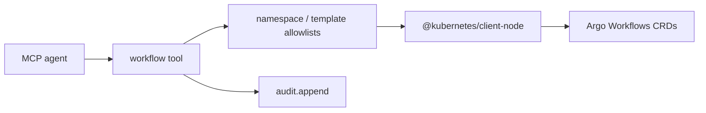

# Design: `workflow` MCP tool (Argo Workflows)

**Status:** Phase A shipped (June 2026) — `CLAWQL_ENABLE_WORKFLOW=1`  
**Operator guide:** [`docs/mcp/workflow-tool.md`](../mcp/workflow-tool.md)
**Tracking:** [#243](https://github.com/danielsmithdevelopment/ClawQL/issues/243), [ADR 0004](../adr/0004-argo-cd-workflows-clawql-pipelines.md)  
**Package:** `packages/clawql-automation` — extends **`AutomationPlugin`**

This document is the implementation blueprint for the optional **`workflow`** MCP tool. It supersedes informal sketches in ADR 0004 open questions where noted.

---

## Goal

Give agents a **stable, workflow-oriented** surface for **durable, repeatable cluster pipelines**. The execution plane is **Argo Workflows** on Kubernetes; ClawQL is a **thin control-plane client** (submit → observe → summarize → optionally audit / notify / memory).

Agents keep using **`search` / `execute`** for ad hoc API calls. **`workflow`** is for parameterized template runs with cluster durability.

| Tool                     | Role                                                |
| ------------------------ | --------------------------------------------------- |
| **`search` / `execute`** | Ad hoc REST/GraphQL/gRPC calls                      |
| **`schedule`**           | Lightweight local SQLite synthetic HTTP checks      |
| **`ouroboros_*`**        | In-process evolutionary / spec-first loops          |
| **`workflow`**           | Parameterized Argo DAG runs from reviewed templates |

---

## Agreed decisions (v1)

| Topic                      | Decision                                                                                                                                                                                             |
| -------------------------- | ---------------------------------------------------------------------------------------------------------------------------------------------------------------------------------------------------- |
| **Submit model**           | **Template-only** — `submit` accepts `template_ref` + `parameters` only. No arbitrary inline `Workflow` specs in v1.                                                                                 |
| **K8s client**             | **`@kubernetes/client-node`** (`CustomObjectsApi` for Argo CRDs; `CoreV1Api` for pod logs).                                                                                                          |
| **Polling**                | **`get`** and **`wait`** (timeout + terminal phase) shipped in Phase A / A.2. Agents may still loop `get` if needed.                                                                                 |
| **Correlation**            | Standard label **`clawql.dev/correlation-id`** on submitted workflows; pair with **`audit.correlationId`** and HITL `seed_id` ([#254](https://github.com/danielsmithdevelopment/ClawQL/issues/254)). |
| **Managed marker**         | Label **`clawql.dev/managed: "true"`** on all tool-created workflows.                                                                                                                                |
| **Minimum Argo Workflows** | **≥ 3.4.0** (CRD group `argoproj.io/v1alpha1`, `workflowTemplateRef` on `Workflow`). Integration tests target the same floor.                                                                        |
| **Registration**           | **`CLAWQL_ENABLE_WORKFLOW=1`** — same truthy pattern as `schedule` / `notify`.                                                                                                                       |
| **Implementation home**    | **`clawql-automation`** plugin (not monolithic `clawql-mcp` transport code).                                                                                                                         |

---

## Package layout

```
packages/clawql-automation/
  src/
    workflow/
      workflow.ts          # zod schema, handler, env guards
      wait.ts              # poll until terminal phase or timeout
      k8s-client.ts        # client-node factory + test doubles
      argo-mapper.ts       # CRD ↔ agent-friendly JSON
      workflow.test.ts
      wait.test.ts
    plugin/
      automation-plugin.ts # + enableWorkflow
      deps.ts              # + configureWorkflowDeps({ createK8sClient })
```

**Subpath import (tests / glue):** `clawql-automation/workflow/workflow`

No background worker in v1 (unlike `schedule`). Argo owns execution.

---

## Architecture



**Connection paths (both supported):**

1. **In-cluster** — `KubeConfig.loadFromCluster()` when `clawql-mcp` runs with a dedicated ServiceAccount.
2. **Dev / out-of-cluster** — `CLAWQL_WORKFLOW_KUBECONFIG` pointing at a kubeconfig file.

---

## Tool schema

Operation-discriminated union (same pattern as **`schedule`**): top-level **`operation`** enum, zod **`superRefine`** for per-op required fields, JSON text responses.

### Phase A operations

| `operation`          | Purpose                                                                                              |
| -------------------- | ---------------------------------------------------------------------------------------------------- |
| **`submit`**         | Create a `Workflow` from an allowlisted `WorkflowTemplate` or `ClusterWorkflowTemplate` + parameters |
| **`get`**            | Run status, phase, condensed node summary                                                            |
| **`wait`**           | Poll `get` until terminal phase (`Succeeded` / `Failed` / `Error`) or timeout                        |
| **`list`**           | List workflows in an allowlisted namespace (label / phase filters)                                   |
| **`logs`**           | Bounded log excerpt for a node / pod                                                                 |
| **`list_templates`** | Catalog templates the SA can read                                                                    |

### Phase A.2 operations

| `operation`  | Purpose                                                         |
| ------------ | --------------------------------------------------------------- |
| **`delete`** | Delete workflow — gated by **`CLAWQL_WORKFLOW_ALLOW_DELETE=1`** |

### Phase B ([#254](https://github.com/danielsmithdevelopment/ClawQL/issues/254), [#244](https://github.com/danielsmithdevelopment/ClawQL/issues/244))

- **`suspend` / `resume`** — HITL glue with Label Studio / webhooks
- **`submit_cron`** — `CronWorkflow` management
- **`artifacts`** — list artifact refs when RBAC permits

### `submit` input (template-only)

```typescript
{
  operation: "submit",
  namespace?: string,           // default: CLAWQL_WORKFLOW_DEFAULT_NAMESPACE
  generate_name?: string,       // prefix; server may default "clawql-"
  template_ref: {
    kind: "WorkflowTemplate" | "ClusterWorkflowTemplate",
    name: string,
    namespace?: string,         // required when kind = WorkflowTemplate
  },
  parameters?: Record<string, string>,
  labels?: Record<string, string>,
  correlation_id?: string,      // → label clawql.dev/correlation-id
}
```

Server builds a minimal `Workflow`:

```yaml
apiVersion: argoproj.io/v1alpha1
kind: Workflow
metadata:
  generateName: clawql-
  namespace: <allowlisted>
  labels:
    clawql.dev/managed: "true"
    clawql.dev/correlation-id: <correlation_id>
spec:
  workflowTemplateRef:
    name: <template>
  arguments:
    parameters:
      - name: ...
        value: ...
```

For **`ClusterWorkflowTemplate`**, use `clusterScope: true` on `workflowTemplateRef` per Argo CRD semantics.

### `get` response (agent-oriented, not raw CRD)

```json
{
  "ok": true,
  "operation": "get",
  "workflow": {
    "namespace": "pipelines",
    "name": "clawql-abc12",
    "uid": "...",
    "phase": "Running",
    "started_at": "2026-06-30T12:00:00Z",
    "finished_at": null,
    "template_ref": { "kind": "WorkflowTemplate", "name": "idp-ingest" },
    "parameters": { "doc_id": "42" },
    "nodes": [
      { "name": "extract", "phase": "Succeeded" },
      { "name": "classify", "phase": "Running" }
    ],
    "links": {
      "argo_ui": "https://argo.example/workflows/pipelines/clawql-abc12"
    }
  }
}
```

`argo-mapper.ts` strips secrets, full pod specs, and unbounded `status.nodes` payloads.

---

## Environment configuration

| Variable                                  | Purpose                                                           |
| ----------------------------------------- | ----------------------------------------------------------------- |
| **`CLAWQL_ENABLE_WORKFLOW`**              | `1` / `true` / `yes` — register **`workflow`** tool               |
| **`CLAWQL_WORKFLOW_NAMESPACE_ALLOWLIST`** | Comma-separated namespaces (**required** when enabled)            |
| **`CLAWQL_WORKFLOW_DEFAULT_NAMESPACE`**   | Default when caller omits `namespace`                             |
| **`CLAWQL_WORKFLOW_TEMPLATE_ALLOWLIST`**  | Optional `ns/name` or `cluster/name` globs                        |
| **`CLAWQL_WORKFLOW_KUBECONFIG`**          | Out-of-cluster kubeconfig path (dev)                              |
| **`CLAWQL_WORKFLOW_ARGO_UI_BASE_URL`**    | Build `links.argo_ui` in responses                                |
| **`CLAWQL_WORKFLOW_ALLOW_DELETE`**        | `1` to permit `delete` (default off)                              |
| **`CLAWQL_WORKFLOW_LOG_TAIL_MAX`**        | Cap `tail_lines` (default **200**)                                |
| **`CLAWQL_WORKFLOW_NOTIFY_ON_TERMINAL`**  | `1` to Slack-notify when `wait` completes (needs channel + token) |
| **`CLAWQL_WORKFLOW_NOTIFY_CHANNEL`**      | Slack channel for terminal `wait` notifications                   |

### Validation (every mutating call)

1. Tool enabled and K8s client configured
2. Namespace in allowlist
3. Template in template allowlist (when configured)
4. Parameter count / size limits (e.g. max **32** params, **4 KiB** per value)
5. `logMcpToolShape("workflow", …)` for observability

Panguard **`beforeCallTool`** runs on **`workflow`** like any other MCP tool.

---

## RBAC (reference Role, allowlisted namespace)

Minimum verbs for Phase A:

| Resource                    | Verbs                                 |
| --------------------------- | ------------------------------------- |
| `workflows` (`argoproj.io`) | create, get, list, watch              |
| `workflowtemplates`         | get, list                             |
| `clusterworkflowtemplates`  | get, list (if cluster templates used) |
| `pods`, `pods/log`          | get, list (for **`logs`**)            |

**Not granted by default:** `cluster-admin`, cross-namespace list, arbitrary `Workflow` patch, secret access. **`delete`** only when env + Role explicitly allow it.

---

## Plugin wiring

```typescript
// createAutomationPlugin options
{ enableSchedule?, enableNotify?, enableWorkflow? }

// clawql-api-adapters buildMcpPlugins
if (flags.enableSchedule || flags.enableNotify || flags.enableWorkflow) {
  plugins.push(createAutomationPlugin({ … }));
}
```

**Deps:** `configureWorkflowDeps({ createK8sClient })` for unit tests — **`workflow`** does **not** use the `execute` path (unlike **`notify`**).

---

## Sibling tool integration

| Tool                            | v1 pattern                                                                                            |
| ------------------------------- | ----------------------------------------------------------------------------------------------------- |
| **`audit`**                     | Handler appends on `submit` and on terminal `get` / `wait` (shipped)                                  |
| **`notify`**                    | Optional server hook on `wait` when `CLAWQL_WORKFLOW_NOTIFY_ON_TERMINAL=1` (shipped)                  |
| **`memory_ingest`**             | Documented agent skill post-run                                                                       |
| **`hitl_enqueue_label_studio`** | Future: suspend → HITL → resume ([#254](https://github.com/danielsmithdevelopment/ClawQL/issues/254)) |
| **`schedule`**                  | Future `action.kind: "argo_workflow"` — out of Phase A scope                                          |

---

## Testing

| Layer       | Approach                                                                                        |
| ----------- | ----------------------------------------------------------------------------------------------- |
| Unit        | Mock `CustomObjectsApi` / mapper fixture CRDs; handler tests for all Phase A operations         |
| Helm CI     | `scripts/kubernetes/test-helm-workflow-templates.sh` (`enableWorkflow` render + RBAC assertions) |
| Schema      | zod superRefine (missing template, disallowed namespace)                                        |
| Plugin      | `automation-plugin.test.ts` — registers `workflow` when `enableWorkflow`                        |
| Integration | Optional CI: **kind** + **Argo Workflows ≥ 3.4.0**, submit minimal template, assert `get` phase |

---

## Phased delivery

### Phase A (MVP)

- [ ] `submit`, `get`, `list`, `list_templates`, `logs`
- [ ] Template-ref-only submits
- [ ] Namespace allowlist + reference RBAC docs
- [ ] `CLAWQL_ENABLE_WORKFLOW` + plugin registration
- [ ] `docs/mcp/workflow-tool.md` (operator guide)

### Phase A.2

- [x] `wait` with timeout
- [x] `delete` behind `CLAWQL_WORKFLOW_ALLOW_DELETE` (handler shipped; Helm `workflow.allowDelete`)
- [x] `audit` append on `submit` and terminal `get` / `wait`
- [x] Helm SA + Role binding values (`enableWorkflow`, `workflow-rbac.yaml`)
- [x] Optional notify on terminal phase (`CLAWQL_WORKFLOW_NOTIFY_ON_TERMINAL`, `wait` hook)

### Phase B

- [ ] `suspend` / `resume` + HITL ([#254](https://github.com/danielsmithdevelopment/ClawQL/issues/254))
- [ ] Argo CD — separate flag or `execute` on Argo CD OpenAPI ([#244](https://github.com/danielsmithdevelopment/ClawQL/issues/244))

---

## References

- [ADR 0004: Argo Workflows + optional Argo CD](../adr/0004-argo-cd-workflows-clawql-pipelines.md)
- [Roadmap: Argo Workflows + CD provider](../roadmap/argo-workflows-cd-provider.md)
- [Plugin registry](../reference/clawql-plugin-registry.md)
- [Argo Workflows CRD reference](https://argo-workflows.readthedocs.io/en/release-3.4/fields/#workflow)
