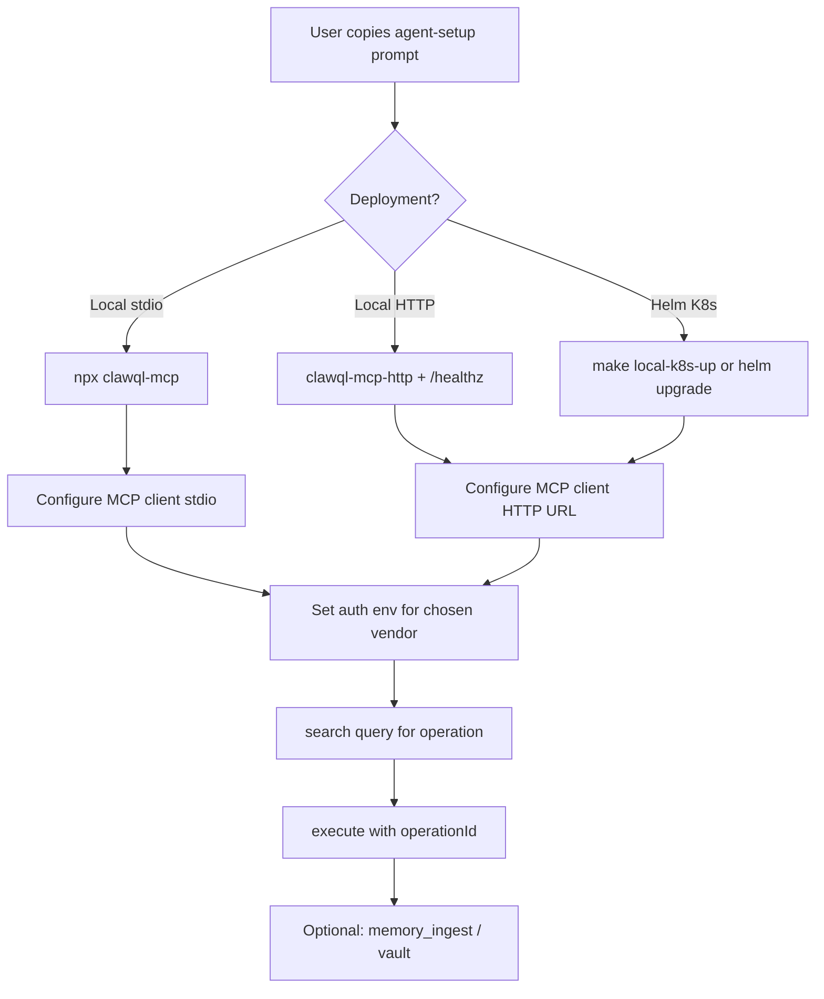

# ClawQL init walkthrough — design spec

> **Historical (7.0.0):** This spec describes the onboarding model from ClawQL **7.0.0**, when bare `npx clawql-mcp` loaded the **opinionated default stack** by default. As of **8.0.0**, the provider catalog is **empty by default** — the opinionated stack requires **`CLAWQL_PROVIDER=default`** (or Helm `providers.pack: default`) opt-in. See [Migrate to 8.0](./migrate-to-8.0.md) for the current model; this document is retained for historical context on the 7.0.0 onboarding UX work.

**Status:** Shipped (7.0.0) — Phases 1–2b complete; Phase 3 UI optional. Superseded for provider-default behavior by 8.0.0.  
**Audience:** Product, docs, and contributors planning the next major release onboarding UX  
**Companion:** [Agent setup](./agent-setup.md) · [Getting started](../readme/getting-started.md) · [Migrate to 8.0](./migrate-to-8.0.md)

This document compares **Executor** (`executor.sh`) onboarding with ClawQL today and proposes a phased **init walkthrough** — copy-paste agent prompts, optional `clawql doctor`, and docs alignment — without committing to a full install script or dashboard yet.

---

## 1. Why this spec exists

ClawQL’s default install behavior changed in **7.0.0** ([#528](https://github.com/danielsmithdevelopment/ClawQL/pull/528)): bare `npx clawql-mcp` loaded an **opinionated default stack** (Cloudflare, GitHub, Slack, Linear, Notion, Onyx), not `all-providers`. **As of 8.0.0, that stack is opt-in only** (`CLAWQL_PROVIDER=default`) — the no-config default is now an **empty catalog**; see [Migrate to 8.0](./migrate-to-8.0.md). Docs and first-run UX must match that model and guide users toward credentials, MCP wiring, and first `search` / `execute` calls.

Executor is a useful reference: one-line install, `doctor`, agent-bootstrap shortcuts, and a **“Set up with your agent”** prompt on their docs homepage.

---

## 2. Executor onboarding (reference)

| Step            | Executor pattern                                                 | User outcome                                                               |
| --------------- | ---------------------------------------------------------------- | -------------------------------------------------------------------------- |
| Install         | `curl -fsSL https://executor.sh/install \| bash`                 | Binary + managed backend + web UI on PATH                                  |
| Health          | `executor doctor` / `doctor --verbose`                           | Status, MCP URL, API key, dashboard port                                   |
| Dashboard       | `executor web` → `http://127.0.0.1:5312`                         | Anonymous workspace; add OpenAPI source in UI                              |
| Agent bootstrap | `executor claude -- "task"` or manual MCP JSON                   | Pre-wired Claude Code session                                              |
| Docs prompt     | Copy-paste block on [executor.sh/docs](https://executor.sh/docs) | Agent picks local vs cloud, installs, connects MCP, adds first integration |
| First tool use  | `tools.search` → `tools.describe` → `execute` in sandbox         | One `execute` tool; thousands of integrations behind it                    |

**Concepts Executor teaches:** Integration → Connection → Policy; context efficiency (one tool vs catalog explosion).

**ClawQL analog:** Bundled provider → auth env / `CLAWQL_PROVIDER_AUTH_JSON` → optional Panguard policy; context efficiency via **`search`** + **`execute`** over merged specs.

---

## 3. ClawQL today (gaps)

| Capability         | ClawQL 7.0.0                                | Remaining gap                                           |
| ------------------ | ------------------------------------------- | ------------------------------------------------------- |
| Install            | `npm install clawql-mcp` / `npx clawql-mcp` | No curl installer; acceptable for npm ecosystem         |
| Health             | `clawql doctor` / `clawql doctor --smoke`   | HTTP-only checks need `CLAWQL_MCP_URL`                  |
| Dashboard          | Helm `clawql-dashboard` (K8s)               | No local-first “add provider” UI for solo dev (Phase 3) |
| Agent bootstrap    | `clawql onboard` + agent-setup prompt       | —                                                       |
| First integration  | `clawql onboard --interactive`              | —                                                       |
| Default stack docs | README, quickstart, migration aligned       | —                                                       |

**Existing assets:**

- [Getting started](../readme/getting-started.md), [Quickstart](https://docs.clawql.com/quickstart), [MCP clients](https://docs.clawql.com/mcp-clients)
- Per-vendor guides: `docs/providers/*-onboarding.md`
- [Plugins hub](https://docs.clawql.com/plugins)
- `scripts/dev/clawql-doctor.sh` — thin wrapper; prefer **`clawql doctor`**

---

## 4. Proposed ClawQL init walkthrough (phased)

### Phase 1 — Docs + prompt + doctor (shipped)

1. **Docs refresh:** Default stack narrative everywhere “first run” is taught; `all-providers` labeled explicit opt-in.
2. **[Agent setup](./agent-setup.md)** + website [`/agent-setup`](https://docs.clawql.com/agent-setup): copy-paste block for Cursor/Claude to run install → MCP config → env for one vendor → first `search` / `execute`.
3. **`clawql doctor`** (replaces `scripts/dev/clawql-doctor.sh` for most checks).
4. **Migration note:** Pre-7.0 “no env = all-providers” → post-7.0 opinionated stack.

### Phase 2 — CLI wrapper (shipped — Tier 1)

- npm bin **`clawql`** — **`init`**, **`doctor`**, **`mcp-config`**, **`secrets`**
- **`clawql init`** — `~/.ClawQL` scaffold, **`CLAWQL_OBSIDIAN_VAULT_PATH`**, interactive default-stack tokens → **`vault/providers.json`**
- **`clawql init --from-env`** / **`--push-vault`** — import + HashiCorp sync
- **`clawql doctor --smoke`**, **`clawql mcp-config --write cursor`**, hidden token input, Vault auto-detect
- MCP **`load-env.ts`** loads local provider vault at startup (vault-first secrets)
- Guide: [local-provider-vault.md](./local-provider-vault.md)

### Phase 2b — End-to-end onboard (shipped — Tier 2)

- **`clawql onboard --interactive`** — chains init → MCP config write → doctor smoke
- Docs updated for **7.0.0**
- Agent-setup prompt uses onboard as the primary path

### Phase 3 — Guided UI (shipped in 7.0 Desktop)

- **ClawQL Desktop (macOS):** Electron app (`desktop/`) — Provider secrets panel + Agent Chat against local `~/.ClawQL` vault
- Helm/K8s dashboard remains the cluster operator path ([#242](https://github.com/danielsmithdevelopment/ClawQL/issues/242))

---

## 5. Agent setup flow (target)

**Prompt must enforce:**

- Restart MCP client after config change
- Default stack list (6 vendors) vs `CLAWQL_PROVIDER=all-providers`
- Never print or commit secrets; use env / `CLAWQL_PROVIDER_AUTH_JSON`
- Point to `clawql doctor` after HTTP start (or `clawql doctor --smoke` for stdio MCP)

---

## 6. `clawql doctor` checks (Phase 1)

| Check       | Pass criteria                                                                       |
| ----------- | ----------------------------------------------------------------------------------- |
| Node        | `node -v` ≥ 22                                                                      |
| Package     | `npx -p clawql-mcp clawql-mcp --help` or local `npm run build`                      |
| HTTP health | `curl -sf $CLAWQL_MCP_URL/healthz` when URL set                                     |
| Spec mode   | Report inferred mode: default stack / `all-providers` / single-spec / custom merge  |
| Auth hints  | Warn if `GITHUB_TOKEN`, `SLACK_BOT_TOKEN`, etc. missing when matching vendor loaded |
| Vault       | If `memory_*` enabled, `CLAWQL_OBSIDIAN_VAULT_PATH` writable                        |

---

## 7. Success metrics

- New user completes first `search` + `execute` within one agent session (self-reported or docs feedback)
- Reduction in issues/confusion about “why isn’t Jira in my default merge?”
- Agent-setup prompt linked from README, getting-started hub, and install page

---

## 8. Non-goals (Phase 1)

- Curl-based global installer competing with npm
- Hosted SaaS onboarding (ClawQL remains self-hosted / npm-first)
- Replacing per-provider onboarding depth (AWS SigV4, Onyx RAG, IDP pipeline stay in dedicated guides)

---

## 9. Related links

- [Bundled providers plugin](../plugins/bundled-providers.md)
- [AWS onboarding](../providers/aws-onboarding.md)
- [Getting started](https://docs.clawql.com/getting-started) · [Operations guide](https://docs.clawql.com/deployment/operations-guide)
- Executor quickstart (external): [executor.sh quickstart](https://rhyssullivan-executor.mintlify.app/quickstart)
