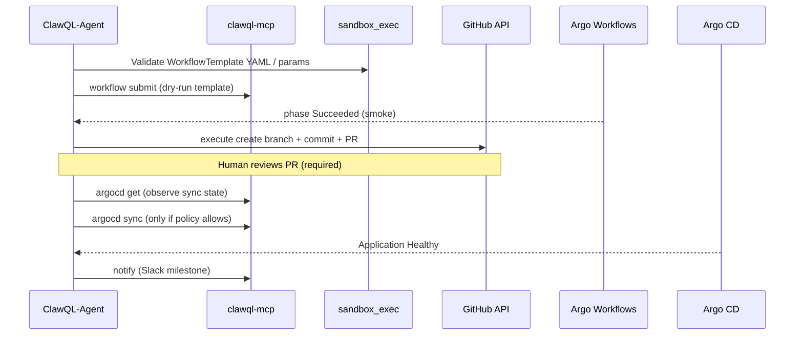

# Agent-authored workflow promotion (sandbox → Git PR → Argo CD)

**Tracking:** [#258](https://github.com/danielsmithdevelopment/ClawQL/issues/258) · Epic [#259](https://github.com/danielsmithdevelopment/ClawQL/issues/259)

Contract for **ClawQL-Agent** (or equivalent LangGraph runtime) to promote validated Argo pipeline changes through Git and Argo CD. **Implementation** of the agent loop lives in [ClawQL-Agent](https://github.com/danielsmithdevelopment/ClawQL-Agent); this repo supplies MCP tools, RBAC, and security boundaries.

## End-to-end flow

## ClawQL MCP surfaces

| Step                      | Tool                                   | Notes                                                                  |
| ------------------------- | -------------------------------------- | ---------------------------------------------------------------------- |
| Validate snippet / mapper | `sandbox_exec`                         | Kata or Docker backend; no cluster mutation                            |
| Smoke workflow            | `workflow`                             | `submit` + `wait` against allowlisted `WorkflowTemplate`               |
| Open PR                   | `execute` on bundled **`github`** spec | `create_pull_request`, `create_or_update_file` — use least-scope token |
| Observe GitOps            | `argocd`                               | `get`, `list` — read Application health                                |
| Promote (gated)           | `argocd`                               | `sync` only when `CLAWQL_ARGO_CD_ALLOW_SYNC=1` + human approval        |
| Audit trail               | `audit` + `memory_ingest`              | `correlationId` links PR URL → workflow UID                            |

Operator guides: [`workflow-tool.md`](../mcp/workflow-tool.md), [`argocd-tool.md`](../mcp/argocd-tool.md).

## Threat model

### Principles

1. **No auto-merge to production** — Git branch protection + required reviewers on the workflows repo; agent may open PRs, never bypass CODEOWNERS.
2. **No blind Argo CD sync** — `argocd sync` is opt-in (`CLAWQL_ARGO_CD_ALLOW_SYNC=1`); default posture is observe-only.
3. **Namespace allowlists** — `CLAWQL_WORKFLOW_NAMESPACE_ALLOWLIST` and `CLAWQL_ARGO_CD_NAMESPACE_ALLOWLIST` cap blast radius.
4. **Template-only workflows** — `workflow submit` accepts `template_ref` only (no arbitrary inline Workflow specs).
5. **Secrets never in PR bodies** — use External Secrets / Vault; agent posts links, not tokens.
6. **Sandbox before cluster** — run validation in `sandbox_exec` or a dev-namespace `workflow` smoke before touching prod GitOps paths.

### Abuse scenarios

| Threat                                  | Mitigation                                                                         |
| --------------------------------------- | ---------------------------------------------------------------------------------- |
| Agent merges malicious WorkflowTemplate | PR review + CI on workflows repo; Argo CD sync to staging first                    |
| Over-privileged GitHub token            | Fine-scoped PAT or GitHub App with `contents:write` on workflows repo only         |
| Cross-namespace workflow submit         | Namespace allowlist env + Kubernetes RBAC (`workflow-rbac.yaml`)                   |
| Unauthorized Argo CD sync               | `allowSync` false by default; Panguard `beforeCallTool` can deny `argocd` sync ops |
| Denial of service (workflow spam)       | Rate limits at gateway; `audit` correlation for operator alerts                    |

### Human-in-the-loop gates

| Gate                 | Owner                                                                                                                                     |
| -------------------- | ----------------------------------------------------------------------------------------------------------------------------------------- |
| PR approval          | Human reviewer on GitHub                                                                                                                  |
| Staging sync         | Platform team or automated policy on `Application` in `staging` namespace                                                                 |
| Production sync      | Separate `Application`; `argocd sync` disabled for agent SA in prod                                                                       |
| HITL document review | `hitl_enqueue_label_studio` + `workflow suspend` / webhook `resume` ([#254](https://github.com/danielsmithdevelopment/ClawQL/issues/254)) |

## Sample GitOps layout

See [`deployment/gitops/README.md`](../../deployment/gitops/README.md) and [`deployment/gitops/applications/clawql-idp-dev.yaml`](../../deployment/gitops/applications/clawql-idp-dev.yaml).

## ClawQL-Agent child work

File implementation epics in **ClawQL-Agent** for:

- PR authoring loop (branch naming, commit message policy)
- Correlation ID threading across MCP tools
- Policy engine (when `argocd sync` is allowed)
- Subscribe/publish adapters for IDP JetStream subjects ([clawql-agent-idp-nats.md](../openclaw/clawql-agent-idp-nats.md), [#128](https://github.com/danielsmithdevelopment/ClawQL/issues/128))

Link PRs back to [#258](https://github.com/danielsmithdevelopment/ClawQL/issues/258) / [#128](https://github.com/danielsmithdevelopment/ClawQL/issues/128).

## Related

- [ADR 0004](../adr/0004-argo-cd-workflows-clawql-pipelines.md)
- [Argo Workflows CD provider roadmap](../roadmap/argo-workflows-cd-provider.md)
- [ClawQL-Agent IDP NATS contract](../openclaw/clawql-agent-idp-nats.md)
- [Slack-first IDP runbook](../openclaw/slack-first-idp-runbook.md)
