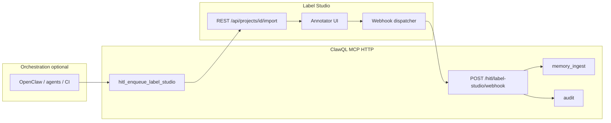

# HITL — Label Studio bridge (optional)

**Issue:** [#228](https://github.com/danielsmithdevelopment/ClawQL/issues/228).  
**Upstream product:** [Label Studio](https://labelstud.io/) — open-source labeling, AI evaluation, and human-in-the-loop workflows (Community Edition or your deployment; API and webhooks per [their documentation](https://labelstud.io/guide/)).

This document is the **operator’s guide** for ClawQL: how the MCP tool and HTTP webhook integrate with Label Studio, how to secure and deploy them, and how they fit **OpenClaw** / IDP-style confidence routing. A shorter **website overview** lives at **`/hitl-label-studio`** on the docs site.

---

## 1. What ClawQL provides

ClawQL does **not** ship Label Studio. It adds:

| Surface                                    | Purpose                                                                                                                                        |
| ------------------------------------------ | ---------------------------------------------------------------------------------------------------------------------------------------------- |
| MCP **`hitl_enqueue_label_studio`**        | Create **review tasks** in a Label Studio **project** via REST **import** (`POST /api/projects/{id}/import`).                                  |
| HTTP **`POST /hitl/label-studio/webhook`** | Receive **webhooks** from Label Studio when annotations change; persist outcomes via **`memory_ingest`** (vault) or **`audit`** (ring buffer). |

**Opt-in:** set **`CLAWQL_ENABLE_HITL_LABEL_STUDIO=1`**. Without it, neither the tool nor the webhook route is registered.

---

## 2. End-to-end architecture



**Outbound (ClawQL → Label Studio):** ClawQL calls your Label Studio **base URL** with **`Authorization: Token <user token>`** (Label Studio’s standard token auth on the API).

**Inbound (Label Studio → ClawQL):** Label Studio POSTs JSON event payloads to **`https://<clawql-public-host>/hitl/label-studio/webhook`**. ClawQL validates **`CLAWQL_HITL_WEBHOOK_TOKEN`** (see §7), then records the payload.

---

## 3. Label Studio prerequisites (your deployment)

1. **Run Label Studio** somewhere reachable from the ClawQL process (same VPC, tailnet, or routable URL). Common options from [Label Studio quick start](https://labelstud.io/guide/install.html): **`pip install label-studio`**, **Docker** (`heartexlabs/label-studio`), or enterprise/hosted equivalents.
2. **Create a project** in the UI. Note the numeric **project id** (appears in URLs and API paths): this is **`project_id`** for the MCP tool.
3. **Define labeling config** so **`task.data`** fields match what you send from ClawQL (e.g. `text`, `context`, custom JSON). The MCP tool passes arbitrary keys under each task’s **`data`** object.
4. **Create an API token** for a user that can **import tasks** (Account / Settings → Access Token, or your deployment’s equivalent). This value is **`CLAWQL_LABEL_STUDIO_API_TOKEN`**.
5. **Webhooks:** In the project (or organization) settings, add a webhook URL pointing to ClawQL **HTTPS** endpoint **`/hitl/label-studio/webhook`**, and subscribe to the events you need (e.g. annotation created/updated — align with your Label Studio version’s webhook UI). Attach the **same shared secret** you put in **`CLAWQL_HITL_WEBHOOK_TOKEN`** using Bearer or header (§7).

---

## 4. ClawQL configuration reference

### 4.1 Feature flag

| Env                                     | Meaning                                                                                                                                                                                                                 |
| --------------------------------------- | ----------------------------------------------------------------------------------------------------------------------------------------------------------------------------------------------------------------------- |
| **`CLAWQL_ENABLE_HITL_LABEL_STUDIO=1`** | Registers **`hitl_enqueue_label_studio`** and mounts **`POST /hitl/label-studio/webhook`** on the Streamable HTTP server (**`clawql-mcp-http`**). Does **not** affect stdio-only workflows unless you also expose HTTP. |

### 4.2 Label Studio REST client

| Env                                 | Meaning                                                                                                                                                          |
| ----------------------------------- | ---------------------------------------------------------------------------------------------------------------------------------------------------------------- |
| **`CLAWQL_LABEL_STUDIO_URL`**       | Base URL **without** trailing slash (e.g. `http://localhost:8080`, `https://label-studio.internal`). Used for **`POST {URL}/api/projects/{project_id}/import`**. |
| **`CLAWQL_LABEL_STUDIO_API_TOKEN`** | User token for **`Authorization: Token …`** on import requests.                                                                                                  |

### 4.3 Webhook authentication

| Env                             | Meaning                                                                                                                                                                                                                                                                                                                                                                                |
| ------------------------------- | -------------------------------------------------------------------------------------------------------------------------------------------------------------------------------------------------------------------------------------------------------------------------------------------------------------------------------------------------------------------------------------- |
| **`CLAWQL_HITL_WEBHOOK_TOKEN`** | Shared secret. Send as **`Authorization: Bearer <token>`** or **`X-Clawql-Hitl-Token: <token>`**. **Required** for the webhook to accept traffic when **`NODE_ENV=production`** (otherwise ClawQL returns **503** until set). In non-production, if unset, requests are accepted **without** bearer validation (development convenience — **do not rely on this in shared networks**). |

### 4.4 Durable outcomes

| Condition                                                                                 | Webhook persistence                                                                                                                                                                     |
| ----------------------------------------------------------------------------------------- | --------------------------------------------------------------------------------------------------------------------------------------------------------------------------------------- |
| **`CLAWQL_ENABLE_MEMORY`** not disabled **and** writable **`CLAWQL_OBSIDIAN_VAULT_PATH`** | **`memory_ingest`** appends to vault note title **`HITL Label Studio review`**; raw JSON in **`toolOutputs`**; **`sessionId`** from **`data.clawql_hitl.correlation_id`** when present. |
| Otherwise                                                                                 | **`audit`** append-only line (category **`hitl`**, action **`label_studio_webhook`**) — **not** durable compliance-grade alone.                                                         |

---

## 5. MCP tool: `hitl_enqueue_label_studio`

### 5.1 Parameters

| Field                | Required | Description                                                                                                                                                                                  |
| -------------------- | -------- | -------------------------------------------------------------------------------------------------------------------------------------------------------------------------------------------- |
| **`project_id`**     | yes      | Integer primary key of the Label Studio project (`/api/projects/{id}/import`).                                                                                                               |
| **`tasks`**          | yes      | Non-empty array (max 100 in schema). Each element: **`data`** — object shown to annotators as **`task.data`**; optional **`meta`** — merged into **`data.meta`**.                            |
| **`confidence`**     | no       | Number in **[0, 1]** stored under **`data.clawql_hitl.confidence`** for reviewer context (your policy maps low scores here).                                                                 |
| **`correlation_id`** | no       | String for cross-system correlation (OpenClaw run id, request id). Stored under **`data.clawql_hitl.correlation_id`**; echoed into webhook **`memory_ingest`** **`sessionId`** when present. |
| **`seed_id`**        | no       | Optional Ouroboros / workflow seed id — **`data.clawql_hitl.seed_id`**.                                                                                                                      |
| **`provenance`**     | no       | Arbitrary JSON object under **`data.clawql_hitl.provenance`** (doc URLs, pipeline ids — avoid secrets).                                                                                      |

Every task also receives **`data.clawql_hitl.enqueued_at`** (ISO timestamp) and **`data.clawql_hitl.source`** = **`clawql_mcp`**.

### 5.2 Example (minimal)

```json
{
  "project_id": 3,
  "tasks": [
    {
      "data": {
        "text": "Model output to review",
        "context": "ticket-4412"
      }
    }
  ],
  "confidence": 0.42,
  "correlation_id": "req-2026-04-28-abc123",
  "provenance": {
    "document_url": "https://internal/wiki/runbook"
  }
}
```

### 5.3 Errors

- Missing **`CLAWQL_LABEL_STUDIO_URL`** or **`CLAWQL_LABEL_STUDIO_API_TOKEN`**: tool returns JSON **`error`** explaining configuration.
- Label Studio HTTP non-success: tool returns **`error`**, **`detail`** (truncated response body).

---

## 6. HTTP webhook: `POST /hitl/label-studio/webhook`

**Only when** **`CLAWQL_ENABLE_HITL_LABEL_STUDIO=1`**.

- **Path:** **`/hitl/label-studio/webhook`** (fixed; not under **`MCP_PATH`**).
- **Method:** **POST** with **`Content-Type: application/json`** (Label Studio default).
- **Auth:** **`Authorization: Bearer &lt;CLAWQL_HITL_WEBHOOK_TOKEN&gt;`** or **`X-Clawql-Hitl-Token`**.

ClawQL parses common Label Studio webhook shapes: top-level **`task`**, **`annotation`**, **`task_id`**, etc. **`correlation_id`** is read from **`task.data.clawql_hitl.correlation_id`** when present.

**Ingress:** Expose this path on the same host/port as Streamable HTTP (e.g. **`https://mcp.example.com/hitl/label-studio/webhook`**). Use TLS termination at your load balancer or Ingress; Label Studio must be able to **reach** this URL (firewall / network policy).

---

## 7. Security checklist

1. **TLS** on the ClawQL webhook URL in production (Label Studio should not POST secrets over plain HTTP across untrusted networks).
2. **Rotate** **`CLAWQL_HITL_WEBHOOK_TOKEN`** and Label Studio webhook configuration together.
3. **Restrict** network access: only Label Studio egress (or your approved automation) should hit **`/hitl/label-studio/webhook`**.
4. **Do not** put raw API keys or PII inside **`provenance`** or task **`data`** fields if logs or vault notes are widely readable.
5. **`NODE_ENV=production`**: webhook **requires** **`CLAWQL_HITL_WEBHOOK_TOKEN`** to be set (503 otherwise).

---

## 8. Confidence policy (OpenClaw / IDP)

ClawQL does **not** implement model routing. Recommended pattern:

| Confidence    | Typical action                                                                                                                                                         |
| ------------- | ---------------------------------------------------------------------------------------------------------------------------------------------------------------------- |
| **≥ 0.9**     | Auto-approve (subject to domain policy and **`execute`** allowlists).                                                                                                  |
| **0.7 – 0.9** | Optional sampling or spot HITL.                                                                                                                                        |
| **&lt; 0.7**  | Call **`hitl_enqueue_label_studio`** with **`confidence`** set; **`notify`** optional Slack alert ([#77](https://github.com/danielsmithdevelopment/ClawQL/issues/77)). |

OpenClaw or your orchestrator decides thresholds; ClawQL only **stores** the numeric hint on the task and **records** webhook outcomes.

**Bootstrap:** [`docs/openclaw/clawql-bootstrap.md`](openclaw/clawql-bootstrap.md) ([#226](https://github.com/danielsmithdevelopment/ClawQL/issues/226)). Umbrella: [#128](https://github.com/danielsmithdevelopment/ClawQL/issues/128).

---

## 9. Helm / Kubernetes

In **`charts/clawql-mcp`**:

- Set **`enableHitlLabelStudio: true`** to inject **`CLAWQL_ENABLE_HITL_LABEL_STUDIO=1`**.
- Supply **`CLAWQL_LABEL_STUDIO_URL`**, **`CLAWQL_LABEL_STUDIO_API_TOKEN`**, **`CLAWQL_HITL_WEBHOOK_TOKEN`** via **`extraEnv`** or **`envFromSecret`** (recommended for tokens).

Ensure **Ingress** or **LoadBalancer** exposes **`/hitl/label-studio/webhook`** to Label Studio. If you terminate TLS at Ingress, use the **public HTTPS URL** in Label Studio’s webhook configuration.

Full keys table: [`docs/deployment/helm.md`](deployment/helm.md).

---

## 10. Troubleshooting

| Symptom                           | Checks                                                                               |
| --------------------------------- | ------------------------------------------------------------------------------------ |
| Tool missing from **`listTools`** | **`CLAWQL_ENABLE_HITL_LABEL_STUDIO=1`**; rebuild/restart server.                     |
| **`not configured`** from tool    | **`CLAWQL_LABEL_STUDIO_URL`** and **`CLAWQL_LABEL_STUDIO_API_TOKEN`** both set.      |
| Import HTTP 401/403               | Token valid for project; user can import; URL matches Label Studio host.             |
| Import HTTP 404                   | **`project_id`** matches an existing project.                                        |
| Webhook **503** in production     | Set **`CLAWQL_HITL_WEBHOOK_TOKEN`**.                                                 |
| Webhook **401**                   | Bearer / header matches token; Label Studio outbound IP allowlisted if applicable.   |
| Nothing in vault after webhook    | **`CLAWQL_ENABLE_MEMORY=0`** or missing vault path → check **`audit`** instead.      |
| Duplicate vault sections          | **`memory_ingest`** dedupes identical payloads; vary payload or use **`sessionId`**. |

---

## 11. Verification checklist

1. **`listTools`** includes **`hitl_enqueue_label_studio`** when flag is on.
2. **`curl`** Label Studio **`GET /api/projects/`** with same token (sanity).
3. Call **`hitl_enqueue_label_studio`** with one test task → task appears in Label Studio UI.
4. Complete annotation → webhook fires → new **`Memory/...`** note or **`audit`** entry in ClawQL.
5. Optional: **`notify`** Slack message on enqueue or on webhook handler (orchestration-side).

---

## 12. Related documentation

| Doc                                                                 | Topic                                                                                  |
| ------------------------------------------------------------------- | -------------------------------------------------------------------------------------- |
| [`docs/mcp-tools.md`](mcp-tools.md)                                 | **`hitl_enqueue_label_studio`** in tools matrix                                        |
| [`docs/notify-tool.md`](notify-tool.md)                             | Slack **`notify`** ([#77](https://github.com/danielsmithdevelopment/ClawQL/issues/77)) |
| [`docs/openclaw/clawql-bootstrap.md`](openclaw/clawql-bootstrap.md) | OpenClaw MCP registration                                                              |
| [`docs/deployment/helm.md`](deployment/helm.md)                     | **`enableHitlLabelStudio`**                                                            |
| [`docs/enterprise-mcp-tools.md`](enterprise-mcp-tools.md)           | Feature-flag table                                                                     |
| [Label Studio docs](https://labelstud.io/guide/)                    | Import API, webhooks, projects                                                         |

---

## 13. Implementation reference (maintainers)

- **`src/hitl-label-studio.ts`** — import client, webhook handler, **`memory_ingest`** / **`audit`** branching.
- **`src/tools.ts`** — MCP registration.
- **`src/server-http.ts`** — webhook route when flag enabled.
- Tests: **`src/hitl-label-studio.test.ts`**, **`src/server-http.test.ts`**, **`src/grpc-hitl-parity.test.ts`**.
