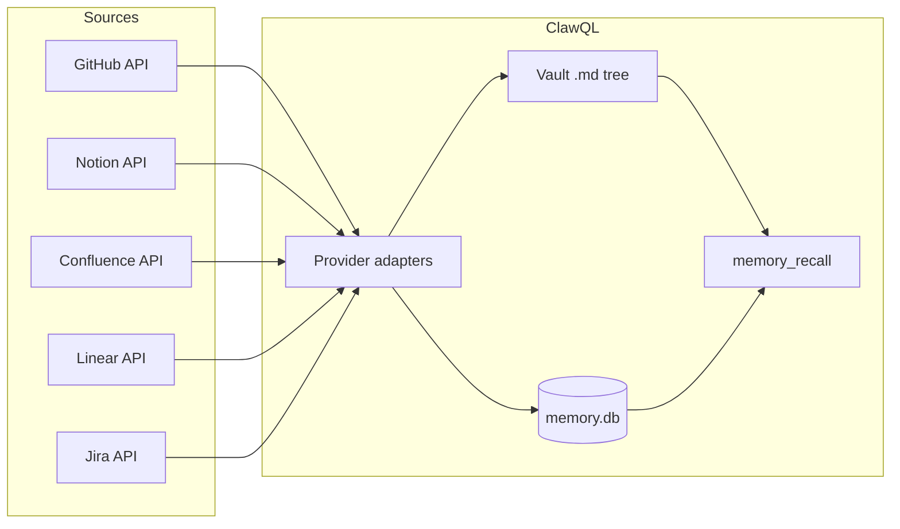

# Knowledge lake: full repo & SaaS ingest (roadmap)

This document describes the **product direction**: point ClawQL at a **GitHub repository** (and later **Notion**, **Confluence**, **Linear**, **Jira**) and build a **durable knowledge base** under the Obsidian vault — **Markdown on disk** + optional **`memory.db`** chunking, wikilinks, vectors, and **`memory_recall`** — so teams can **ask questions** against *everything* the connector imports (configs, docs, issues, vendor-specific records).

**Today:** [`ingest_external_knowledge`](external-ingest.md) supports **bulk Markdown** and **single-URL fetch** with formatting. **Full providers** are the next layer on top of the same pipeline.

---

## Goals

| Goal | Meaning |
| ---- | ------- |
| **Completeness** | Ingest *authorized* content: source files, READMEs, docs trees, issue/PR bodies, labels, milestones — per provider capabilities. |
| **Queryable** | Same retrieval story as the rest of ClawQL memory: keyword + graph + optional **embeddings** (`CLAWQL_VECTOR_BACKEND`). |
| **Incremental** | Re-sync without rewriting the whole vault: cursors (`ETag`, `since`, `updated_at`), skip unchanged blobs. |
| **Tenant-safe** | Tokens in env / secret manager; never log secrets; respect org/repo ACLs. |

---

## Architecture (unchanged spine)



Each **provider** normalizes to **Markdown notes** (YAML frontmatter for stable ids, timestamps, source URLs) under a **predictable path prefix**, then calls the same **`syncMemoryDbForVaultScanRoot`** (and optional vectors) as manual ingest.

---

## 1. GitHub repository (first priority)

### What to pull (phased)

| Phase | Content | API surface (indicative) |
| ----- | ------- | ------------------------- |
| **G1 — Code & docs** | Default branch tree: `README*`, `docs/**`, `*.md`, selected configs (`package.json`, `Dockerfile`, `*.yaml`, …) | [Git Trees](https://docs.github.com/en/rest/git/trees), [Contents](https://docs.github.com/en/rest/repos/contents) |
| **G2 — Issues & PRs** | Issues (open/closed per policy), bodies, comments, labels; PRs as optional | REST or [GraphQL](https://docs.github.com/en/graphql) |
| **G3 — Richer** | Releases, wiki if enabled, Discussions (if API coverage fits) | REST / GraphQL |

### Suggested vault layout

```text
External/github/<owner>/<repo>/
  _meta.md                 # sync cursor, commit SHA, last run
  tree/                    # mirror of selected paths → .md
  issues/
    <number>-<slug>.md
  pull/
    <number>-<slug>.md     # optional
```

Frontmatter keys (example): `clawql_source: github`, `github_id`, `updated_at`, `html_url`.

### Operational constraints

- **Auth:** `GITHUB_TOKEN` (fine-scoped PAT or GitHub App installation token).
- **Rate limits:** respect REST/GraphQL quotas; exponential backoff; optional **webhook**-driven incremental sync for orgs that can expose a receiver (future).
- **Size:** cap single-file size; exclude `node_modules/`, `.git`, binary blobs (or store “binary placeholder” notes).
- **Private repos:** same as API access — token must allow read.

### Why not “clone git” only?

A bare **clone** gives files but not **issues/PR metadata** in one shot. **API-first** (or **clone + API for issues**) matches “all issues + all docs” and keeps incremental sync tractable.

---

## 2. Notion

- **API:** [Notion API](https://developers.notion.com/) — pages, databases, blocks.
- **Ingest:** Expand blocks to Markdown-like text; database rows → one note per row or templated sections.
- **Auth:** Integration token + shared pages/databases.

---

## 3. Confluence

- **API:** [Confluence Cloud REST](https://developer.atlassian.com/cloud/confluence/rest/) (and Data Center variants).
- **Ingest:** Pages → Markdown (HTML export or storage format → existing HTML→MD path); spaces → folder prefix.
- **Auth:** API token / OAuth per Atlassian policy.

---

## 4. Linear

- **API:** [Linear GraphQL API](https://developers.linear.app/docs/graphql/working-with-the-graphql-api) — issues, projects, teams, comments.
- **Ingest:** Issues as `External/linear/<team>/<issue-id>.md` with frontmatter for state, priority, links.

---

## 5. Jira

- **API:** [Jira Cloud REST](https://developer.atlassian.com/cloud/jira/platform/rest/v3/) — issues, fields, comments, attachments metadata.
- **Ingest:** Issues as Markdown notes; JQL-driven “what to pull” (project, updated since, …).

---

## Cross-cutting concerns

| Topic | Approach |
| ----- | -------- |
| **Dedup / identity** | Stable ids in frontmatter; optional Cuckoo over `chunk_id` for membership checks at recall time (already in hybrid memory). |
| **Merkle / integrity** | Optional snapshot over ingested doc set for “what did we index?” audits ([#37](https://github.com/danielsmithdevelopment/ClawQL/issues/37)). |
| **Multi-tenant** | One MCP process per deployment; separate vault paths or env per customer; no cross-tenant vault paths. |
| **Answers beyond recall** | Today: **`memory_recall`** + agent reasoning. Future: optional **RAG** tool that composes recall + LLM — out of scope for connector-only work. |

---

## Implementation tracking

- Umbrella: [#40](https://github.com/danielsmithdevelopment/ClawQL/issues/40) (external ingest), epic [#24](https://github.com/danielsmithdevelopment/ClawQL/issues/24) (hybrid memory).
- **Next concrete step:** `source: "github"` (or dedicated **`ingest_github_repo`**) behind **`CLAWQL_EXTERNAL_INGEST`** (or a dedicated flag), implementing **G1** (tree + Markdown/config text) with **`dryRun`** and a documented **`GITHUB_TOKEN`**.

---

## Related docs

- **[external-ingest.md](external-ingest.md)** — current tool behavior and env.
- **[memory-db-hybrid-implementation.md](memory-db-hybrid-implementation.md)** — `memory.db`, chunking, vectors.
- **[hybrid-memory-backends.md](hybrid-memory-backends.md)** — Postgres / sqlite-vec.
