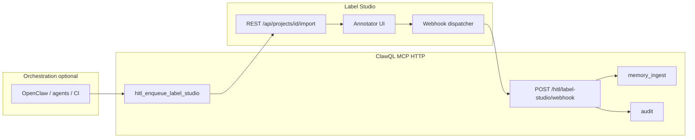
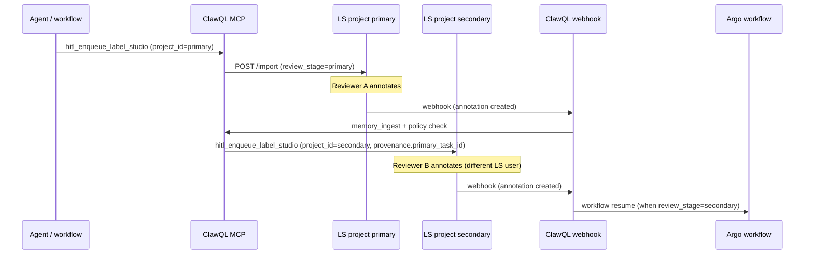

# HITL — Label Studio bridge (optional)

**Issue:** [#228](https://github.com/danielsmithdevelopment/ClawQL/issues/228).  
**Upstream product:** [Label Studio](https://labelstud.io/) — open-source labeling, AI evaluation, and human-in-the-loop workflows (Community Edition or your deployment; API and webhooks per [their documentation](https://labelstud.io/guide/)).

This document is the **operator’s guide** for ClawQL: how the MCP tool and HTTP webhook integrate with Label Studio, how to secure and deploy them, and how they fit **OpenClaw** / IDP-style confidence routing. A shorter **website overview** lives at **`/hitl-label-studio`** on the docs site.

---

## 1. What ClawQL provides

ClawQL does **not** ship Label Studio. It adds:

| Surface                                    | Purpose                                                                                                                                        |
| ------------------------------------------ | ---------------------------------------------------------------------------------------------------------------------------------------------- |
| MCP **`hitl_enqueue_label_studio`**        | Create **review tasks** in a Label Studio **project** via REST **import** (`POST /api/projects/{id}/import`).                                  |
| HTTP **`POST /hitl/label-studio/webhook`** | Receive **webhooks** from Label Studio when annotations change; persist outcomes via **`memory_ingest`** (vault) or **`audit`** (ring buffer). |

**Opt-in:** set **`CLAWQL_ENABLE_HITL_LABEL_STUDIO=1`**. Without it, neither the tool nor the webhook route is registered.

---

## 2. End-to-end architecture



**Outbound (ClawQL → Label Studio):** ClawQL calls your Label Studio **base URL** with **`Authorization: Token <user token>`** (Label Studio’s standard token auth on the API).

**Inbound (Label Studio → ClawQL):** Label Studio POSTs JSON event payloads to **`https://<clawql-public-host>/hitl/label-studio/webhook`**. ClawQL validates **`CLAWQL_HITL_WEBHOOK_TOKEN`** (see §7), then records the payload.

---

## 3. Label Studio prerequisites (your deployment)

1. **Run Label Studio** somewhere reachable from the ClawQL process (same VPC, tailnet, or routable URL). Common options from [Label Studio quick start](https://labelstud.io/guide/install.html): **`pip install label-studio`**, **Docker** (`heartexlabs/label-studio`), or enterprise/hosted equivalents.
2. **Create a project** in the UI. Note the numeric **project id** (appears in URLs and API paths): this is **`project_id`** for the MCP tool.
3. **Define labeling config** so **`task.data`** fields match what you send from ClawQL (e.g. `text`, `context`, custom JSON). The MCP tool passes arbitrary keys under each task’s **`data`** object.
4. **Create an API token** for a user that can **import tasks** (Account / Settings → Access Token, or your deployment’s equivalent). This value is **`CLAWQL_LABEL_STUDIO_API_TOKEN`**.
5. **Webhooks:** In the project (or organization) settings, add a webhook URL pointing to ClawQL **HTTPS** endpoint **`/hitl/label-studio/webhook`**, and subscribe to the events you need (e.g. annotation created/updated — align with your Label Studio version’s webhook UI). Attach the **same shared secret** you put in **`CLAWQL_HITL_WEBHOOK_TOKEN`** using Bearer or header (§7).

---

## 4. ClawQL configuration reference

### 4.1 Feature flag

| Env                                     | Meaning                                                                                                                                                                                                                 |
| --------------------------------------- | ----------------------------------------------------------------------------------------------------------------------------------------------------------------------------------------------------------------------- |
| **`CLAWQL_ENABLE_HITL_LABEL_STUDIO=1`** | Registers **`hitl_enqueue_label_studio`** and mounts **`POST /hitl/label-studio/webhook`** on the Streamable HTTP server (**`clawql-mcp-http`**). Does **not** affect stdio-only workflows unless you also expose HTTP. |

### 4.2 Label Studio REST client

| Env                                 | Meaning                                                                                                                                                          |
| ----------------------------------- | ---------------------------------------------------------------------------------------------------------------------------------------------------------------- |
| **`CLAWQL_LABEL_STUDIO_URL`**       | Base URL **without** trailing slash (e.g. `http://localhost:8080`, `https://label-studio.internal`). Used for **`POST {URL}/api/projects/{project_id}/import`**. |
| **`CLAWQL_LABEL_STUDIO_API_TOKEN`** | User token for **`Authorization: Token …`** on import requests.                                                                                                  |

### 4.3 Webhook authentication

| Env                             | Meaning                                                                                                                                                                                                                                                                                                                                                                                |
| ------------------------------- | -------------------------------------------------------------------------------------------------------------------------------------------------------------------------------------------------------------------------------------------------------------------------------------------------------------------------------------------------------------------------------------- |
| **`CLAWQL_HITL_WEBHOOK_TOKEN`** | Shared secret. Send as **`Authorization: Bearer <token>`** or **`X-Clawql-Hitl-Token: <token>`**. **Required** for the webhook to accept traffic when **`NODE_ENV=production`** (otherwise ClawQL returns **503** until set). In non-production, if unset, requests are accepted **without** bearer validation (development convenience — **do not rely on this in shared networks**). |

### 4.4 Durable outcomes

| Condition                                                                                 | Webhook persistence                                                                                                                                                                     |
| ----------------------------------------------------------------------------------------- | --------------------------------------------------------------------------------------------------------------------------------------------------------------------------------------- |
| **`CLAWQL_ENABLE_MEMORY`** not disabled **and** writable **`CLAWQL_OBSIDIAN_VAULT_PATH`** | **`memory_ingest`** appends to vault note title **`HITL Label Studio review`**; raw JSON in **`toolOutputs`**; **`sessionId`** from **`data.clawql_hitl.correlation_id`** when present. |
| Otherwise                                                                                 | **`audit`** append-only line (category **`hitl`**, action **`label_studio_webhook`**) — **not** durable compliance-grade alone.                                                         |

### 4.5 Workflow auto-resume (Argo HITL, [#254](https://github.com/danielsmithdevelopment/ClawQL/issues/254))

| Env                                         | Meaning                                                                                                                                                                                                                                                          |
| ------------------------------------------- | ---------------------------------------------------------------------------------------------------------------------------------------------------------------------------------------------------------------------------------------------------------------- |
| **`CLAWQL_HITL_WEBHOOK_RESUME_WORKFLOW=1`** | After webhook auth, call **`workflow` `resume`** when **`data.clawql_hitl.workflow`** (from **`workflow_ref`** on enqueue) or **`provenance.workflow_namespace` / `workflow_name`** is present. Requires **`CLAWQL_ENABLE_WORKFLOW=1`** and namespace allowlist. |

Webhook JSON responses include **`workflow_resume`** when a resume was attempted (`ok`, `resumed_nodes`, or `error`).

### 4.6 NATS JetStream (async HITL path, [#254](https://github.com/danielsmithdevelopment/ClawQL/issues/254))

When Helm deploys NATS (`nats.enabled=true`), ClawQL can **publish** and **consume** workflow events on JetStream subject roots (`clawql.workflow.*`). Use this for multi-replica HTTP, async replay, or decoupled producers (edge, Ouroboros).

| Env                                          | Meaning                                                                                                                   |
| -------------------------------------------- | ------------------------------------------------------------------------------------------------------------------------- |
| **`CLAWQL_NATS_URL`**                        | NATS server URL (injected by Helm when `nats.enabled=true`).                                                              |
| **`CLAWQL_NATS_JETSTREAM=1`**                | Require JetStream (set by Helm when `nats.jetStream.enabled=true`).                                                       |
| **`CLAWQL_NATS_ENABLE_PUBLISH=1`**           | Publish `hitl.enqueued`, `hitl.completed`, `workflow.suspended`, `workflow.resumed` events.                               |
| **`CLAWQL_NATS_ENABLE_CONSUMER=1`**          | Start in-process JetStream consumer worker.                                                                               |
| **`CLAWQL_NATS_CONSUMER_RESUME_WORKFLOW=1`** | Consumer calls **`workflow` `resume`** on **`clawql.workflow.hitl.completed`** (requires **`CLAWQL_ENABLE_WORKFLOW=1`**). |

**Dual path:** keep **`CLAWQL_HITL_WEBHOOK_RESUME_WORKFLOW=1`** for synchronous resume in the webhook handler; enable the NATS consumer for async / multi-pod deployments. If both run, duplicate resume attempts on an already-resumed workflow are treated as success.

Deep dive: [`docs/deployment/helm.md`](../deployment/helm.md#nats-jetstream-deep-dive) · lending W-2 sample: [`deployment/samples/lending-w2/`](../../deployment/samples/lending-w2/README.md).

---

## 5. MCP tool: `hitl_enqueue_label_studio`

### 5.1 Parameters

| Field                | Required | Description                                                                                                                                                                                         |
| -------------------- | -------- | --------------------------------------------------------------------------------------------------------------------------------------------------------------------------------------------------- |
| **`project_id`**     | yes      | Integer primary key of the Label Studio project (`/api/projects/{id}/import`).                                                                                                                      |
| **`tasks`**          | yes      | Non-empty array (max 100 in schema). Each element: **`data`** — object shown to annotators as **`task.data`**; optional **`meta`** — merged into **`data.meta`**.                                   |
| **`confidence`**     | no       | Number in **[0, 1]** stored under **`data.clawql_hitl.confidence`** for reviewer context (your policy maps low scores here).                                                                        |
| **`correlation_id`** | no       | String for cross-system correlation (OpenClaw run id, request id). Stored under **`data.clawql_hitl.correlation_id`**; echoed into webhook **`memory_ingest`** **`sessionId`** when present.        |
| **`seed_id`**        | no       | Optional Ouroboros / workflow seed id — **`data.clawql_hitl.seed_id`**.                                                                                                                             |
| **`workflow_ref`**   | no       | Argo Workflow to resume on webhook when **`CLAWQL_HITL_WEBHOOK_RESUME_WORKFLOW=1`** — stored as **`data.clawql_hitl.workflow`** (`namespace`, `name`, optional `node_field_selector`).              |
| **`provenance`**     | no       | Arbitrary JSON object under **`data.clawql_hitl.provenance`** (doc URLs, pipeline ids — avoid secrets). May include `workflow_namespace` / `workflow_name` as an alternative to **`workflow_ref`**. |

Every task also receives **`data.clawql_hitl.enqueued_at`** (ISO timestamp) and **`data.clawql_hitl.source`** = **`clawql_mcp`**.

### 5.2 Example (minimal)

```json
{
  "project_id": 3,
  "tasks": [
    {
      "data": {
        "text": "Model output to review",
        "context": "ticket-4412"
      }
    }
  ],
  "confidence": 0.42,
  "correlation_id": "req-2026-04-28-abc123",
  "provenance": {
    "document_url": "https://internal/wiki/runbook"
  }
}
```

### 5.3 Errors

- Missing **`CLAWQL_LABEL_STUDIO_URL`** or **`CLAWQL_LABEL_STUDIO_API_TOKEN`**: tool returns JSON **`error`** explaining configuration.
- Label Studio HTTP non-success: tool returns **`error`**, **`detail`** (truncated response body).

---

## 6. HTTP webhook: `POST /hitl/label-studio/webhook`

**Only when** **`CLAWQL_ENABLE_HITL_LABEL_STUDIO=1`**.

- **Path:** **`/hitl/label-studio/webhook`** (fixed; not under **`MCP_PATH`**).
- **Method:** **POST** with **`Content-Type: application/json`** (Label Studio default).
- **Auth:** **`Authorization: Bearer &lt;CLAWQL_HITL_WEBHOOK_TOKEN&gt;`** or **`X-Clawql-Hitl-Token`**.

ClawQL parses common Label Studio webhook shapes: top-level **`task`**, **`annotation`**, **`task_id`**, etc. **`correlation_id`** is read from **`task.data.clawql_hitl.correlation_id`** when present.

**Ingress:** Expose this path on the same host/port as Streamable HTTP (e.g. **`https://mcp.example.com/hitl/label-studio/webhook`**). Use TLS termination at your load balancer or Ingress; Label Studio must be able to **reach** this URL (firewall / network policy).

---

## 7. Security checklist

1. **TLS** on the ClawQL webhook URL in production (Label Studio should not POST secrets over plain HTTP across untrusted networks).
2. **Rotate** **`CLAWQL_HITL_WEBHOOK_TOKEN`** and Label Studio webhook configuration together.
3. **Restrict** network access: only Label Studio egress (or your approved automation) should hit **`/hitl/label-studio/webhook`**.
4. **Do not** put raw API keys or PII inside **`provenance`** or task **`data`** fields if logs or vault notes are widely readable.
5. **`NODE_ENV=production`**: webhook **requires** **`CLAWQL_HITL_WEBHOOK_TOKEN`** to be set (503 otherwise).

---

## 8. Confidence policy (OpenClaw / IDP)

ClawQL does **not** implement model routing. Recommended pattern:

| Confidence    | Typical action                                                                                                                                                         |
| ------------- | ---------------------------------------------------------------------------------------------------------------------------------------------------------------------- |
| **≥ 0.9**     | Auto-approve (subject to domain policy and **`execute`** allowlists).                                                                                                  |
| **0.7 – 0.9** | Optional sampling or spot HITL.                                                                                                                                        |
| **&lt; 0.7**  | Call **`hitl_enqueue_label_studio`** with **`confidence`** set; **`notify`** optional Slack alert ([#77](https://github.com/danielsmithdevelopment/ClawQL/issues/77)). |

OpenClaw or your orchestrator decides thresholds; ClawQL only **stores** the numeric hint on the task and **records** webhook outcomes.

**Bootstrap:** [`docs/openclaw/clawql-bootstrap.md`](openclaw/clawql-bootstrap.md) ([#226](https://github.com/danielsmithdevelopment/ClawQL/issues/226)). Umbrella: [#128](https://github.com/danielsmithdevelopment/ClawQL/issues/128).

---

## 9. Helm / Kubernetes

In **`charts/clawql-mcp`**:

- Set **`enableHitlLabelStudio: true`** to inject **`CLAWQL_ENABLE_HITL_LABEL_STUDIO=1`**.
- Supply **`CLAWQL_LABEL_STUDIO_URL`**, **`CLAWQL_LABEL_STUDIO_API_TOKEN`**, **`CLAWQL_HITL_WEBHOOK_TOKEN`** via **`extraEnv`** or **`envFromSecret`** (recommended for tokens).

Ensure **Ingress** or **LoadBalancer** exposes **`/hitl/label-studio/webhook`** to Label Studio. If you terminate TLS at Ingress, use the **public HTTPS URL** in Label Studio’s webhook configuration.

**Label Studio deployment (BYO):** This chart does **not** install Label Studio. Point **`CLAWQL_LABEL_STUDIO_URL`** at your instance:

| Edition        | Install                                                                                                    | RBAC                                                                                          |
| -------------- | ---------------------------------------------------------------------------------------------------------- | --------------------------------------------------------------------------------------------- |
| **Community**  | [Docker `heartexlabs/label-studio`](https://labelstud.io/guide/install.html) or `pip install label-studio` | No org/project RBAC — see [§14 Multi-reviewer RBAC](#14-multi-reviewer-rbac-ce-vs-enterprise) |
| **Enterprise** | [HumanSignal install guide](https://docs.humansignal.com/guide/install) (license required)                 | Native Annotator / Reviewer roles, SAML, workspaces                                           |

Example **`extraEnv`** / Secret keys only (no paid bits in-chart):

```yaml
enableHitlLabelStudio: true
extraEnv:
  - name: CLAWQL_LABEL_STUDIO_URL
    value: "https://label-studio.internal"
  # CLAWQL_LABEL_STUDIO_API_TOKEN and CLAWQL_HITL_WEBHOOK_TOKEN from envFromSecret
```

Full keys table: [`docs/deployment/helm.md`](deployment/helm.md).

---

## 10. Troubleshooting

| Symptom                           | Checks                                                                               |
| --------------------------------- | ------------------------------------------------------------------------------------ |
| Tool missing from **`listTools`** | **`CLAWQL_ENABLE_HITL_LABEL_STUDIO=1`**; rebuild/restart server.                     |
| **`not configured`** from tool    | **`CLAWQL_LABEL_STUDIO_URL`** and **`CLAWQL_LABEL_STUDIO_API_TOKEN`** both set.      |
| Import HTTP 401/403               | Token valid for project; user can import; URL matches Label Studio host.             |
| Import HTTP 404                   | **`project_id`** matches an existing project.                                        |
| Webhook **503** in production     | Set **`CLAWQL_HITL_WEBHOOK_TOKEN`**.                                                 |
| Webhook **401**                   | Bearer / header matches token; Label Studio outbound IP allowlisted if applicable.   |
| Nothing in vault after webhook    | **`CLAWQL_ENABLE_MEMORY=0`** or missing vault path → check **`audit`** instead.      |
| Duplicate vault sections          | **`memory_ingest`** dedupes identical payloads; vary payload or use **`sessionId`**. |

---

## 11. Verification checklist

1. **`listTools`** includes **`hitl_enqueue_label_studio`** when flag is on.
2. **`curl`** Label Studio **`GET /api/projects/`** with same token (sanity).
3. Call **`hitl_enqueue_label_studio`** with one test task → task appears in Label Studio UI.
4. Complete annotation → webhook fires → new **`Memory/...`** note or **`audit`** entry in ClawQL.
5. Optional: **`notify`** Slack message on enqueue or on webhook handler (orchestration-side).

---

## 12. Related documentation

| Doc                                                                                        | Topic                                                                                                  |
| ------------------------------------------------------------------------------------------ | ------------------------------------------------------------------------------------------------------ |
| [`docs/mcp/mcp-tools.md`](mcp-tools.md)                                                    | **`hitl_enqueue_label_studio`** in tools matrix                                                        |
| [`docs/mcp/notify-tool.md`](notify-tool.md)                                                | Slack **`notify`** ([#77](https://github.com/danielsmithdevelopment/ClawQL/issues/77))                 |
| [`docs/openclaw/clawql-bootstrap.md`](openclaw/clawql-bootstrap.md)                        | OpenClaw MCP registration                                                                              |
| [`docs/deployment/helm.md`](deployment/helm.md)                                            | **`enableHitlLabelStudio`**                                                                            |
| [`docs/mcp/enterprise-mcp-tools.md`](enterprise-mcp-tools.md)                              | Feature-flag table                                                                                     |
| [`deployment/samples/lending-w2/README.md`](../../deployment/samples/lending-w2/README.md) | W-2 HITL + suspend/resume sample ([#253](https://github.com/danielsmithdevelopment/ClawQL/issues/253)) |
| [Label Studio docs](https://labelstud.io/guide/)                                           | Import API, webhooks, projects                                                                         |
| [Label Studio CE vs Enterprise](https://labelstud.io/guide/label_studio_compare)           | RBAC capability matrix (upstream)                                                                      |

---

## 14. Multi-reviewer RBAC (CE vs Enterprise) ([#249](https://github.com/danielsmithdevelopment/ClawQL/issues/249))

ClawQL integrates with **your** Label Studio deployment. **Who may import, annotate, and approve** is governed by Label Studio edition and your operator patterns — not by ClawQL MCP flags alone.

**Upstream references (version your deployment against these):**

- [Community vs Enterprise comparison](https://labelstud.io/guide/label_studio_compare)
- [Enterprise roles and permissions](https://labelstud.io/guide/enterprise_features)
- [Manage RBAC (Enterprise)](https://labelstud.io/guide/manage_users.html)
- [SAML / SSO (Enterprise)](https://docs.humansignal.com/guide/auth_setup)

### 14.1 Capability matrix (Label Studio)

| Capability                                        | Community Edition | Starter Cloud | Enterprise |
| ------------------------------------------------- | ----------------- | ------------- | ---------- |
| **Org / workspace RBAC**                          | ❌                | Limited       | ✅         |
| **Project roles (Annotator / Reviewer)**          | ❌                | ✅            | ✅         |
| **Assign tasks to specific users**                | ❌                | ✅            | ✅         |
| **Assign reviewers to tasks**                     | ❌                | ✅            | ✅         |
| **Role-based review workflows**                   | ❌                | Limited       | ✅         |
| **Fine-grained action permissions**               | ❌                | ❌            | ✅         |
| **SAML / LDAP SSO**                               | ❌                | ❌            | ✅         |
| **REST import API** (`/api/projects/{id}/import`) | ✅                | ✅            | ✅         |
| **Project webhooks**                              | ✅                | ✅            | ✅         |

ClawQL needs only **import API + webhooks** on the Label Studio side. Multi-reviewer policy is **your** choice of edition plus orchestration.

### 14.2 ClawQL role mapping (who does what)

| Action                                | Typical actor            | ClawQL / Label Studio surface                                                                                                                                                     | CE note                                                                                                             |
| ------------------------------------- | ------------------------ | --------------------------------------------------------------------------------------------------------------------------------------------------------------------------------- | ------------------------------------------------------------------------------------------------------------------- |
| **Enqueue review tasks**              | Agent, CI, or automation | MCP **`hitl_enqueue_label_studio`** → LS **import**                                                                                                                               | Use a **dedicated service account** token in **`CLAWQL_LABEL_STUDIO_API_TOKEN`** — not a human annotator’s password |
| **Annotate / label**                  | Human reviewer(s)        | Label Studio UI on **`task.data`**                                                                                                                                                | On CE, any user with project access can edit; **separate LS accounts** per person                                   |
| **Approve / reject (policy)**         | Second reviewer or lead  | LS **Reviewer** role (Enterprise) **or** orchestration on webhook (CE pattern below)                                                                                              | CE has no native “reviewer only” role                                                                               |
| **Record decision + resume pipeline** | ClawQL + optional Argo   | **`POST /hitl/label-studio/webhook`** → **`memory_ingest`** / **`audit`**; optional **`workflow` `resume`** ([#254](https://github.com/danielsmithdevelopment/ClawQL/issues/254)) | Webhook token restricts **who can POST to ClawQL**, not who annotates in LS                                         |

### 14.3 Community Edition workarounds

When Enterprise RBAC is not available, use **process + account separation** instead of native roles:

1. **Import-only automation account** — One Label Studio user + API token used **only** by ClawQL (`CLAWQL_LABEL_STUDIO_API_TOKEN`). Humans never share this token.
2. **Per-person Label Studio logins** — Annotators use individual accounts; do not reuse the automation token in browsers.
3. **Project separation** — Different projects for different sensitivity levels or review stages (e.g. `lending-w2-primary` vs `lending-w2-secondary`).
4. **Webhook merge policy in orchestration** — OpenClaw, **`workflow`**, or a small policy service decides when a Label Studio completion is **final** vs needs another hop (see §14.4).
5. **Network chokepoint** — Expose **`/hitl/label-studio/webhook`** only to Label Studio egress; use **`CLAWQL_HITL_WEBHOOK_TOKEN`** in production ([#228](https://github.com/danielsmithdevelopment/ClawQL/issues/228)).

**What CE cannot enforce natively:** preventing User A from editing User B’s annotations in the same project, or hiding the import API from non-automation users. Mitigate with **separate projects**, **separate instances**, or **upgrade to Enterprise**.

### 14.4 Recommended pattern: two-person rule on CE (dual-project gate)

Use this when policy requires **two distinct humans** before an IDP pipeline resumes (e.g. lending W-2 [#253](https://github.com/danielsmithdevelopment/ClawQL/issues/253)).



**Setup:**

| Step | Detail                                                                                                                                                                                                                                                                        |
| ---- | ----------------------------------------------------------------------------------------------------------------------------------------------------------------------------------------------------------------------------------------------------------------------------- |
| 1    | Create **two** Label Studio projects (same labeling config XML — see [`deployment/samples/lending-w2/label-studio-config.xml`](../../deployment/samples/lending-w2/label-studio-config.xml)).                                                                                 |
| 2    | **Reviewer A** — access only to **primary** project. **Reviewer B** — access only to **secondary** (on CE: separate logins + discipline; on Enterprise: project-level Annotator/Reviewer roles).                                                                              |
| 3    | Primary enqueue sets **`provenance.review_stage`: `"primary"`** and **`correlation_id`** (workflow id).                                                                                                                                                                       |
| 4    | Webhook handler or agent policy: on primary completion, call **`hitl_enqueue_label_studio`** again with **`project_id`** = secondary, same **`correlation_id`**, **`provenance.review_stage`: `"secondary"`**, and **`provenance.primary_task_id`** from the webhook payload. |
| 5    | On secondary completion, set **`CLAWQL_HITL_WEBHOOK_RESUME_WORKFLOW=1`** (or NATS consumer [#254](https://github.com/danielsmithdevelopment/ClawQL/issues/254)) so Argo **`resume`** runs only after the second review.                                                       |

**Merge policy (explicit):** Treat **`review_stage=secondary`** webhook as **approval**; **`primary`** alone must **not** resume production workflows. Implement the branch in OpenClaw, a thin webhook forwarder, or your agent runbook — ClawQL records every webhook; **gating** is orchestration-side.

Example secondary enqueue (agent / `execute` script):

```json
{
  "project_id": 2,
  "correlation_id": "lending-w2-demo-001",
  "tasks": [
    {
      "data": {
        "text": "Same document excerpt for second review",
        "clawql_hitl": {
          "review_stage": "secondary"
        }
      }
    }
  ],
  "provenance": {
    "review_stage": "secondary",
    "primary_task_id": 42,
    "workflow_namespace": "clawql",
    "workflow_name": "lending-w2-demo-001"
  },
  "workflow_ref": {
    "namespace": "clawql",
    "name": "lending-w2-demo-001"
  }
}
```

### 14.5 Enterprise path (BYO license)

When native RBAC, SAML, and reviewer assignment are required:

1. Deploy **Label Studio Enterprise** per [HumanSignal documentation](https://docs.humansignal.com/guide/install) — **ClawQL does not redistribute** enterprise images or licenses.
2. Map IdP groups → **Annotator** / **Reviewer** / **Manager** per [role matrix](https://labelstud.io/guide/manage_users.html).
3. Point **`CLAWQL_LABEL_STUDIO_URL`** at the enterprise instance; use a **Manager** or **service** token with import permission for **`CLAWQL_LABEL_STUDIO_API_TOKEN`**.
4. Enable **`enableHitlLabelStudio`** on **`charts/clawql-mcp`**; store tokens in Vault / ESO ([#241](https://github.com/danielsmithdevelopment/ClawQL/issues/241)).
5. Optional: single-project **review workflow** with Enterprise assign-reviewers — ClawQL enqueue + webhook unchanged ([#228](https://github.com/danielsmithdevelopment/ClawQL/issues/228)).

**Pre-annotations and vertical packs** (faster annotator UX) are tracked separately in [#247](https://github.com/danielsmithdevelopment/ClawQL/issues/247).

---

## 15. Implementation reference (maintainers)

- **`src/hitl-label-studio.ts`** — import client, webhook handler, **`memory_ingest`** / **`audit`** branching.
- **`src/tools.ts`** — MCP registration.
- **`src/server-http.ts`** — webhook route when flag enabled.
- Tests: **`src/hitl-label-studio.test.ts`**, **`src/server-http.test.ts`**, **`src/grpc-hitl-parity.test.ts`**.
