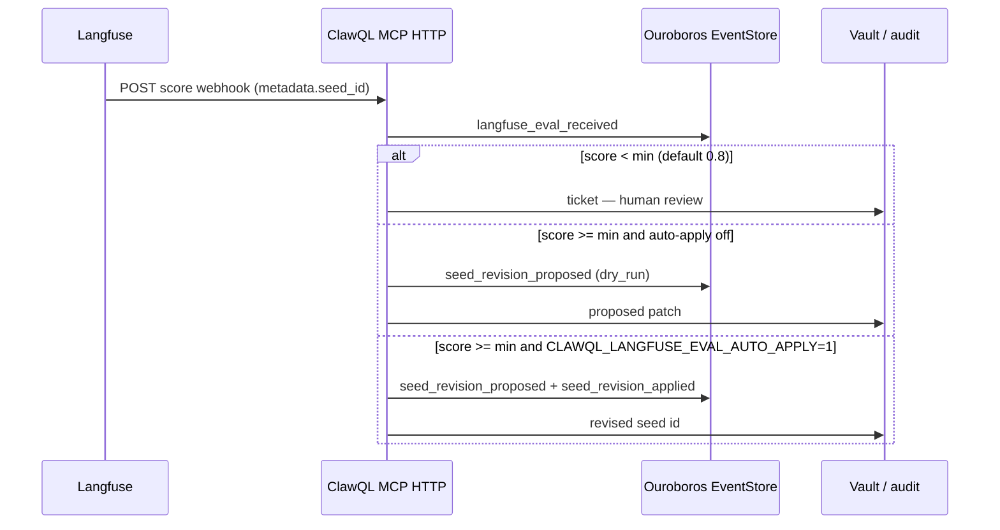

# Langfuse eval → Ouroboros seed revision (optional)

**Issue:** [#250](https://github.com/danielsmithdevelopment/ClawQL/issues/250) — active learning: production eval scores gate Ouroboros seed bumps.

## 1. What ClawQL provides

When **`CLAWQL_ENABLE_LANGFUSE_EVAL=1`** and **`CLAWQL_ENABLE_OUROBOROS=1`**:

| Surface                                         | Purpose                                                    |
| ----------------------------------------------- | ---------------------------------------------------------- |
| **`POST /observability/langfuse/webhook`**      | Ingest Langfuse (or compatible) score webhooks             |
| **`ouroboros_propose_seed_revision_from_eval`** | Same normalization + gating from MCP (requires both flags) |

**Default-off auto-apply:** seed lineage is **never** mutated unless **`CLAWQL_LANGFUSE_EVAL_AUTO_APPLY=1`** (or per-call `autoApply: true` on the MCP tool). Without it, ClawQL records a **proposed** patch and vault/audit trail only.

## 2. Happy path



1. **Instrument traces** with `metadata.seed_id` (or `clawql_seed_id` / `ouroboros_seed_id`) matching the Ouroboros lineage root id.
2. **Configure Langfuse** (or your exporter) to POST score events to **`https://<mcp-host>/observability/langfuse/webhook`** with **`Authorization: Bearer <CLAWQL_LANGFUSE_WEBHOOK_TOKEN>`**.
3. **Low score** → `action: "ticket"` — no seed mutation; use HITL or manual triage.
4. **High score** → proposed patch adds an `evaluation_principles` entry and an `acceptance_criteria` line tied to the metric.
5. **Explicit promote** → set **`CLAWQL_LANGFUSE_EVAL_AUTO_APPLY=1`** only after you trust the gate; new `seed_id` is appended to lineage events.

## 3. Configuration reference

| Variable                          | Default | Notes                                         |
| --------------------------------- | ------- | --------------------------------------------- |
| `CLAWQL_ENABLE_LANGFUSE_EVAL`     | off     | Registers webhook + MCP tool (with Ouroboros) |
| `CLAWQL_ENABLE_OUROBOROS`         | off     | Required for lineage load / apply             |
| `CLAWQL_LANGFUSE_WEBHOOK_TOKEN`   | unset   | **Required** when `NODE_ENV=production`       |
| `CLAWQL_LANGFUSE_EVAL_MIN_SCORE`  | `0.8`   | Threshold for propose vs ticket               |
| `CLAWQL_LANGFUSE_EVAL_AUTO_APPLY` | off     | `1` / `true` / `yes` to mutate seeds          |

Helm: **`enableLangfuseEval: true`** (pairs with **`enableOuroboros: true`**). Inject **`CLAWQL_LANGFUSE_WEBHOOK_TOKEN`** via **`extraEnv`** / **`envFromSecret`**.

## 4. Webhook payload shapes

ClawQL normalizes common Langfuse export / webhook JSON:

```json
{
  "score": { "name": "accuracy", "value": 0.92, "comment": "good run" },
  "trace": { "id": "trace-abc", "metadata": { "seed_id": "seed_root_01" } }
}
```

Flat bodies with `value` / `scoreName` / `metadata.seed_id` are also accepted.

## 5. MCP tool example

```json
{
  "scoreValue": 0.91,
  "scoreName": "accuracy",
  "seedId": "seed_root_01",
  "autoApply": false
}
```

Or pass a raw **`payload`** from Langfuse. Response includes **`action`**, **`dryRun`**, **`proposal`**, and optional **`revisedSeed`** when applied.

## 6. Durability

Webhook handling appends to **`memory_ingest`** when the vault is writable; otherwise **`audit`**. Ouroboros events (`langfuse_eval_received`, `seed_revision_proposed`, `seed_revision_applied`) are stored when Postgres (or in-memory) event store is active.

## 7. Related docs

- **[`mcp-tools.md`](mcp-tools.md)** — flag table
- **[`../ouroboros/clawql-ouroboros.md`](../ouroboros/clawql-ouroboros.md)** — seed / lineage model
- **[`hitl-label-studio.md`](hitl-label-studio.md)** — human review for low-confidence paths ([#249](https://github.com/danielsmithdevelopment/ClawQL/issues/249))
