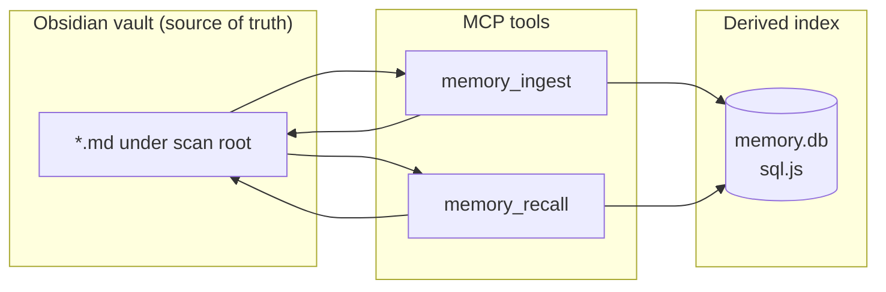

# Hybrid `memory.db` implementation — technical narrative (GitHub #27)

This document explains **what was built**, **why**, **how the pieces fit together**, and **how to operate** the SQLite sidecar beside the Obsidian vault. It complements the schema reference **[memory-db-schema.md](memory-db-schema.md)** with implementation detail and file-level navigation.

**Optional Postgres (vectors + future Cuckoo / Merkle):** see **[hybrid-memory-backends.md](hybrid-memory-backends.md)** for the dual-backend story and migration conventions.

---

## 1. Context and goals

### 1.1 Issue tracking

| Item | Role |
|------|------|
| **[#27](https://github.com/danielsmithdevelopment/ClawQL/issues/27)** | Primary driver: **`memory.db` schema**, **wikilink relations**, **chunking contract**, migrations, ingest + recall wiring. |
| **[#24](https://github.com/danielsmithdevelopment/ClawQL/issues/24)** | Epic: hybrid memory (sqlite-vec + Cuckoo + vault); this work is the **relational foundation** before vectors and membership filters land. |
| **[#16](https://github.com/danielsmithdevelopment/ClawQL/issues/16)** | **Shipped for `memory_recall`:** optional embeddings + sqlite/postgres vector backends (see **`hybrid-memory-backends.md`**). **Still open / future:** semantic retrieval for spec **`search`**; **`vector-search-design.md`** tracks direction. |

### 1.2 Product intent

- **Vault Markdown stays canonical.** Agents and humans keep editing `.md` files; the DB is a **derived index** for structure, future vectors, and fast membership gates (Cuckoo in #25).
- **No native SQLite bindings** in this phase: the Docker image uses **`npm ci --ignore-scripts`**, and the runtime image is **Distroless**. A WASM-based SQLite (**[sql.js](https://github.com/sql-js/sql.js/)**) avoids `node-gyp` / prebuild fragility while remaining file-backed after explicit `export()` writes.
- **Node 20+ CI** must pass: `better-sqlite3` was rejected for this reason; **sql.js** runs on the whole matrix in **`.github/workflows/ci.yml`**.

---

## 2. Architecture (high level)



- **`memory_ingest`** writes or appends Markdown under `Memory/` (unchanged contract). After a **successful, non-skipped** write, it triggers a **full rescan** of the same subtree `memory_recall` uses and **rebuilds** rows in `memory.db` for every Markdown file in that scan.
- **`memory_recall`** still scores keywords and walks wikilinks **from parsed file contents**. Additionally, when the DB feature is enabled, it **merges** edges read from **`wikilink_edge`** into the adjacency structure so recall can benefit from **persisted** link rows (e.g. after ingest) even before vectors exist.

---

## 3. Schema version and migrations

- **Constant:** `SCHEMA_VERSION = 1` in `src/memory-db.ts` (not exported; bump when adding DDL).
- **Table `schema_migrations`:** `(version INTEGER PK, name TEXT, applied_at TEXT)`.
- **Bootstrap:** `migrate()` creates `schema_migrations` if missing, reads `MAX(version)`, and if `v < 1` runs the full DDL block for `vault_document`, `vault_chunk`, `wikilink_edge`, indexes, and inserts migration row `1 / 'initial' / ISO timestamp`.
- **Foreign keys:** `PRAGMA foreign_keys = ON` is executed at the start of each sync / read session on a connection.

See **[memory-db-schema.md](memory-db-schema.md)** for column-by-column tables.

---

## 4. Chunking contract (`paragraph_v1`)

**Module:** `src/memory-chunk.ts`

| Step | Behavior |
|------|----------|
| 1 | Strip YAML frontmatter via **`stripVaultFrontmatter`** (same semantics as recall). |
| 2 | Compute **`index_body_sha256`** over the indexable body string. |
| 3 | Split the body on **regex `\n{2,}`** (paragraph boundaries). |
| 4 | For each paragraph, **trim** for stored text; **offsets** (`char_start`, `char_end`) refer to positions in the **indexable body** (UTF-16 indices, consistent with JavaScript `String` indexing). |
| 5 | If a trimmed paragraph exceeds **`CLAWQL_MEMORY_CHUNK_MAX_CHARS`** (default **2000**, env override), split into consecutive windows of at most that length (**no overlap** in v1). |

**Stable chunk primary key:**

```text
chunk_id = SHA256("vault|{relativePath}|paragraph_v1|{ordinal}|{content_sha256}")
```

Implemented as **`vaultChunkId()`** so re-ingest replaces the same logical chunk when content hash matches.

---

## 5. Wikilink projection

**Modules:** `src/vault-markdown.ts` (`extractWikilinkTargets`), `src/memory-slug-index.ts` (`buildSlugToVaultPath`), `src/memory-ingest.ts` (`slugifyTitle`)

- For each document in a sync batch, targets are parsed from `[[Page]]` / `[[Page|alias]]` (left side wins), same as `memory_recall`.
- **Resolution:** a batch-local map **slug → vault-relative path** is built from **all documents in that batch** (filename slug + first `# heading` slug), mirroring recall’s resolver.
- **Row shape:** `(from_path, to_target, to_resolved_path)` where `to_target` is the raw display string and `to_resolved_path` is nullable when the target is not in the batch map (outside scan root or missing note).

**Recall merge:** `loadWikilinkEdgesFromDatabase()` batches `IN` queries on `from_path` and returns edges with non-null `to_resolved_path`. Recall only merges an edge if **`to_resolved_path`** is still a path loaded in the current scan (`textByRel.has(to)`), avoiding ghost hops to deleted files.

---

## 6. Module map (source files)

| File | Responsibility |
|------|----------------|
| **`src/vault-markdown.ts`** | Shared **`stripVaultFrontmatter`**, **`extractWikilinkTargets`** — single definition for recall, chunking, and DB sync. |
| **`src/memory-slug-index.ts`** | **`listVaultMarkdownRelPaths`**: directory walk honoring `CLAWQL_MEMORY_RECALL_MAX_FILES`, skipping dot dirs. **`buildSlugToVaultPath`**: slug index from `{ path, text }[]`. |
| **`src/memory-chunk.ts`** | **`planVaultMarkdownChunks`**, **`vaultChunkId`**, strategy constant **`CHUNK_STRATEGY_PARAGRAPH_V1`**. |
| **`src/memory-db.ts`** | sql.js init (`require.resolve("sql.js")` → `sql-wasm.wasm` next to `dist/sql-wasm.js` — works with package **exports**), path resolution, **`migrate`**, **`syncMemoryDbFromDocuments`**, **`syncMemoryDbForVaultScanRoot`**, **`loadWikilinkEdgesFromDatabase`**, **`recallSyncDbEnabled`**, **`memoryDbSyncEnabled`**. |
| **`src/memory-recall.ts`** | Uses slug index + vault markdown helpers; optional **`syncMemoryDbFromDocuments`** when **`CLAWQL_MEMORY_DB_SYNC_ON_RECALL=1`**; merges DB edges when DB enabled; optional vector KNN via **`memory-embedding`** when **`CLAWQL_VECTOR_BACKEND=sqlite`**. Re-exports **`extractWikilinkTargets`** for compatibility. |
| **`src/memory-embedding.ts`** | OpenAI-compatible **`/embeddings`**, **`vectorBackend()`** vs **`effectiveVectorBackend()`** (postgres without URL → sqlite vectors), float32 BLOB helpers, shared ranking (**#26**). |
| **`src/vector-store/pgvector.ts`** | **Postgres + pgvector**: pool, shutdown hooks, upsert after sync, `<=>` KNN for **`memory_recall`**. |
| **`src/memory-backends/postgres-migrations.ts`** | Versioned DDL (`clawql_pg_schema_migrations`); migration **1** = chunk vector table. |
| **`src/memory-backends/types.ts`** | Extension-point types (vectors today; Cuckoo / Merkle placeholders). |
| **`src/memory-ingest.ts`** | After vault lock completes successfully, **`await import("./memory-db.js")`** then **`syncMemoryDbForVaultScanRoot`** — **dynamic import** avoids a static circular dependency (`memory-db` imports `slugifyTitle` from `memory-ingest`). |
| **`src/memory-db.test.ts`**, **`src/memory-chunk.test.ts`** | Contract + persistence tests. |
| **`src/memory-ingest.test.ts`** | Asserts **`memory.db`** exists after ingest. |

---

## 7. Environment variables (operator reference)

| Variable | Default / behavior |
|----------|---------------------|
| **`CLAWQL_OBSIDIAN_VAULT_PATH`** | Required for any vault or DB behavior (unchanged). |
| **`CLAWQL_MEMORY_DB`** | Set **`0`** to disable DB sync on ingest, DB merge on recall, and DB refresh on recall. |
| **`CLAWQL_MEMORY_DB_PATH`** | Relative path is resolved **under the vault** via `resolveVaultPath` (no `..`). Default **`memory.db`**. Absolute paths allowed for custom mount layouts. |
| **`CLAWQL_MEMORY_DB_SYNC_ON_RECALL`** | Set **`1`** to run **`syncMemoryDbFromDocuments`** with the same file set recall just read (full sql.js **export** each time — heavier). Default **unset / off**. |
| **`CLAWQL_MEMORY_CHUNK_MAX_CHARS`** | Paragraph window size before hard-split (`2000`). |
| **`CLAWQL_MEMORY_RECALL_SCAN_ROOT`**, **`CLAWQL_MEMORY_RECALL_MAX_FILES`** | Define which files participate in both recall and **ingest-triggered full rescan**. |
| **`CLAWQL_VECTOR_BACKEND`** | Default **off** (unset): keyword + wikilinks only. **`sqlite`**: chunk vectors + in-process KNN in **`memory.db`**. **`postgres`**: **`pgvector`** when **`CLAWQL_VECTOR_DATABASE_URL`** is set; otherwise SQLite vectors + one-time warning. Full tradeoffs: **[hybrid-memory-backends.md](hybrid-memory-backends.md)**. |
| **`CLAWQL_VECTOR_DATABASE_URL`** | Postgres URL when **`CLAWQL_VECTOR_BACKEND=postgres`** and you want server-side ANN; optional at first deploy. |
| **`CLAWQL_EMBEDDING_*`**, **`OPENAI_API_KEY`** | OpenAI-compatible **`/embeddings`** for hybrid recall; see **[README.md](../README.md)** env table. |
| **`CLAWQL_MEMORY_VECTOR_*`** | Vector leg tuning for **`memory_recall`**: similarity floor, score scaling, KNN caps, Postgres **dual-write** (see README). |
| **`CLAWQL_MCP_LOG_TOOLS`** | Set **`1`** to emit **shape-only** **`console.error`** lines for **`memory_ingest`** / **`memory_recall`** (field lengths and flags — **no** query text, titles, or bodies). |
| **`CLAWQL_CUCKOO_*`** | **Reserved** for approximate membership ([#25](https://github.com/danielsmithdevelopment/ClawQL/issues/25)); not read by the runtime yet. |

**Staged rollout:** start with **`CLAWQL_MEMORY_DB`** default (sidecar on when the vault is set) and vectors **off**; enable **`CLAWQL_VECTOR_BACKEND=sqlite`** when you want semantic seeds without Postgres; move to **`postgres`** when you need **`pgvector`** in a shared DB. **`CLAWQL_MEMORY_DB=0`** disables the SQLite sidecar entirely (lexical recall from vault files only).

---

## 8. Runtime behavior details

### 8.1 sql.js lifecycle per operation

Each **`syncMemoryDbFromDocuments`** call:

1. **`readFile`** the existing `memory.db` if present; else new in-memory DB.
2. **`migrate`**, **`BEGIN`**, for each document: delete outgoing wikilinks, **`DELETE` document** (cascades chunks), insert document + chunks + edges, **`COMMIT`**.
3. **`db.export()`** → write atomically via **`{path}.pid.tmp` + `rename`**.

Each **`loadWikilinkEdgesFromDatabase`** call: open/read or empty, migrate, select, **`db.close()`** without persisting (read-only path).

### 8.2 Title extraction for `vault_document.title`

**`extractTitle()`** in `memory-db.ts`: prefers first `# heading` after frontmatter; else first `#` in file; else slug from filename.

### 8.3 Error handling

- **Ingest:** DB sync failures are **`console.error`** only; ingest still returns success for the Markdown write.
- **Recall:** DB sync (when enabled) and merge failures are logged; recall still returns lexical + parsed-graph results.

---

## 9. Tests and quality gates

- **`npm run build`** — TypeScript `strict` compile.
- **`npx vitest run`** — includes chunk geometry tests, SQL assertions against written `memory.db`, ingest integration check for file creation.
- **CI matrix:** Node **20, 22, 24** per `.github/workflows/ci.yml`.

---

## 10. Dependencies

- **`sql.js`** (runtime): WASM SQLite.
- **`@types/sql.js`** (dev): TypeScript typings.

---

## 11. Follow-on work (not in this change)

| Issue | Topic |
|-------|--------|
| **#26** | sqlite-vec + embedding pipeline; populate `embedding` / `embedding_model`. |
| **#25** | Cuckoo membership layer keyed off stable ids from this schema. |
| **#28** | ~~Operator docs + optional tool-shape logging~~ — **done** (this section + **`CLAWQL_MCP_LOG_TOOLS`**). **Cuckoo** env names remain reserved pending **#25**. |
| **#30** | Observability: FPR, rebuild, multi-worker MCP HTTP. |

---

## 12. Changelog and README

- **`CHANGELOG.md`** `[Unreleased]`**:** bullet summarizing `memory.db` + doc link.
- **`README.md`**: env table rows for **`CLAWQL_MEMORY_DB`**, **`CLAWQL_MEMORY_DB_PATH`**, **`CLAWQL_MEMORY_DB_SYNC_ON_RECALL`**, **`CLAWQL_MEMORY_CHUNK_MAX_CHARS`**.

---

## 13. Related documentation index

- **[memory-db-schema.md](memory-db-schema.md)** — DDL-oriented reference.
- **[memory-obsidian.md](memory-obsidian.md)** — why the vault exists; link to sidecar.
- **[vector-search-design.md](vector-search-design.md)** — vector/embeddings design; **`memory_recall`** hybrid behavior is implemented; spec **`search`** vectors remain directional.
- **[mcp-tools.md](mcp-tools.md)** — MCP tool table updated for ingest/recall + DB behavior.
