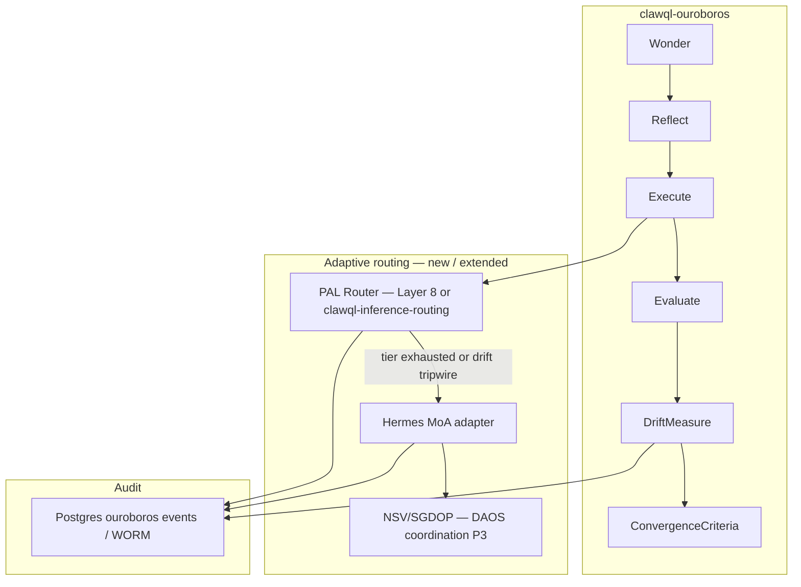

# Upstream Q00/ouroboros sync roadmap

**Status:** Planning · July 2026  
**Upstream baseline:** [Q00/ouroboros v0.50.3](https://github.com/Q00/ouroboros/releases/tag/v0.50.3) (PAL / model-tier routing, frugality proof machinery)  
**ClawQL target:** `clawql-ouroboros` evolutionary loop + Layer 8 inference routing + Hermes MoA (DAOS §6.7)

**Related:** [clawql-ouroboros guide](./clawql-ouroboros.md) · [DAOS unified spec v2.7](./daos-unified-architecture-specification-v2.7.md) · [Token efficiency Layer 8](../architecture/clawql-token-efficiency.md) · [GitHub epic #556](https://github.com/danielsmithdevelopment/ClawQL/issues/556)

---

## Context

`clawql-ouroboros` is a TypeScript port of the evolutionary loop from [Q00/ouroboros](https://github.com/Q00/ouroboros), maintained in friendly coordination with upstream (JQ Lee). Upstream has diverged since the initial port — notably **PAL Router** (frugal → standard → frontier with per-retry escalation), **3-component drift measurement**, and **frugality proof events**.

ClawQL adds governance primitives upstream does not ship: WORM audit, PEP/ATR, Manifest policy blocks, and (roadmap) **NSV/SGDOP** swarm coordination. The differentiated stack is **PAL (vertical cost routing) + Hermes MoA (horizontal ensemble) + SGDOP (blind-spot direction) + WORM (auditable tier decisions)**.

This document separates **what to port** from **what to leave alone**, defines package boundaries, and sequences implementation tickets.

---

## Gap analysis (shipped today)

| Capability                                                                    | `clawql-ouroboros`                                         | Q00 v0.50.3                         |
| ----------------------------------------------------------------------------- | ---------------------------------------------------------- | ----------------------------------- |
| Wonder / Reflect / Execute / Evaluate                                         | Shipped                                                    | Shipped                             |
| Ontology similarity convergence                                               | Shipped (`convergence.ts`)                                 | Shipped (different math)            |
| Stagnation / oscillation detection                                            | Shipped (fingerprint window)                               | Shipped (4 named patterns)          |
| 3-component drift (Goal 50% / Constraint 30% / Ontology 20%, threshold ≤ 0.3) | **Not shipped** — `ambiguity_score` on Seed unused in loop | Shipped (`ouroboros_measure_drift`) |
| PAL / model-tier routing                                                      | **Not shipped** — documented omission                      | **Shipped** (headline v0.50.3)      |
| Frugality proof / per-AC token attribution                                    | **Not shipped**                                            | Shipped                             |
| MoA / multi-model consensus                                                   | **Not shipped** — DAOS §6.7 roadmap                        | Shipped (Stage 3 + tiers)           |
| NSV / SGDOP                                                                   | **Not shipped** — DAOS P3 roadmap                          | Partial (consensus triggers)        |
| Routing                                                                       | `clawql_execute` / `clawql_search` API hints               | LLM tier + runtime routing          |

**Marketing gap:** [`docs/posts/introducing-clawql-ouroboros.md`](../posts/introducing-clawql-ouroboros.md) claims ontological drift tracking; implementation must catch up or copy be revised.

---

## Architecture: where each piece lives



| Piece                  | Package / layer                                | Rationale                                     |
| ---------------------- | ---------------------------------------------- | --------------------------------------------- |
| Drift evaluator        | `clawql-ouroboros`                             | Seed-native; per-generation                   |
| Stagnation taxonomy    | `clawql-ouroboros`                             | Extend `ConvergenceSignal.reason`             |
| PAL tier ladder        | Layer 8 / new `clawql-inference-routing` (TBD) | Shared across ouroboros, agent chat, schedule |
| Frugality audit events | `clawql-ouroboros` event store + WORM envelope | Same lineage stream                           |
| MoA fan-out            | Hermes runtime / gateway adapter               | External ensemble; not in-loop Python port    |
| NSV/SGDOP model pick   | DAOS coordination (build plan P3)              | Needs embeddings + Coordinator                |
| Active Conductor menus | MCP event meta on lineage                      | Host judgment; proposed upstream RFC          |

---

## Adaptive routing flow (target)

```
Request → PAL: Frugal solo (Phi-4 class)
  → success? done (min cost)
  → failure? Standard solo (Qwen class)
    → success? done
    → failure OR combined_drift > 0.3 OR NSV below nsv_crit?
      → MoA fan-out (Hermes: reference models + aggregator)
      → SGDOP informs which families to include (when shipped)
      → ensemble converges? done
      → still failing? Frontier solo → HITL / Command Deck
```

Every PAL escalation and MoA trigger writes an auditable event (`pal_escalation`, `moa_fanout`, `drift_measured`) with failure signal, tier before/after, and token attribution when available.

---

## Port / adapt / skip

### Port or adapt (tickets below)

1. **3-component drift measurement** — upstream weighting; new evaluator + convergence gate; MCP `ouroboros_measure_drift`.
2. **PAL Router** — tier map in Manifest or Layer 8 config; one-notch escalation per retry; decomposed-child vs top-level initial tier.
3. **Frugality proof events** — per-generation token attribution + escalation audit (fail-closed admission rules per upstream spirit).
4. **Stagnation taxonomy** — named reasons: `spinning`, `oscillation`, `no_drift`, `diminishing_returns` mapped onto existing detectors.
5. **PAL → MoA coupling** — MoA at Standard-tier exhaustion, not immediate Frontier single-model jump.
6. **Active Conductor (later)** — `attention_required` + `recommended_host_actions` on lineage events (upstream RFC proposed, not in v0.50.3 binaries).

### Skip (intentionally)

- Python TUI, `ooo` CLI, LiteLLM integration, Codex warm-thread workarounds
- Direct port of TraceGuard prose validators (reimplement against ClawQL eval pipeline)
- Full `~/.ouroboros/mcp_servers.yaml` auto-discovery (ClawQL `sources` / provider model is sufficient; cherry-pick resume-durable config fingerprint if needed later)
- Double Diamond subprocess orchestration (host delegates via MCP hints today)

---

## Implementation sequencing

| Phase    | Ticket                                                              | Deliverable                                                                          | Depends on                 |
| -------- | ------------------------------------------------------------------- | ------------------------------------------------------------------------------------ | -------------------------- |
| **P0-A** | [#557](https://github.com/danielsmithdevelopment/ClawQL/issues/557) | Drift evaluator + `ouroboros_measure_drift` MCP tool + `drift_measured` events       | —                          |
| **P0-B** | [#558](https://github.com/danielsmithdevelopment/ClawQL/issues/558) | Convergence gate: `combined_drift > 0.3` blocks premature converge; triggers reflect | P0-A                       |
| **P0-C** | [#559](https://github.com/danielsmithdevelopment/ClawQL/issues/559) | Stagnation taxonomy reason codes on `ConvergenceSignal`                              | —                          |
| **P0-D** | [#560](https://github.com/danielsmithdevelopment/ClawQL/issues/560) | PAL tier map + `AdaptiveRouter` interface; inject into Wonder/Reflect/Execute        | Layer 8 config sketch      |
| **P0-E** | [#561](https://github.com/danielsmithdevelopment/ClawQL/issues/561) | `pal_escalation` + token attribution events in Postgres event store                  | P0-D                       |
| **P1-A** | [#562](https://github.com/danielsmithdevelopment/ClawQL/issues/562) | PAL → MoA trigger at Standard failure + drift tripwire                               | P0-A, P0-D, Hermes adapter |
| **P1-B** | [#563](https://github.com/danielsmithdevelopment/ClawQL/issues/563) | Align introducing post / clawql-ouroboros.md with shipped drift behavior             | P0-A                       |
| **P2**   | DAOS P3                                                             | NSV/SGDOP-directed MoA model family selection                                        | Coordinator, embeddings    |
| **P3**   | [#564](https://github.com/danielsmithdevelopment/ClawQL/issues/564) | Active Conductor attention menus on MCP lineage stream                               | P0-E events                |

**P0-A is the recommended first PR** — small surface, closes marketing/implementation gap, gives PAL/MoA a concrete failure signal.

---

## TypeScript contracts (sketch)

See epic issue body for `ModelTierMap`, `AdaptiveRouter`, `PalRoutingDecision`, `MoaRoutingDecision`, and `RoutingAuditEvent` types. Implementation packages should export these from a single module to avoid drift between gateway and ouroboros.

---

## Upstream coordination (JQ Lee)

Before locking weighting assumptions, confirm:

1. Drift 50/30/20 when Wonder and Reflect run on different tiers in one generation.
2. Frugality proof baseline thresholds for enterprise audit (`insufficient_data` vs `fail_no_frugality`).
3. MoA vs Frontier — upstream failure signal preference.
4. Active Conductor S1 (attention classification) timeline.
5. SGDOP math changes since last ClawQL PHE iteration.

---

## References

- Q00 release: [v0.50.3 — Frugality-first execution](https://github.com/Q00/ouroboros/releases/tag/v0.50.3)
- Upstream drift skill: [skills/status/SKILL.md](https://github.com/Q00/ouroboros/blob/main/skills/status/SKILL.md)
- Upstream Active Conductor RFC: [docs/rfc/active-conductor.md](https://github.com/Q00/ouroboros/blob/main/docs/rfc/active-conductor.md) (proposed)
- ClawQL Layer 8: [clawql-token-efficiency.md § Layer 8](../architecture/clawql-token-efficiency.md)
- DAOS MoA: [daos-unified-architecture-specification-v2.7.md § 6.7](./daos-unified-architecture-specification-v2.7.md)
- Shipped loop code: [`packages/clawql-ouroboros/src/convergence.ts`](../../packages/clawql-ouroboros/src/convergence.ts)
