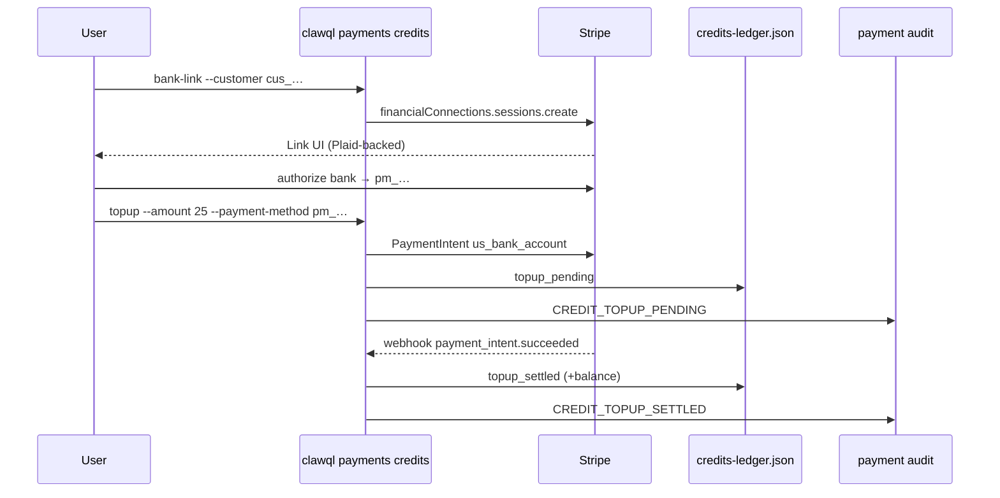

# Prepaid credits + bank top-up (Stripe Financial Connections / ACH)

**Status:** Tier-1 scaffold (July 2026)  
**Package:** `clawql-payments`  
**CLI:** `clawql payments credits *`

## Goal

Let users **connect a bank account**, **top up prepaid credit balances**, and **transfer credits peer-to-peer** between ClawQL tenants. Balances can be debited for inference/docs usage (alongside plan entitlements). Withdrawals use existing payout / off-ramp rails; this doc covers the prepaid ledger + ACH top-up + P2P transfer.

## Why not a raw Plaid SDK?

ClawQL already runs on **Stripe**. Bank linking is implemented with **[Stripe Financial Connections](https://docs.stripe.com/financial-connections/payments)** + **`us_bank_account` ACH PaymentIntents**.

Stripe’s Link / Financial Connections UI commonly uses **Plaid (and other aggregators) under the hood**. That gives users a familiar bank-connect experience without a second identity, webhook, or compliance surface in ClawQL.

Use a direct Plaid integration only if you need non-payment Plaid products (Identity, Assets, Transactions analytics) outside Stripe.

## Flow



ACH can take **1–3 business days**. Credits settle on `payment_intent.succeeded` (or immediately in dry-run).

## Feature flags

| Env                                     | Default                               | Meaning                                                         |
| --------------------------------------- | ------------------------------------- | --------------------------------------------------------------- |
| `CLAWQL_CREDITS_ENABLED`                | off                                   | Enable prepaid credit ledger                                    |
| `CLAWQL_ACH_TOPUP_ENABLED`              | on when credits + `STRIPE_SECRET_KEY` | Enable FC + ACH top-up path                                     |
| `CLAWQL_ACH_TOPUP_DRY_RUN`              | off                                   | Create sessions / settle without live Stripe/ACH (tests, demos) |
| `CLAWQL_CREDITS_RETURN_URL`             | —                                     | Optional return URL for Financial Connections                   |
| `CLAWQL_CREDITS_TRANSFER_DIRECT`        | off                                   | Skip stage/confirm (break-glass / tests only)                   |
| `CLAWQL_CREDITS_TRANSFER_REQUIRE_TOTP`  | off                                   | Require enrolled TOTP on transfer confirm                       |
| `CLAWQL_CREDITS_HATEOAS_BASE`           | compensation / `clawql://tool`        | Public origin for pay/request/invite deep links + HTMX          |
| `CLAWQL_CREDITS_PHONE_REQUIRE_VERIFIED` | off                                   | Require `--verified` when claiming a phone alias                |
| `CLAWQL_CREDITS_PHONE_DEFAULT_CC`       | `1`                                   | Default country code for 10-digit national numbers              |

## CLI

```bash
export CLAWQL_CREDITS_ENABLED=1
export CLAWQL_ACH_TOPUP_DRY_RUN=1   # local demo without Stripe

clawql payments credits show
clawql payments credits bank-link --customer cus_xxx
clawql payments credits topup --customer cus_xxx --amount 25
# live:
# clawql payments credits topup --customer cus_xxx --amount 25 --payment-method pm_xxx

# Claim email (default) + optional privacy username
clawql payments credits directory claim --email bob@acme.com --tenant-id bob
clawql payments credits directory claim --tenant-id bob --handle bob
clawql payments credits pay --to bob@acme.com --amount 10 --note coffee
# or: clawql payments credits pay --to @bob --amount 10
# → prints action_id + confirmation_code (balances unchanged)
clawql payments credits transfer --confirm --action-id <uuid> --code <hex>

# Or explicit tenant id
clawql payments credits transfer --to-tenant bob --amount 10

# Optional authenticator TOTP on confirm
clawql payments credits step-up enroll --tenant-id alice --show-secrets
export CLAWQL_CREDITS_TRANSFER_REQUIRE_TOTP=1
clawql payments credits transfer --confirm --action-id <uuid> --code <hex> --totp 123456
```

## Peer-to-peer transfers

Transfers are **high-impact**. Default path is DAOS-style **2PC** (stage → confirm). Money does not move until confirm.

Payees can be **email** (default), **`@username`** (optional privacy), or raw tenant ids — see [consumer P2P roadmap](./p2p-consumer-roadmap.md).

| Property    | Behavior                                                                                  |
| ----------- | ----------------------------------------------------------------------------------------- |
| Addressing  | Email (default), optional `@username`, or `--to-tenant`                                   |
| Scope       | Tenant ↔ tenant prepaid credits (not Stripe Connect / USDC chain send)                    |
| Staging     | Default — `stageTransfer` returns `action_id` + `confirmation_code`                       |
| Confirm     | `confirmTransfer` with code; optional TOTP when `CLAWQL_CREDITS_TRANSFER_REQUIRE_TOTP=1`  |
| Direct      | Break-glass only: `CLAWQL_CREDITS_TRANSFER_DIRECT=1` (tests / trusted ops)                |
| Overdraft   | Rejected — sender must have spendable grant balance                                       |
| Idempotency | Optional `--idempotency-key` on the execute leg                                           |
| WORM        | `CREDIT_TRANSFER_SENT` + `CREDIT_TRANSFER_RECEIVED` (accounting category `peer_transfer`) |
| MCP         | `payments_credits_directory_*` + `payments_credits_transfer_stage` / `_confirm`           |

```mermaid
sequenceDiagram
  participant A as Tenant A
  participant CLI as credits pay
  participant Dir as directory.json
  participant Pend as pending-actions
  participant Ledger as credits-ledger.json
  participant WORM as payment audit

  A->>CLI: pay --to bob@acme.com|--to @bob --amount 10
  CLI->>Dir: resolve email or @username → tenant
  CLI->>Pend: stage (inert) + confirmation_code
  CLI-->>A: action_id + code
  A->>CLI: transfer --confirm --action-id --code [--totp]
  CLI->>Pend: assert code (+ TOTP if required)
  CLI->>Ledger: lock A+B; transfer_out / transfer_in
  CLI->>WORM: CREDIT_TRANSFER_SENT + RECEIVED
```

### Step-up / 2FA model

ClawQL is not an IdP — phishing-resistant MFA for human SSO stays a **customer** concern. For prepaid P2P:

1. **Confirmation code** (always, unless `CLAWQL_CREDITS_TRANSFER_DIRECT=1`) — second factor for CLI/MCP/agent flows
2. **Optional TOTP** — enroll via `credits step-up enroll`; gate with `CLAWQL_CREDITS_TRANSFER_REQUIRE_TOTP=1`
3. Secrets live in `$CLAWQL_HOME/Payments/step-up-totp.json` (mode `0600`) — **never** in the payment WORM

Platform liability is unchanged (credits move between tenants). Withdraw to bank/USDC remains via [payouts / off-ramp](./payouts-ramp.md).

## Storage

- Ledger: `$CLAWQL_HOME/Payments/credits-ledger.json` (append-only entries, USD cents)
- Directory: `$CLAWQL_HOME/Payments/directory.json` (email + optional `@username` → tenantId; mode `0600`; emails never in WORM)
- WORM kinds: `BANK_LINKED`, `CREDIT_TOPUP_PENDING`, `CREDIT_TOPUP_SETTLED`, `CREDIT_TOPUP_FAILED`, `CREDIT_DEBITED`, `CREDIT_TRANSFER_SENT`, `CREDIT_TRANSFER_RECEIVED`

## Effect services

- `CreditsService` — balance / debit / settle / **transfer**
- `AchTopupService` — Financial Connections session + ACH top-up PaymentIntent

Wired into `paymentsServicesLiveLayer()`. Discovery advertises `type: "credits"` in `.well-known/payments.json` when enabled.

## Follow-ups

- QR / deep links ([consumer roadmap](./p2p-consumer-roadmap.md))
- Hosted checkout / Billing Portal bank payment method UX
- Optional direct Plaid Link only if product needs non-Stripe bank data
- Valkey Lua hot counter + Postgres durable grants (same DeductionService API)

Inference debit/hold is implemented via [`DeductionService`](./deduction-service.md) (`CLAWQL_CREDITS_ENFORCE_INFERENCE`).
