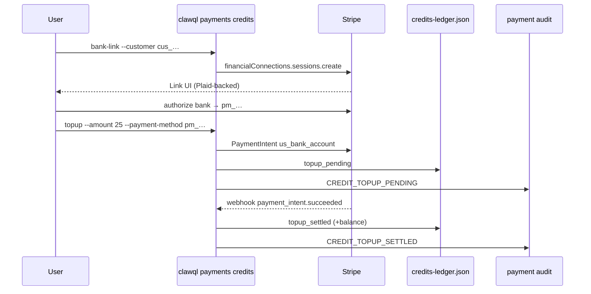

# Prepaid credits + bank top-up (Stripe Financial Connections / ACH)

**Status:** Tier-1 scaffold (July 2026)  
**Package:** `clawql-payments`  
**CLI:** `clawql payments credits *`

## Goal

Let users **connect a bank account** and **top up prepaid credit balances** that ClawQL can debit for inference/docs usage (alongside plan entitlements).

## Why not a raw Plaid SDK?

ClawQL already runs on **Stripe**. Bank linking is implemented with **[Stripe Financial Connections](https://docs.stripe.com/financial-connections/payments)** + **`us_bank_account` ACH PaymentIntents**.

Stripe’s Link / Financial Connections UI commonly uses **Plaid (and other aggregators) under the hood**. That gives users a familiar bank-connect experience without a second identity, webhook, or compliance surface in ClawQL.

Use a direct Plaid integration only if you need non-payment Plaid products (Identity, Assets, Transactions analytics) outside Stripe.

## Flow



ACH can take **1–3 business days**. Credits settle on `payment_intent.succeeded` (or immediately in dry-run).

## Feature flags

| Env                         | Default                               | Meaning                                                         |
| --------------------------- | ------------------------------------- | --------------------------------------------------------------- |
| `CLAWQL_CREDITS_ENABLED`    | off                                   | Enable prepaid credit ledger                                    |
| `CLAWQL_ACH_TOPUP_ENABLED`  | on when credits + `STRIPE_SECRET_KEY` | Enable FC + ACH top-up path                                     |
| `CLAWQL_ACH_TOPUP_DRY_RUN`  | off                                   | Create sessions / settle without live Stripe/ACH (tests, demos) |
| `CLAWQL_CREDITS_RETURN_URL` | —                                     | Optional return URL for Financial Connections                   |

## CLI

```bash
export CLAWQL_CREDITS_ENABLED=1
export CLAWQL_ACH_TOPUP_DRY_RUN=1   # local demo without Stripe

clawql payments credits show
clawql payments credits bank-link --customer cus_xxx
clawql payments credits topup --customer cus_xxx --amount 25
# live:
# clawql payments credits topup --customer cus_xxx --amount 25 --payment-method pm_xxx
```

## Storage

- Ledger: `$CLAWQL_HOME/Payments/credits-ledger.json` (append-only entries, USD cents)
- WORM kinds: `BANK_LINKED`, `CREDIT_TOPUP_PENDING`, `CREDIT_TOPUP_SETTLED`, `CREDIT_TOPUP_FAILED`, `CREDIT_DEBITED`

## Effect services

- `CreditsService` — balance / debit / settle
- `AchTopupService` — Financial Connections session + ACH top-up PaymentIntent

Wired into `paymentsServicesLiveLayer()`. Discovery advertises `type: "credits"` in `.well-known/payments.json` when enabled.

## Follow-ups

- Debit credits automatically from inference entitlement path when balance > 0
- Hosted checkout / Billing Portal bank payment method UX
- Optional direct Plaid Link only if product needs non-Stripe bank data
