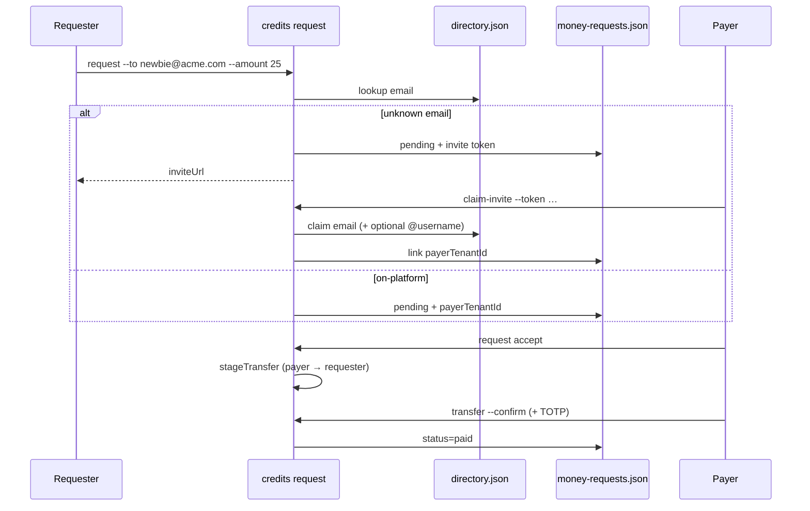

# Money requests & invoices

Ask someone to pay prepaid credits — by **email** (default), **`@username`**, or tenant id.

Unknown emails get an **invite URL + one-time token** so they can join ClawQL, claim the directory identity, then accept and pay (same stage → confirm path as `credits pay`).

## Flow



## CLI

```bash
export CLAWQL_CREDITS_ENABLED=1

# Invoice someone already on the platform
clawql payments credits invoice --to bob@acme.com --amount 25 --note "March consulting"
# alias: credits request --to @bob --amount 25

# Invite someone new by email
clawql payments credits request --to newbie@acme.com --amount 40 --note "dinner"
# → share inviteUrl / token once

# Invitee joins + links the request
clawql payments credits request claim-invite \
  --request-id UUID --token TOKEN --tenant-id newbie [--handle newb]

# Payer accepts → stages transfer (money not moved yet)
clawql payments credits request accept --request-id UUID --tenant-id bob

# Confirm (same high-impact step-up as pay)
clawql payments credits transfer --confirm --action-id … --code … [--totp …]

clawql payments credits request list --tenant-id alice
clawql payments credits request decline|cancel --request-id UUID
```

## Storage

- `$CLAWQL_HOME/Payments/money-requests.json` (mode `0600`)
- Invite tokens stored as **SHA-256 hashes** only; cleartext token returned once at create
- Emails never written to payment WORM

## MCP (`CLAWQL_PAYMENTS_MCP_TOOLS=1`)

| Tool | Role |
| ---- | ---- |
| `payments_credits_request_create` | Create / invite |
| `payments_credits_request_list` | List |
| `payments_credits_request_claim_invite` | Join via email invite |
| `payments_credits_request_accept` | Stage payer → requester transfer |

## Env

| Variable | Default | Meaning |
| -------- | ------- | ------- |
| `CLAWQL_CREDITS_REQUEST_TTL_SEC` | 7 days | Request expiry |

See also: [consumer roadmap](./p2p-consumer-roadmap.md), [credits ACH / P2P](./credits-ach.md).
