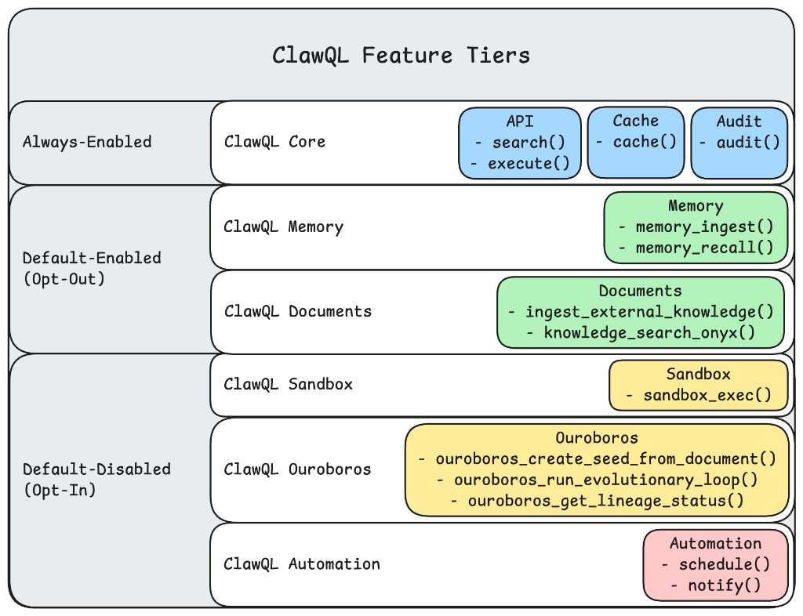

# ClawQL Configuration

This page summarizes how ClawQL selects specs, loads auth, and enables optional tools.

## Feature tiers (architecture diagram)

ClawQL groups capabilities into three bands. This matches the **layer diagram** above (**ClawQL Core** vs default-on opt-out vs default-off opt-in). The diagram is revised when new modules ship (for example future **`clawql-web3`**); the sections below remain authoritative for env and registration behavior.

### ClawQL Core (always on — no opt-out)

**There is no env or Helm toggle for Core.** The diagram places **`search`**, **`execute`**, **`audit`**, and **`cache`** in this band together:

- **`search`**, **`execute`** — OpenAPI / Discovery discovery and execution; optional **native GraphQL** / **gRPC** merged into the same index from env (**`CLAWQL_GRAPHQL_*`**, **`CLAWQL_GRPC_SOURCES`**) and/or the **bundled GraphQL-only** provider **`linear`** ([ADR 0002](../adr/0002-multi-protocol-supergraph.md), **`providers/README.md`**).
- **`audit`** — in-process event ring buffer ([#89](https://github.com/danielsmithdevelopment/ClawQL/issues/89)); tune **`CLAWQL_AUDIT_MAX_ENTRIES`** only. **Prometheus:** **`clawql_audit_*`** aggregates on **`GET /metrics`**. **Loki:** optional **`CLAWQL_LOKI_PUSH_URL`** (+ **`CLAWQL_LOKI_BEARER_TOKEN`** / **`CLAWQL_LOKI_TENANT_ID`**) pushes each **`append`** as JSON. Not durable — use **`memory_ingest`** for persisted trails.
- **`cache`** — in-process LRU key/value ([#75](https://github.com/danielsmithdevelopment/ClawQL/issues/75)); tune **`CLAWQL_CACHE_MAX_*`** only. Not persisted — use **`memory_ingest`** / **`memory_recall`** for vault-backed state.

### Default on — opt out

Unset means **on**. Set **`0`**, **`false`**, or **`no`** to hide tools or shrink merges:

| Band                  | MCP tools                                                                                                                                                                                            | Env to opt out                                                                                                                                                                                                                                                            |
| --------------------- | ---------------------------------------------------------------------------------------------------------------------------------------------------------------------------------------------------- | ------------------------------------------------------------------------------------------------------------------------------------------------------------------------------------------------------------------------------------------------------------------------- |
| **ClawQL Memory**     | **`memory_ingest`**, **`memory_recall`**                                                                                                                                                             | **`CLAWQL_ENABLE_MEMORY=0`**                                                                                                                                                                                                                                              |
| **ClawQL Documents**  | **`ingest_external_knowledge`**; **`knowledge_search_onyx`** when also **`CLAWQL_ENABLE_ONYX=1`**; optional **`run_idp_pipeline`**, **`classify_document`**, **`extract_document`** (separate flags) | **`CLAWQL_ENABLE_DOCUMENTS=0`** (drops **docling**, **tika**, **gotenberg**, **paperless**, **stirling**, **onyx**, **nextcloud**, **coneshare** from **`all-providers`**; hides document MCP tools). Explicit **`CLAWQL_BUNDLED_PROVIDERS=…`** can still list those ids. |
| **Cloudflare bundle** | _(spec merge only — no extra MCP tools)_                                                                                                                                                             | **`CLAWQL_ENABLE_CLOUDFLARE=0`** (omits Cloudflare from the **no-config default stack** only). Default **on** when unset. **`all-providers`** always includes Cloudflare. Explicit **`CLAWQL_PROVIDER=cloudflare`** still loads it.                                       |

### Default off — opt in (cloud add-ons for default stack)

Unset means **off**. Set **`1`** / **`true`** / **`yes`** to **add** Google/AWS to the no-config default stack (in addition to Cloudflare, GitHub, Slack, Linear, Notion, Onyx):

| Bundle                               | Env                          | Notes                                                                                    |
| ------------------------------------ | ---------------------------- | ---------------------------------------------------------------------------------------- |
| **Google Cloud** (50 Discovery APIs) | **`CLAWQL_ENABLE_GOOGLE=1`** | Explicit **`CLAWQL_PROVIDER=google`** or **`all-providers`** still loads GCP regardless. |
| **AWS** (50 OpenAPI specs)           | **`CLAWQL_ENABLE_AWS=1`**    | Explicit **`CLAWQL_PROVIDER=aws`** or **`all-providers`** still loads AWS regardless.    |

**Fresh install** with no spec env: **Cloudflare, GitHub, Slack, Linear, Notion, Onyx**. Use **`CLAWQL_PROVIDER=all-providers`** for literally every bundled vendor plus GCP and AWS manifests.

### Default off — opt in

Set **`1`** / **`true`** / **`yes`** where noted:

| Band                  | MCP tools                                                  | Flags / prerequisites                                                                                                                                                                                                                                                           |
| --------------------- | ---------------------------------------------------------- | ------------------------------------------------------------------------------------------------------------------------------------------------------------------------------------------------------------------------------------------------------------------------------- |
| **ClawQL Sandbox**    | **`sandbox_exec`**                                         | **`CLAWQL_ENABLE_SANDBOX=1`** registers the tool. Then **`CLAWQL_SANDBOX_BACKEND`**: omit = bridge; **`auto`** = Seatbelt → Docker → bridge; or pin **`bridge`** \| **`macos-seatbelt`** \| **`docker`** ([#207](https://github.com/danielsmithdevelopment/ClawQL/issues/207)). |
| **ClawQL Ouroboros**  | **`ouroboros_*`** (three tools)                            | **`CLAWQL_ENABLE_OUROBOROS=1`**                                                                                                                                                                                                                                                 |
| **ClawQL Automation** | **`schedule`**, **`notify`**, **`workflow`**, **`argocd`** | **`CLAWQL_ENABLE_SCHEDULE=1`**, **`CLAWQL_ENABLE_NOTIFY=1`**, **`CLAWQL_ENABLE_WORKFLOW=1`**, **`CLAWQL_ENABLE_ARGO_CD=1`** (Argo Workflows ≥ 3.4.0 / Argo CD CRDs; namespace allowlists required)                                                                              |

**`workflow`** — durable **Argo Workflows** pipelines (template-ref **`submit`**, **`wait`**, **`get`**, **`logs`**, suspend/resume, cron, artifacts). Implemented in **`clawql-automation`** / **`AutomationPlugin`**. Helm: **`enableWorkflow: true`** + **`workflow.namespaceAllowlist`**. Operator guide: [`docs/mcp/workflow-tool.md`](../mcp/workflow-tool.md).

**`argocd`** — observe/sync **Argo CD Applications** via Kubernetes CRD API. **`CLAWQL_ENABLE_ARGO_CD=1`** + namespace allowlist. Helm: **`argocd.enabled`**. Operator guide: [`docs/mcp/argocd-tool.md`](../mcp/argocd-tool.md).

**`knowledge_search_onyx`** — **`CLAWQL_ENABLE_ONYX=1`** plus **Documents** still enabled (documents off hides the tool regardless).

**IDP MCP tools (documents on, each opt-in):** **`run_idp_pipeline`** (`CLAWQL_ENABLE_IDP_PIPELINE=1`), **`classify_document`** (`CLAWQL_ENABLE_IDP_CLASSIFIER=1`), **`extract_document`** (`CLAWQL_ENABLE_LANGEXTRACT=1`). See [`docs/mcp/idp-pipeline-runner.md`](../mcp/idp-pipeline-runner.md), [`docs/runbooks/fine-tuned-classifier.md`](../runbooks/fine-tuned-classifier.md), [`docs/providers/langextract-onboarding.md`](../providers/langextract-onboarding.md).

### Diagram vs. this build

**Core** matches the diagram: **`search`**, **`execute`**, **`audit`**, **`cache`** — always on, **no opt-out** (no **`CLAWQL_ENABLE_*`** for Core).

## Spec Selection Precedence

ClawQL resolves specs in two stages:

1. Multi-spec merge mode
2. Single-spec mode

### Stage 1: Multi-spec merge (checked in order)

1. `CLAWQL_SPEC_PATHS`
2. `CLAWQL_BUNDLED_PROVIDERS`
3. `CLAWQL_PROVIDER` (merged preset such as `default`, `google`, `all-providers`, `atlassian`)
4. **Default bundled stack** when no single-spec env is set — Cloudflare, GitHub, Slack, Linear, Notion, Onyx (+ optional **`CLAWQL_ENABLE_GOOGLE`** / **`CLAWQL_ENABLE_AWS`**; omit Cloudflare with **`CLAWQL_ENABLE_CLOUDFLARE=0`**)

When Stage 1 is active:

- `search` uses one merged operation index
- `execute` runs **REST** per **OpenAPI/Discovery** operation on the owning spec; **native** GraphQL / gRPC operations (from **`CLAWQL_GRAPHQL_*`** / **`CLAWQL_GRPC_SOURCES`**, or from a bundled GraphQL provider such as **`linear`** in the merge) **execute** over HTTP GraphQL or gRPC unary

### Stage 2: Single-spec (first match wins)

1. `CLAWQL_SPEC_PATH`
2. `CLAWQL_SPEC_URL`
3. `CLAWQL_DISCOVERY_URL`
4. `CLAWQL_PROVIDER` (single vendor, e.g. `cloudflare`, or bundled GraphQL-only **`linear`**)

## High-Value Environment Variables

### Spec and provider selection

- `CLAWQL_SPEC_PATH`
- `CLAWQL_SPEC_PATHS`
- `CLAWQL_SPEC_URL`
- `CLAWQL_DISCOVERY_URL`
- `CLAWQL_PROVIDER`
- `CLAWQL_BUNDLED_PROVIDERS`
- **`CLAWQL_GRAPHQL_URL`** — single GraphQL HTTP endpoint (like **`CLAWQL_SPEC_URL`** for OpenAPI). Optional **`CLAWQL_GRAPHQL_NAME`**, **`CLAWQL_GRAPHQL_HEADERS`**, **`CLAWQL_GRAPHQL_SCHEMA_PATH`** / **`CLAWQL_GRAPHQL_INTROSPECTION_PATH`** when upstream introspection is blocked. When set **without** any OpenAPI/Discovery selection env (**`CLAWQL_SPEC_*`**, **`CLAWQL_PROVIDER`**, **`CLAWQL_BUNDLED_PROVIDERS`**, etc.), ClawQL skips bundled REST defaults and loads **only** native GraphQL (plus **`CLAWQL_GRPC_SOURCES`** if set).
- **`CLAWQL_GRAPHQL_SOURCES`** — JSON array of `{ name, endpoint, headers?, schemaPath?, introspectionPath? }` merged into **`search`** / **`execute`** (HTTP introspection by default; disk SDL / introspection JSON when set). Combined with **`CLAWQL_GRAPHQL_URL`** when both are set. See `.env.example` and **`docs/mcp/mcp-tools.md`** (native GraphQL section).
- **`CLAWQL_GRPC_SOURCES`** — JSON array of `{ name, endpoint, protoPath, insecure? }` for unary gRPC. See `.env.example` and **`docs/adr/0002-multi-protocol-supergraph.md`**.

### Auth

- `CLAWQL_PROVIDER_AUTH_JSON` (preferred for merged providers)
- `CLAWQL_GITHUB_TOKEN`
- `CLAWQL_CLOUDFLARE_API_TOKEN`
- `CLAWQL_GOOGLE_ACCESS_TOKEN`
- `LINEAR_API_KEY` / `CLAWQL_LINEAR_API_KEY` (merged **`specLabel`** **`linear`** — raw key in **`Authorization`**, not **`Bearer`**)
- `CLAWQL_BEARER_TOKEN` (scoped fallback)

### Vault memory

- `CLAWQL_OBSIDIAN_VAULT_PATH`
- `CLAWQL_MEMORY_RECALL_LIMIT`
- `CLAWQL_MEMORY_RECALL_MAX_DEPTH`
- `CLAWQL_MEMORY_RECALL_MIN_SCORE`
- `CLAWQL_MEMORY_DB`, `CLAWQL_MEMORY_DB_PATH`

### Optional tool flags

See **[Feature tiers](#feature-tiers-architecture-diagram)** first. Quick list:

- **Default on, opt out:** `CLAWQL_ENABLE_MEMORY`, `CLAWQL_ENABLE_DOCUMENTS` — set `0` / `false` / `no` to hide tools or trim default **`all-providers`** (documents).
- **Default off, opt in:** `CLAWQL_ENABLE_SCHEDULE`, `CLAWQL_ENABLE_NOTIFY`, `CLAWQL_ENABLE_WORKFLOW`, `CLAWQL_ENABLE_ONYX`, `CLAWQL_ENABLE_OUROBOROS`.

## `.env` loading and canonical `CLAWQL_*` names

On startup, **`clawql-mcp`** / **`clawql-mcp-http`** import **`src/load-env.ts`**, which loads **dotenv** from:

1. **`<packageRoot>/.env`** — next to the installed package’s `dist/` (the npm package root),
2. **`process.cwd()/.env`** — with **`override: true`** so values from the current working directory win when both files define the same key.

That lets you keep **`CLAWQL_*`** (and tokens) in a repo or project **`.env`** for local runs and Cursor MCP **without** pasting secrets into **`mcp.json`**. Only variables consumed by the server process apply here; the MCP client’s **`url`** for HTTP mode is configured separately (see **`docs/readme/deployment.md`**).

**Prefer `CLAWQL_*`** for new configuration. A few legacy names remain as aliases where noted in **`.env.example`** — for example **`CLAWQL_SPEC_URL`** or **`OPENAPI_SPEC_URL`** (same meaning; prefer **`CLAWQL_SPEC_URL`**), and **`CLAWQL_DISCOVERY_URL`** or **`GOOGLE_DISCOVERY_URL`**. Resolution checks **`CLAWQL_*` first**, then the legacy variable.

## Full References

- Full MCP tool reference and env details: `docs/mcp/mcp-tools.md`
- Memory and vault details: `docs/memory/memory-obsidian.md`
- Hybrid memory backends: `docs/memory/hybrid-memory-backends.md`
- Provider matrix and bundled specs: `providers/README.md`
- Complete environment sample: `.env.example`
