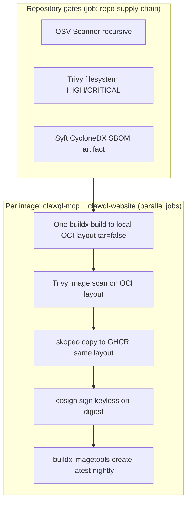

# Golden image pipeline (end to end) and enforcement

This document describes the **full path** from repository change to **signed images on GHCR**, how **CI blocks** promotion when anything fails, and how **Kubernetes admission** ties the published artifact to what is allowed to run—so operators can reason about **build → scan → push → sign → deploy** in one place.

Related: [`image-signature-enforcement.md`](image-signature-enforcement.md) (Kyverno policy details and forks), [`npm-supply-chain.md`](npm-supply-chain.md) (npm packages, not container images), [`docker/README.md`](../../docker/README.md) (operator `cosign verify` commands), [`.github/workflows/docker-publish.yml`](../../.github/workflows/docker-publish.yml), [`charts/clawql-mcp/values.yaml`](../../charts/clawql-mcp/values.yaml), [`scripts/local-k8s-docker-desktop.sh`](../../scripts/local-k8s-docker-desktop.sh).

## Goals (what “golden” means here)

1. **No silent promotion:** rolling tags (**`latest`**, **`nightly`**, date-stamped **`nightly-YYYYMMDD`**) only move after **repo gates**, **image build**, **vulnerability scan on the exact bytes pushed**, **registry push**, and **Cosign** signing.
2. **No second-build drift:** the **same OCI layout** Trivy scans is what **`skopeo copy`** uploads—there is **not** a separate “release build” that could differ.
3. **Deploy-time linkage:** clusters that install the **Helm chart defaults** get a **Kyverno `ClusterPolicy`** that **verifies Cosign signatures** for the published **ClawQL MCP** and **website** images (see [Enforcement at deploy](#enforcement-at-deploy)).

Scanner data, severity choices, and `.trivyignore` / `osv-scanner.toml` mean this is **not** a proof of zero defects— it is a **gated, reproducible pipeline** with **cryptographic identity** on the digest that passed the gates.

---

## High-level flow

Both **`build-push-mcp`** and **`build-push-website`** **`need: repo-supply-chain`**—if repository gates fail, **no image job runs**.

---

## Step 1 — Repository supply chain (`repo-supply-chain`)

Workflow: [`.github/workflows/docker-publish.yml`](../../.github/workflows/docker-publish.yml) job **`repo-supply-chain`**.

| Step             | What runs                                                                                  | Failure effect                               |
| ---------------- | ------------------------------------------------------------------------------------------ | -------------------------------------------- |
| OSV-Scanner      | `ghcr.io/google/osv-scanner` with [`osv-scanner.toml`](../../osv-scanner.toml)             | Job fails → **no** MCP or website build jobs |
| Trivy filesystem | `aquasecurity/trivy-action`, **HIGH** / **CRITICAL**, [`.trivyignore`](../../.trivyignore) | Job fails → **no** image builds              |
| Syft SBOM        | `anchore/syft:v1.19.0` → CycloneDX JSON uploaded as artifact                               | Artifact missing → job fails                 |

The main **[`ci.yml`](../../.github/workflows/ci.yml)** workflow also runs a **`supply-chain`** job (OSV + Trivy fs + repository SBOM upload) on pushes/PRs so **merge queue** can block bad dependency states before they reach **`main`**.

---

## Step 2 — Single BuildKit export (per image)

After **`repo-supply-chain`** succeeds, two jobs can run in parallel:

- **`build-push-mcp`**: `docker buildx build` with [`docker/Dockerfile`](../../docker/Dockerfile), multi-arch **`linux/amd64`**, **`linux/arm64`**.
- **`build-push-website`**: `docker buildx build` with [`website/Dockerfile`](../../website/Dockerfile), same platform pattern.

Output is a **local OCI image layout**:

- **`--output type=oci,tar=false,dest=<dir>`** — directory layout (Trivy is reliable on this; OCI **tar** exports are avoided due to upstream friction).

BuildKit also emits **SLSA-style provenance** (`--provenance=mode=max`) and **SBOM** (`--sbom=true`) as attestations on the build output where BuildKit attaches them.

**There is still no GHCR write** at this stage.

---

## Step 3 — Trivy on the OCI layout (gate before registry)

Each job runs **Trivy** (`ghcr.io/aquasecurity/trivy:0.59.1` per workflow env) against the **directory** produced in step 2:

- **`trivy image --input /work/oci`** with **HIGH** / **CRITICAL**, **`--exit-code 1`**, repo [`.trivyignore`](../../.trivyignore).

If this fails, the workflow **stops**—nothing is pushed for that image.

---

## Step 4 — Push the scanned bytes (`skopeo copy`)

**`skopeo copy`** uploads **from** `oci:<local-layout>` **to** `docker://<ghcr-with-sha-tag>` using the runner’s **`config.json`** (GitHub **`GITHUB_TOKEN`** login from **`docker/login-action`**).

Immutable tags come from **`docker/metadata-action`** (**`type=sha,prefix=sha-,format=short`**): only **`sha-*`** references are written first; digest is read back for signing.

---

## Step 5 — Cosign keyless sign

**`cosign sign --yes <image>@<digest>`** uses **GitHub Actions OIDC** (`permissions: id-token: write`) → **Fulcio** / **Rekor** (keyless). The signature is bound to the **digest** that was pushed—same artifact as scanned.

---

## Step 6 — Promote rolling tags (`imagetools create`)

**`docker buildx imagetools create`** points **`latest`**, **`nightly`**, and (on schedule) **`nightly-YYYYMMDD`** at the **signed digest**. Promotion runs **only** after push and sign steps succeed for that digest.

So: **rolling tags do not advance** on failed gates or failed signing.

---

## Enforcement at deploy

Signing in CI **does not** stop a malicious or mistaken **`kubectl apply`** of an arbitrary image by itself. **Admission control** closes the loop for workloads that use the **ClawQL-published** images.

### Helm chart (default on)

[`charts/clawql-mcp/values.yaml`](../../charts/clawql-mcp/values.yaml) defaults **`kyverno.imageSignaturePolicy.enabled: true`**, which renders a **`ClusterPolicy`** ([`templates/kyverno-clusterpolicy-cosign.yaml`](../../charts/clawql-mcp/templates/kyverno-clusterpolicy-cosign.yaml)) using **`verifyImages`** with **Cosign keyless** **`subjectRegExp`** / **`issuerRegExp`** matching this repo’s **GitHub Actions** identity and **`ghcr.io/danielsmithdevelopment/clawql-mcp*`** / **`clawql-website*`** image patterns.

**Requirements:**

- Install **[Kyverno](https://kyverno.io/)** in the cluster **before** applying the chart (CRDs must exist), **or** disable the policy: **`--set kyverno.imageSignaturePolicy.enabled=false`** until Kyverno is available.

**Docker Desktop (`make local-k8s-up`):**

- [`scripts/local-k8s-docker-desktop.sh`](../../scripts/local-k8s-docker-desktop.sh) installs the **Kyverno Helm chart** (pin via **`CLAWQL_KYVERNO_CHART_VERSION`**, default **3.7.2**), uses [`values-docker-desktop.yaml`](../../charts/clawql-mcp/values-docker-desktop.yaml) with **`matchReleaseNamespaceOnly: true`** so the policy applies to the **`clawql`** release namespace, pulls **signed GHCR** images for MCP and UI, and **rejects** unsigned local **`docker build`** env overrides.

### What this does / does not cover

| Covered                                                                                                                                            | Not automatically covered                                                                                                                                   |
| -------------------------------------------------------------------------------------------------------------------------------------------------- | ----------------------------------------------------------------------------------------------------------------------------------------------------------- |
| **Pods** whose container images match the **`clawql-mcp`** / **`clawql-website`** GHCR globs must verify with the configured **Sigstore** identity | Other images in the same namespace (Postgres, Onyx, ingress, etc.)—different images, different risk                                                         |
| **Keyless** signatures matching **GitHub Actions** issuer + **this repo** subject pattern                                                          | Forks must **override** regexes and image references in values                                                                                              |
| **Tag-based** refs still resolve to a digest for verification                                                                                      | **`verifyDigest: true`** in values is optional and requires manifests to use digests—see [`image-signature-enforcement.md`](image-signature-enforcement.md) |

Operator verification without applying a workload: **`cosign verify`** as documented in [`docker/README.md`](../../docker/README.md).

---

## Quick reference table

| Layer           | Mechanism                                                            | Artifact / outcome                                           |
| --------------- | -------------------------------------------------------------------- | ------------------------------------------------------------ |
| Merge / CI      | **`ci.yml`** `supply-chain`                                          | OSV + Trivy fs + SBOM artifact; gates **`test`**             |
| Publish         | **`docker-publish.yml`** `repo-supply-chain`                         | Same repo gates + SBOM artifact for the publish run          |
| Image integrity | Single **OCI layout** + **Trivy** + **`skopeo copy`**                | No second build; scanned bytes = pushed bytes                |
| Identity        | **Cosign keyless** on digest                                         | Signature in **Rekor** / Sigstore ecosystem                  |
| Mutability      | **`imagetools`** promotion                                           | **`latest`** / **`nightly`** only after success              |
| Cluster         | **Kyverno `verifyImages`** (Helm default) + optional **digest pins** | Unsigned / wrong-identity **ClawQL** images blocked at admit |

---

## Issues and tracking

- [#156](https://github.com/danielsmithdevelopment/ClawQL/issues/156) — **CI + publish pipeline + security docs** (narrowed); follow-ups [#202](https://github.com/danielsmithdevelopment/ClawQL/issues/202) (MCP OSV), [#203](https://github.com/danielsmithdevelopment/ClawQL/issues/203) (Helm rescan), [#204](https://github.com/danielsmithdevelopment/ClawQL/issues/204) (audit / memory hooks)
- [#132](https://github.com/danielsmithdevelopment/ClawQL/issues/132) — digest-first deploys and admission follow-ups
- [#164](https://github.com/danielsmithdevelopment/ClawQL/issues/164) — deliverables matrix maintenance
