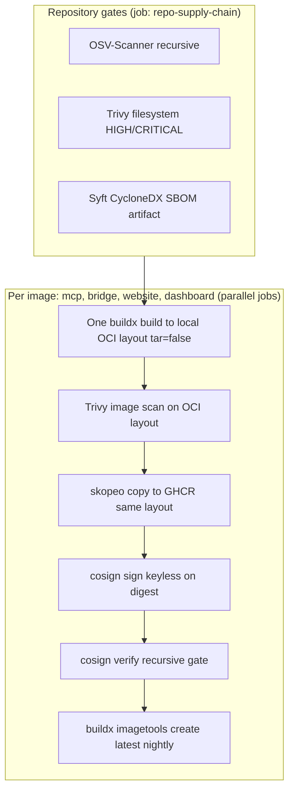

# Golden image pipeline (end to end) and enforcement

This document describes the full path from repository change to signed images on GHCR, how CI blocks promotion when anything fails, and how Kubernetes admission ties the published artifact to what is allowed to run — so operators can reason about build → scan → push → sign → deploy in one place.

---

## What "golden" means here

Rolling tags (`latest`, `nightly`, date-stamped `nightly-YYYYMMDD`) only move after repo gates, image build, vulnerability scan on the exact bytes pushed, registry push, Cosign signing, and `cosign verify` on the pushed digest (same identity / issuer policy as Kyverno `verifyImages`).

The same OCI layout Trivy scans is what `skopeo copy` uploads — there is no separate "release build" that could differ from the scanned artifact.

Clusters that install the Helm chart defaults get a Kyverno `ClusterPolicy` that verifies Cosign signatures for the published ClawQL MCP, Panguard MCP bridge, website, and dashboard images (see [Enforcement at deploy](#enforcement-at-deploy)).

Scanner data, severity choices, and `.trivyignore` / `osv-scanner.toml` mean this pipeline is gated and reproducible with cryptographic identity on the digest that passed the gates. It is not a proof of zero defects.

---

## High-level flow


```mermaid
flowchart TB
  subgraph repo["Repository gates (job: repo-supply-chain)"]
    OSV[OSV-Scanner recursive]
    TrivyFS[Trivy filesystem HIGH/CRITICAL]
    Syft[Syft CycloneDX SBOM artifact]
  end
  subgraph perImage["Per image: mcp, bridge, website, dashboard (parallel jobs)"]
    Build[One buildx build to local OCI layout tar=false]
    TrivyOCI[Trivy image scan on OCI layout]
    Skopeo[skopeo copy to GHCR same layout]
    Cosign[cosign sign keyless on digest]
    CosignVerify[cosign verify recursive gate]
    Promote[buildx imagetools create latest nightly]
  end
  repo --> Build
  Build --> TrivyOCI
  TrivyOCI --> Skopeo
  Skopeo --> Cosign
  Cosign --> CosignVerify
  CosignVerify --> Promote
```

All `build-push-*` image jobs (`build-push-mcp`, `build-push-panguard-bridge`, `build-push-website`, `build-push-dashboard`) `need: repo-supply-chain` — if repository gates fail, no image job runs.

---

## Step 1 — Repository supply chain (`repo-supply-chain`)

Workflow: [`.github/workflows/docker-publish.yml`](https://github.com/danielsmithdevelopment/ClawQL/blob/main/.github/workflows/docker-publish.yml) job `repo-supply-chain`.

| Step             | What runs                                                                                                                               | Failure effect                               |
| ---------------- | --------------------------------------------------------------------------------------------------------------------------------------- | -------------------------------------------- |
| OSV-Scanner      | `ghcr.io/google/osv-scanner` with [`osv-scanner.toml`](https://github.com/danielsmithdevelopment/ClawQL/blob/main/osv-scanner.toml)     | Job fails → no `docker-publish` image builds |
| Trivy filesystem | `aquasecurity/trivy-action`, HIGH / CRITICAL, [`.trivyignore`](https://github.com/danielsmithdevelopment/ClawQL/blob/main/.trivyignore) | Job fails → no image builds                  |
| Syft SBOM        | `anchore/syft:v1.19.0` → CycloneDX JSON uploaded as artifact                                                                            | Artifact missing → job fails                 |

The main [`ci.yml`](https://github.com/danielsmithdevelopment/ClawQL/blob/main/.github/workflows/ci.yml) workflow also runs a `supply-chain` job (OSV + Trivy fs + repository SBOM upload) on pushes/PRs so the merge queue can block bad dependency states before they reach `main`.

---

## Step 2 — Single BuildKit export (per image)

After `repo-supply-chain` succeeds, four image jobs run in parallel:

- **`build-push-mcp`**: `docker buildx build` with [`docker/Dockerfile`](https://github.com/danielsmithdevelopment/ClawQL/blob/main/docker/Dockerfile), multi-arch `linux/amd64`, `linux/arm64`.
- **`build-push-panguard-bridge`**: [`docker/panguard-mcp-bridge/Dockerfile`](https://github.com/danielsmithdevelopment/ClawQL/blob/main/docker/panguard-mcp-bridge/Dockerfile).
- **`build-push-website`**: [`website/Dockerfile`](https://github.com/danielsmithdevelopment/ClawQL/blob/main/website/Dockerfile).
- **`build-push-dashboard`**: [`dashboard/Dockerfile`](https://github.com/danielsmithdevelopment/ClawQL/blob/main/dashboard/Dockerfile).

The docs site runtime image uses Next `output: 'standalone'` and copies only `.next/standalone`, `.next/static`, and `public` into the runner stage — not the full `npm ci` tree — so the GHCR image stays much smaller than copying all `node_modules`.

Output is a local OCI image layout: `--output type=oci,tar=false,dest=<dir>` (directory layout — Trivy is reliable on this; OCI tar exports are avoided due to upstream friction).

BuildKit also emits SLSA-style provenance (`--provenance=mode=max`) and SBOM (`--sbom=true`) as attestations on the build output where BuildKit attaches them.

There is no GHCR write at this stage.

---

## Step 3 — Trivy on the OCI layout (gate before registry)

Each job runs Trivy (`ghcr.io/aquasecurity/trivy:0.59.1` per workflow env) against the directory produced in step 2:

```
trivy image --input /work/oci
```

with HIGH / CRITICAL, `--exit-code 1`, repo `.trivyignore`. If this fails, the workflow stops — nothing is pushed for that image.

---

## Step 4 — Push the scanned bytes (`skopeo copy`)

`skopeo copy` uploads from `oci:<local-layout>` to `docker://<ghcr-with-sha-tag>` using the runner's `config.json` (GitHub `GITHUB_TOKEN` login from `docker/login-action`).

Immutable tags come from `docker/metadata-action` (`type=sha,prefix=sha-,format=short`): only `sha-*` references are written first; digest is read back for signing.

---

## Step 5 — Cosign keyless sign

`cosign sign --yes <image>@<digest>` uses GitHub Actions OIDC (`permissions: id-token: write`) → Fulcio / Rekor (keyless). The signature is bound to the digest that was pushed — same artifact as scanned.

**Kyverno compatibility note:** [`docker-publish.yml`](https://github.com/danielsmithdevelopment/ClawQL/blob/main/.github/workflows/docker-publish.yml) pins Cosign v2, whose default signatures use the legacy Sigstore bundle form that Kyverno `verifyImages` accepts on typical clusters. Cosign v3 with `--new-bundle-format=true` produces bundle v0.3 signature artifacts that commonly fail in-cluster verification until Kyverno/Sigstore stacks catch up. The workflow stays on v2 for admission compatibility.

Before promotion, each image job runs `cosign verify --recursive` on `<image>@<digest>` with `--certificate-identity-regexp` / `--certificate-oidc-issuer-regexp` matching this repository's GitHub Actions workflow identity (the workflow regex uses the `github.repository` context so forks verify against their own path). If verification fails, `latest` / `nightly` do not move.

---

## Step 6 — Promote rolling tags (`imagetools create`)

`docker buildx imagetools create` points `latest`, `nightly`, and (on schedule) `nightly-YYYYMMDD` at the signed digest. Promotion runs only after push, sign, and `cosign verify` succeed for that digest.

Each job does not programmatically change GHCR visibility: GitHub's published Packages REST/OpenAPI has no `PATCH` route for container-package visibility (only GET / delete / restore appear under `/…/packages/`). Operators make images Public in Package settings, or set Org → Packages defaults for new packages. The job does run anonymous `skopeo inspect` on `:latest` so Kyverno-style anonymous manifest reads are proven before the release is considered complete.

GitHub commonly creates linked packages as Private until visibility is changed in the UI or via org policy for new packages. Private packages break `docker pull` without auth and `verifyImages`. The publish workflow fails on failed anonymous registry reads; `make ghcr-packages-public` (GET-only audit) and [`docker/README.md`](https://github.com/danielsmithdevelopment/ClawQL/blob/main/docker/README.md) § GHCR visibility document the operator checklist.

Rolling tags do not advance on failed gates, failed signing, failed verification, or failed anonymous registry reads.

---

## Enforcement at deploy

Admission control closes the loop that CI signing alone cannot. Signing in CI prevents silent tag movement and establishes cryptographic provenance. A `kubectl apply` of an arbitrary image still reaches the cluster unless the admission webhook rejects it.

### Helm chart (default on)

[`charts/clawql-mcp/values.yaml`](https://github.com/danielsmithdevelopment/ClawQL/blob/main/charts/clawql-mcp/values.yaml) defaults `kyverno.imageSignaturePolicy.enabled: true`, which renders a `ClusterPolicy` ([`templates/kyverno-clusterpolicy-cosign.yaml`](https://github.com/danielsmithdevelopment/ClawQL/blob/main/charts/clawql-mcp/templates/kyverno-clusterpolicy-cosign.yaml)) using `verifyImages` with Cosign keyless `subjectRegExp` / `issuerRegExp` matching this repo's GitHub Actions identity and `ghcr.io/danielsmithdevelopment/clawql-mcp*` / `clawql-panguard-mcp-bridge*` / `clawql-website*` / `clawql-dashboard*` image patterns.

**Requirements:**

Install [Kyverno](https://kyverno.io/) in the cluster before applying the chart (CRDs must exist), or disable the policy with `--set kyverno.imageSignaturePolicy.enabled=false` until Kyverno is available.

**Docker Desktop (`make local-k8s-up`):**

[`scripts/kubernetes/local-k8s-docker-desktop.sh`](https://github.com/danielsmithdevelopment/ClawQL/blob/main/scripts/kubernetes/local-k8s-docker-desktop.sh) installs the Kyverno Helm chart (pin via `CLAWQL_KYVERNO_CHART_VERSION`, default 3.7.2), uses `values-docker-desktop.yaml` with `matchReleaseNamespaceOnly: true` so the policy applies to the `clawql` release namespace, pulls signed GHCR images for MCP, docs UI, and dashboard, and rejects unsigned local `docker build` deploys.

### Coverage

| Covered                                                                                                                                                                                | Outside automatic coverage                                                                                                                                                                                                         |
| -------------------------------------------------------------------------------------------------------------------------------------------------------------------------------------- | ---------------------------------------------------------------------------------------------------------------------------------------------------------------------------------------------------------------------------------- |
| Pods whose container images match the `clawql-mcp` / `clawql-panguard-mcp-bridge` / `clawql-website` / `clawql-dashboard` GHCR globs must verify with the configured Sigstore identity | Other images in the same namespace (Postgres, Onyx, ingress, etc.) — different images, different risk                                                                                                                              |
| Keyless signatures matching GitHub Actions issuer + this repo subject pattern                                                                                                          | Forks must override regexes and image references in values                                                                                                                                                                         |
| Tag-based refs still resolve to a digest for verification                                                                                                                              | `verifyDigest: true` in values is optional and requires manifests to use digests — see [`image-signature-enforcement.md`](https://github.com/danielsmithdevelopment/ClawQL/blob/main/docs/security/image-signature-enforcement.md) |

Operator verification without applying a workload: `cosign verify` as documented in [`docker/README.md`](https://github.com/danielsmithdevelopment/ClawQL/blob/main/docker/README.md).

---

## Private registry mirror (Harbor)

Many enterprises front GHCR with [Harbor](https://goharbor.io/) for replication, pull-through cache, vulnerability scanning, and retention policies. ClawQL builds and signs on GHCR; Harbor is an organizational consumption pattern sitting on top of that source.

Recommended practices:

1. **Replication / proxy:** mirror `ghcr.io/danielsmithdevelopment/clawql-*` images into a Harbor project (immutable tags or digest pins only).
2. **Admission allowlists:** point Kyverno `verifyImages` (Helm values) and cluster egress allowlists at your Harbor hostname + project path (for example `harbor.example.com/clawql/clawql-mcp@sha256:…`) when workloads must pull from Harbor directly. Adjust `issuerRegExp` / `subjectRegExp` if you re-sign in Harbor or use a different identity; see [`image-signature-enforcement.md`](https://github.com/danielsmithdevelopment/ClawQL/blob/main/docs/security/image-signature-enforcement.md).
3. **SBOM next to the image:** attach the CycloneDX artifact produced in `ci.yml` / `docker-publish.yml` (Syft) as an OCI reference or Harbor-supported SBOM attachment so audits tie digest to SBOM without relying on GitHub Actions artifacts alone.

---

## Vendor image mirror (OpenClaw)

Workflow: [`.github/workflows/container-mirror.yml`](https://github.com/danielsmithdevelopment/ClawQL/blob/main/.github/workflows/container-mirror.yml) (scheduled daily + `workflow_dispatch`).

| Step    | Behavior                                                                                                                                            |
| ------- | --------------------------------------------------------------------------------------------------------------------------------------------------- |
| Pull    | `skopeo copy` from `docker://ghcr.io/openclaw/openclaw:slim` to a local OCI layout (no GHCR write)                                                  |
| Gate    | Trivy `image` scan on that layout (HIGH / CRITICAL, `.trivyignore`) — failure → no push                                                             |
| Publish | `skopeo copy` the same layout to `ghcr.io/danielsmithdevelopment/openclaw-vendor` (`:slim`, `:mirror-YYYYMMDD`, `:run-<run_id>` tags on one digest) |
| Sign    | Cosign v2 `sign --recursive` on the pushed digest (same OIDC identity as `docker-publish` — matches Helm `kyverno.imageSignaturePolicy` defaults)   |

Helm `openclaw.image.repository` defaults to `ghcr.io/danielsmithdevelopment/openclaw-vendor`; Kyverno `imageReferences` includes `openclaw-vendor*` so admission matches this repo's signatures. Third-party base CVEs may require narrow `.trivyignore` updates or pinning an older upstream digest until upstream fixes land.

---

## Quick reference

| Layer           | Mechanism                                                    | Artifact / outcome                                       |
| --------------- | ------------------------------------------------------------ | -------------------------------------------------------- |
| Merge / CI      | `ci.yml` `supply-chain` + `secret-scan` (Gitleaks)           | OSV + Trivy fs + SBOM + secret scan; gates `test`        |
| Publish         | `docker-publish.yml` `repo-supply-chain`                     | Same repo gates + SBOM artifact for the publish run      |
| Image integrity | Single OCI layout + Trivy + `skopeo copy`                    | Scanned bytes = pushed bytes                             |
| Identity        | Cosign keyless on digest                                     | Signature in Rekor / Sigstore ecosystem                  |
| Mutability      | `imagetools` promotion                                       | `latest` / `nightly` only after success                  |
| Cluster         | Kyverno `verifyImages` (Helm default) + optional digest pins | Unsigned / wrong-identity ClawQL images blocked at admit |
| Scheduled audit | `trufflehog-scheduled.yml`                                   | TruffleHog git history; `providers/` excluded            |

---

## Packer golden host VMs (managed tiers)

Container images (GHCR + Cosign + Kyverno) are separate from Packer AMI / GCP images used for managed AWS/GCP/Cloudflare host tiers. Operator how-to lives at [Getting started for teams — Golden host images](https://docs.clawql.com/getting-started/for-teams#golden-host-images); this section is the security contract for those VMs.

| Control                     | Requirement                                                                                                    |
| --------------------------- | -------------------------------------------------------------------------------------------------------------- |
| **No secrets in the image** | Sync credentials (R2/S3/GCS keys) are never baked; inject at boot via Vault, instance role, or secrets manager |
| **Manifest verify on pull** | Boot seeding verifies every pulled vault file with SHA-256 against the remote sync manifest                    |
| **Bake gate**               | Image build runs `clawql doctor` before the AMI/GCP image is published                                         |
| **Boot gate**               | Startup runs `clawql doctor --smoke` after `bootstrap-team-vault.sh` before serving traffic                    |
| **Cloudflare Workers path** | `scripts/packer/cloudflare-bootstrap.sh` uses the same pull + hash verify + doctor gate                        |

Related: [ADR 0006](https://github.com/danielsmithdevelopment/ClawQL/blob/main/docs/adr/0006-golden-host-images-packer.md), [`packer/`](https://github.com/danielsmithdevelopment/ClawQL/tree/main/packer), [team vault sync](https://docs.clawql.com/getting-started/for-teams#team-vault-sync).

---

## Issues and tracking

- [#156](https://github.com/danielsmithdevelopment/ClawQL/issues/156) — CI + publish pipeline + security docs (narrowed); follow-ups [#202](https://github.com/danielsmithdevelopment/ClawQL/issues/202) (MCP OSV), [#203](https://github.com/danielsmithdevelopment/ClawQL/issues/203) (Helm rescan), [#204](https://github.com/danielsmithdevelopment/ClawQL/issues/204) (audit / memory hooks)
- [#283](https://github.com/danielsmithdevelopment/ClawQL/issues/283) — Gitleaks (pre-commit + CI) + TruffleHog (scheduled) + Harbor consumption docs
- [#132](https://github.com/danielsmithdevelopment/ClawQL/issues/132) — digest-first deploys and admission follow-ups
- [#164](https://github.com/danielsmithdevelopment/ClawQL/issues/164) — deliverables matrix maintenance

© Copyright 2026. All rights reserved. · [ClawQL on GitHub](https://github.com/danielsmithdevelopment/ClawQL)
