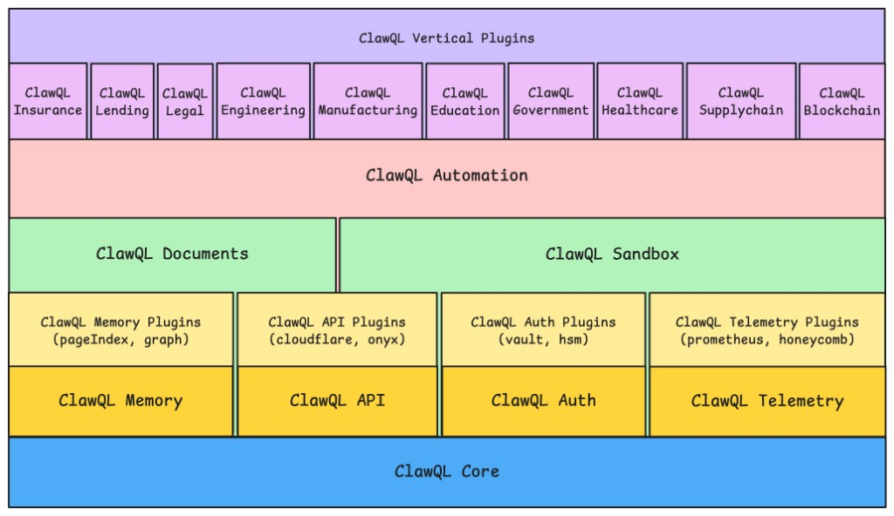

# ClawQL Modularization

**Version 1.9** · May 2026

---

## Document scope & evidence (read this first)

This document is a **target modularization and platform architecture** for ClawQL. It mixes **shipped today**, **partial**, and **planned** work in one narrative. In particular, **§2 “To ship”** describes **intended package boundaries and responsibilities**, not “installable npm packages available now,” unless the same name also appears under **§2.4 Shipped**. For the **v2.0 intelligent MCP gateway** narrative (single front-end for multi-backend MCP), see [`clawql-modularization-v2.md`](./clawql-modularization-v2.md).

**Where to ground claims in Git:**

- **Product surface, transports, feature tiers, and what exists today in the MCP server:** [`docs/clawql-ecosystem.md`](../clawql-ecosystem.md) — use this when explaining ClawQL to buyers or integrators who need **shipped vs vision** spelled out in prose.
- **Security and compliance controls mapped to shipped / partial / planned / customer-owned work:** [`docs/security/clawql-security-defense-deliverables.md`](../security/clawql-security-defense-deliverables.md) — pair with [`docs/security/clawql-security-defense-in-depth.md`](../security/clawql-security-defense-in-depth.md) for the narrative baseline.
- **Self-hosted k3s + MCP production stack (May 2026):** [`docs/security/clawql-comprehensive-defense-in-depth-mcp-k3s-may-2026.md`](../security/clawql-comprehensive-defense-in-depth-mcp-k3s-may-2026.md) — supply chain through SIEM, Panguard chokepoint, Istio egress discipline, model integrity, GPU quotas, and process (PICERL / STRIDE). Use this when §7’s package-centric view needs the **full cluster** story.
- **Issue-tracked roadmap (GitHub):** epic [#259](https://github.com/danielsmithdevelopment/ClawQL/issues/259) and linked checklists — use for **dates and ownership**, not this doc’s week labels alone.
- **Package delivery epic:** [#306](https://github.com/danielsmithdevelopment/ClawQL/issues/306) — one issue per package from §2; **epic closes when all `modularization-platform` issues are done** (verticals use `modularization-vertical` and stay open on domain timelines).

**Mesh and multi-protocol scope:** Treat **GraphQL Mesh (or equivalent) as the integration spine** in this doc as **architecture direction**. Each first-class `SpecKind` (Postgres with RLS, Fabric gateway + mTLS, NATS subscriptions, x402-gated subgraphs, etc.) is **substantial engineering** beyond a single config block; sequence them using the phases below rather than assuming parallel delivery.

**Week labels in §10:** “Week _n_” means **recommended phase order and dependency structure** for a well-staffed program — **not** a promise of calendar wall-clock unless resourced and scoped accordingly. Slip a phase before inventing new parallel workstreams.

---

## 1. Vision & Core Objectives

ClawQL is a modular, production-grade, self-healing, multi-tenant AI memory + agent platform that scales from solo developer to large enterprise.

**Core Principles:**

- Natural language as the primary interface for all users — ops, config, auth, scaling.
- `clawql-api` is the universal agentic API layer: any spec, any protocol, one unified surface. This is intentional architecture, not a concern to be split.
- Vertical packages for industry-specific workflows — disabled by default, zero footprint when off.
- Zero operational burden via Kubernetes Operator + Dashboard + Agent Chat.
- Defense-in-Depth: Merkle, ATR, Presidio, WORM, Kata, RBAC/ABAC.
- Clean separation: primitives (`clawql-core`) → universal API (`clawql-api`) → memory + documents → verticals.

---

## 2. Complete Package Ecosystem

**Status column:** **To ship** = planned package boundary for modularization; **✅** (§2.4) = shipped as described there. If a row reads like a release matrix, re-read **Document scope & evidence** at the top of this file.

### 2.1 Always-Enabled

| Package       | Status  | Responsibilities                                                                                                                                                                                                                              |
| ------------- | ------- | --------------------------------------------------------------------------------------------------------------------------------------------------------------------------------------------------------------------------------------------- |
| `clawql-core` | To ship | Types, ATR primitives, audit ring buffer, Merkle utils, Cuckoo filter, error factories, cache helpers, ID generation                                                                                                                          |
| `clawql-api`  | To ship | **The universal agentic API layer.** Unified `search()` + `execute()`, all protocol adapters (REST/gRPC/OpenAPI/GraphQL Mesh/MCP), plugin system, permission hook, rate limiting, response formatting, GraphQL projection, multi-spec merging |

### 2.2 Default-Enabled

| Package            | Status  | Responsibilities                                                                                                                                           |
| ------------------ | ------- | ---------------------------------------------------------------------------------------------------------------------------------------------------------- |
| `clawql-auth`      | To ship | Multi-user auth (noAuth/apiKey/OIDC/SAML/OAuth2/LDAP), RBAC/ABAC, vertical RLS, ATR enrichment, session management, Vault secrets, hardware auth (YubiKey) |
| `clawql-documents` | To ship | Document pipeline orchestration: Tika → Gotenberg → Stirling-PDF → Paperless NGX. OCR, Presidio redaction, metadata, hierarchy extraction                  |
| `clawql-memory`    | To ship | Memory 2.0 hybrid: Obsidian Vault + Adjacency-list Graph + PageIndex + Onyx (optional)                                                                     |
| `clawql-pageindex` | To ship | Standalone npm package (MIT) — vectorless hierarchical tree building and traversal                                                                         |

### 2.3 Default-Disabled (Opt-In)

| Package                | Status  | Responsibilities                                                                                         |
| ---------------------- | ------- | -------------------------------------------------------------------------------------------------------- |
| `clawql-telemetry`     | To ship | Privacy-first Prometheus metrics, OpenTelemetry traces, Grafana dashboard feeds, Uptime Kuma integration |
| `clawql-sandbox`       | To ship | Secure code execution (Kata/gVisor), `sandbox_exec` MCP tool                                             |
| `clawql-automation`    | To ship | Scheduling, `notify()` Slack integration, NATS JetStream backbone, HITL approval gates                   |
| `clawql-lending`       | To ship | 5-vertical LOS: mortgage, auto, BNPL, payday, commercial. Powers SeeTheGreens.                           |
| `clawql-blockchain`    | To ship | Hyperledger Fabric, Base, Solana, Chainlink, The Graph, x402/MPP, agentic wallet                         |
| `clawql-legal`         | To ship | Contract intelligence, case law, e-discovery, privilege review, drafting                                 |
| `clawql-healthcare`    | To ship | FHIR/HL7, DICOM, EHR structuring, HIPAA de-identification                                                |
| `clawql-insurance`     | To ship | Claims, policy ingestion, underwriting automation, fraud flagging                                        |
| `clawql-supplychain`   | To ship | Procurement-to-payment, logistics docs, ERP connectors, trade compliance                                 |
| `clawql-government`    | To ship | Permitting, FOIA, tax forms, procurement, FedRAMP-ready defaults                                         |
| `clawql-manufacturing` | To ship | Production docs, QC, MES/ERP, BOM validation, traceability                                               |
| `clawql-education`     | To ship | LMS connectors (Canvas/Moodle/Blackboard), content generation, adaptive learning                         |
| `clawql-engineering`   | To ship | MATLAB MCP Core + Simulink Agentic Toolkit (**requires licensed MATLAB on host**)                        |

### 2.4 Shipped

| Package              | Status                                                                                |
| -------------------- | ------------------------------------------------------------------------------------- |
| `clawql-mcp`         | ✅ MCP server, stdio/HTTP/gRPC transports, tool registration                          |
| `clawql-ouroboros`   | ✅ Evolutionary loops, Seed, EvolutionaryLoop, InMemoryEventStore, PostgresEventStore |
| `mcp-grpc-transport` | ✅ First TypeScript gRPC transport for MCP                                            |

### 2.5 Internal (Monorepo, Not Published Standalone)

| Package          | Responsibilities                                           |
| ---------------- | ---------------------------------------------------------- |
| `@clawql/merkle` | SHA-256 Merkle tree computation and root verification      |
| `@clawql/cuckoo` | Cuckoo filter for O(1) probabilistic deduplication         |
| `@clawql/utils`  | Hashing, ID generation, date utils, `normalizeOperationId` |

---

## 3. Dependency Graph (Acyclic — CI-Enforced)

Each layer in the platform stack depends on one or more layers below it: **ClawQL Core** at the foundation; **Memory, API, Auth, and Telemetry** services on Core; **service plugins** on their parent service; **Documents** (Memory + API plugins) and **Sandbox** (Auth + Telemetry plugins); **Automation** on Documents and Sandbox; **industry verticals** on Automation; and **vertical plugins** spanning the verticals. The diagram is a compact view of that direction; the ASCII graph that follows encodes the same acyclic package edges enforced in CI.



```
@clawql/merkle  @clawql/cuckoo  @clawql/utils
         │              │              │
         └──────────────┴──────────────┘
                        │
                   clawql-core
                   (types, ATR, audit, cache, errors)
                        │
           ┌────────────┴────────────────┐
           │                             │
      clawql-api                   clawql-pageindex
   (THE universal layer:            (standalone npm,
    REST/gRPC/OpenAPI/              MIT, zero deps
    GraphQL/MCP, search,            on clawql-*)
    execute, plugins,
    protocol adapters)
           │
    ┌──────┼──────────────────────┐
    │      │                      │
clawql- clawql-              clawql-
 auth  documents              memory ──► clawql-pageindex
           │                      │
           │              (Graph + Vault +
           │               PageIndex + Onyx)
           │
    ┌──────┼──────────────────────────────────────┐
    │      │                                       │
clawql- clawql-        clawql-               clawql-
telemetry sandbox     automation            [verticals]
                                               │
                          ┌────────────────────┼──────────────────┐
                          │                    │                   │
                    clawql-lending       clawql-blockchain   clawql-legal
                    clawql-healthcare    clawql-insurance    clawql-supplychain
                    clawql-government    clawql-manufacturing clawql-education
                    clawql-engineering
```

**Dependency rules (enforced via ESLint `no-restricted-imports` + CI):**

- No vertical package imports another vertical package directly.
- Cross-vertical communication routes through `clawql-api` (plugin calls) or `clawql-memory` (shared knowledge graph via `cross_vertical` recall mode with elevated ATR).
- **Exception:** `clawql-lending` declares `clawql-blockchain` as an optional peer dependency for Fabric consortium features. Declared in `package.json` as `peerDependenciesMeta: { 'clawql-blockchain': { optional: true } }`. When absent, all lending features work — Fabric tools simply aren’t registered.

---

## 4. Package Specifications

### 4.1 `clawql-core`

Zero runtime dependencies outside Node built-ins. Must remain this way permanently.

**Exports:**

```ts
// Types (from Memory 2.0 Cursor-ready guide — these are the canonical types)
export type {
  EntityType,
  EntityNode,
  Edge,
  EntityMetadata,
  EntitySourceType,
  PageIndexNode,
  PageIndexTree,
  PageIndexBranch,
  PageIndexBuildMethod,
  BFSLayer,
  BFSResult,
  VaultMatch,
  RecallMode,
  RecallOptions,
  RecallResult,
  MemoryIngestInput,
  MemoryIngestResult,
  LLMExtractionResult,
  LLMExtractionEntity,
  LLMExtractionRelation,
  PruningPolicy,
  PruneResult,
  MemoryATRClaims,
  LendingVertical,
  ProvenanceRecord,
} from "./types/memory";

export type {
  SpecKind,
  SpecSource,
  LoadedSpec, // from multi-protocol guide
} from "./types/specs";

export type { ATRClaims, AuditEvent, CacheEntry, ErrorCode, Plugin, MCPTool } from "./types/core";

// Utilities
export { computeMerkleRoot, verifyMerkleRoot } from "./merkle";
export { CuckooFilter } from "./cuckoo";
export { createAuditRingBuffer } from "./audit";
export { createCache } from "./cache";
export { ClawQLError, ErrorCodes } from "./errors";
export { generateId, hashContent, normalizeOperationId } from "./utils";
```

`**normalizeOperationId` — double-underscore separator (colons break MCP clients):\*\*

```ts
// kind__provider__operation
// postgres__loans__select
// fabric__autoLendingConsortium__IssueLoan
// graph__aaveLending__loans
export function normalizeOperationId(kind: string, provider: string, operation: string): string {
  return [kind, provider, operation].map((s) => s.replace(/[^a-zA-Z0-9]/g, "_")).join("__");
}
```

---

### 4.2 `clawql-api` — The Universal Agentic API Layer

This is the product. Its scope is intentionally broad: the entire point is that an agent can discover and invoke any operation across any API, data store, or protocol through one unified surface. Breadth is the feature.

```ts
import { createApi } from "clawql-api";

const api = createApi({
  core: coreInstance,

  // Specs: any mix of OpenAPI, gRPC, GraphQL, Postgres, Redis, SQLite,
  //        NATS JetStream, Hyperledger Fabric, The Graph — all first-class
  specs: [
    { kind: "openapi", id: "github", url: "..." },
    { kind: "openapi", id: "paperless", url: "..." },
    { kind: "grpc", id: "internal-svc", endpoint: "localhost:50051" },
    { kind: "graphql", id: "onyx", endpoint: "http://onyx:8080/graphql" },
    { kind: "postgres", id: "loans-db", uri: process.env.CLAWQL_POSTGRES_URI },
    { kind: "redis", id: "cache", url: process.env.CLAWQL_REDIS_URL },
    { kind: "nats-jetstream", id: "events", servers: ["nats://localhost:4222"] },
    { kind: "fabric", id: "consortium", gatewayEndpoint: "..." },
    { kind: "the-graph", id: "aave", subgraphId: "Qm...", apiKey: "..." },
  ],

  auth: authInstance, // optional — if absent, noAuth defaults applied
  plugins: [
    lendingPlugin(), // from clawql-lending
    blockchainPlugin(), // from clawql-blockchain
  ],
  telemetry: telemetryInstance, // optional
});

// External surface — unchanged for all consumers including Cursor and Claude Desktop
await api.search("create a GitHub issue");
await api.execute("github__issues__create", { title: "...", body: "..." });
await api.execute("postgres__loans__select", { where: { status: "pending" } });
await api.execute("fabric__consortium__IssueLoan", { amount: 42000 });
```

**Internal architecture of `clawql-api`:**

```
Incoming request (search / execute)
        │
        ▼
Auth middleware (delegates to clawql-auth if present, else noAuth pass-through)
        │
        ▼
Rate limiter + request tracer
        │
        ▼
Unified GraphQL Mesh supergraph
  ├── OpenAPI 3 / Swagger 2 / Google Discovery subgraphs (existing)
  ├── Native GraphQL subgraphs (Onyx, The Graph, custom)
  ├── gRPC subgraphs (@omnigraph/grpc)
  ├── Postgres subgraph (custom pg Pool handler + RLS)
  ├── Redis subgraph (makeExecutableSchema + Mesh source wrapper)
  ├── SQLite subgraph (better-sqlite3 + Mesh source)
  ├── NATS JetStream subgraph (subscription guard on stdio transport)
  └── Hyperledger Fabric subgraph (Fabric Gateway gRPC + mTLS)
        │
        ▼
GraphQL projection (trim response to requested fields — token efficiency)
        │
        ▼
Response formatter + audit log
```

**Plugin interface:**

```ts
export interface Plugin {
  name: string;
  version: string;
  tools: MCPTool[];
  onRegister?(api: ClawQLApi): void | Promise<void>;
  onTeardown?(): void | Promise<void>;
}
```

**Spec kinds supported** (from multi-protocol guide):

```ts
type SpecKind =
  | "openapi"
  | "graphql"
  | "the-graph" // The Graph Protocol (x402-gated)
  | "grpc"
  | "fabric" // Hyperledger Fabric (distinct from generic gRPC)
  | "postgres"
  | "sqlite"
  | "redis"
  | "nats-jetstream"
  | "bundled";
```

**Subscription transport constraint:**

```
Transport       │ Query │ Mutation │ Subscription
────────────────┼───────┼──────────┼─────────────
stdio (Cursor)  │  ✓    │    ✓     │     ✗
HTTP /mcp       │  ✓    │    ✓     │   SSE only
gRPC (mcp-grpc) │  ✓    │    ✓     │     ✓
```

NATS JetStream subscriptions and Fabric event streams require `CLAWQL_TRANSPORT=grpc`. In stdio mode, subscribe operations return a helpful error — they never fail silently.

**Bundled providers** (offline-capable, no external registry call required):
GitHub, Google Cloud (~50 services), Cloudflare, Paperless NGX, Stirling-PDF, Slack, Apache Tika, Gotenberg, Onyx, PagerDuty

---

### 4.3 `clawql-auth`

`clawql-api` has an optional auth hook. When `clawql-auth` is absent, all requests receive permissive ATR claims (`{ role: 'admin', scope: ['*'] }`). When present, it enriches every request with scoped claims before any operation executes.

**Supported modes:**

```ts
type AuthMode = "noAuth" | "apiKey" | "oidc" | "saml" | "oauth2" | "ldap";
```

```ts
import { createClawQLAuth } from "clawql-auth";

// Solo developer / local (no IdP — still generates ATR claims structurally)
const auth = createClawQLAuth({ mode: "noAuth" });

// API key (CI/CD, programmatic access)
const auth = createClawQLAuth({
  mode: "apiKey",
  keys: process.env.CLAWQL_API_KEYS?.split(",") ?? [],
  defaultClaims: { role: "service", scope: ["*"] },
});

// Enterprise OIDC
const auth = createClawQLAuth({
  mode: "oidc",
  oidc: { issuer: "https://...", clientId: "..." },
  rbac: { enabled: true },
  verticalRLS: true,
  abac: {
    policies: [
      // "mortgage underwriters can only access mortgage vertical"
      { role: "underwriter", vertical: "mortgage", scope: ["vertical:mortgage"] },
    ],
  },
});
```

**Natural language management via Agent Chat:**

```
"Enable clawql-lending and give the mortgage team read access to the auto vertical"
→ clawql-auth MCP tools: update_role_policy, assign_user_role, set_vertical_rls
→ Audit logged, Merkle-rooted, WORM-persisted
```

---

### 4.4 `clawql-documents`

Orchestrates the 4-service document pipeline. The services (Tika, Gotenberg, Stirling-PDF, Paperless NGX) are infrastructure configured via env vars or Helm. This package is the TypeScript orchestration layer.

```ts
import { processDocument } from "clawql-documents";

const result = await processDocument({
  input: { type: "file", path: "/uploads/loan-package.pdf" },
  options: {
    ocr: true,
    redact: true, // Presidio redaction (requires CLAWQL_PRESIDIO_ENDPOINT)
    archive: true, // Paperless NGX import
    extractHierarchy: true, // feeds clawql-pageindex tree build
    tags: ["mortgage", "borrower-8831"],
  },
});

// result.extractedText    — post-Tika, post-Presidio (redacted)
// result.structuredFields — { income, employer, ssn_redacted: true, ... }
// result.pdfPath          — post-Gotenberg conversion
// result.paperlessId      — Paperless NGX document ID
// result.merkleRoot       — covers all pipeline steps
// result.contentHash      — SHA-256 of original pre-redaction (for Cuckoo dedup)
// result.presidioRedacted — boolean
```

**Pipeline stages (in order):**

1. **Tika** — Extract text + metadata from 1,000+ MIME types
2. **Gotenberg** — Convert to PDF (Chromium for HTML/URL, LibreOffice for Office formats)
3. **Stirling-PDF** — OCR, PII redaction, merge/split, Merkle hash per document
4. **Presidio** — Entity recognition + redaction of PII/financial data
5. **Paperless NGX** — Full-text indexed archive, auto-tagged, Onyx index push on import

Each stage failure is logged to audit. Stages 2–5 are individually bypassable via options flags.

---

### 4.5 `clawql-memory`

Memory 2.0 hybrid layer. **The complete type system, SQLite schema, BFS algorithm, hybrid recall algorithm, `synthesize()` token budget allocation, Ouroboros hooks, Fabric event hooks, and 8-week implementation checklist are in `ClawQL_Memory2_Cursor_Ready.md`. That document is the source of truth for this package’s implementation.**

**Summary of what this package exposes:**

```ts
// Primary MCP tools
export { memory_ingest } from "./ingest";
export { memory_recall } from "./recall";

// PageIndex MCP tools (delegated to clawql-pageindex)
export { pageindex_build_tree, pageindex_traverse, pageindex_get_content } from "./pageindex-tools";

// Ouroboros + Fabric hooks
export {
  recallBrownfieldForSeed,
  ingestSeedCompletion,
  ingestFabricEvent,
} from "./ouroboros-hooks";

// Storage
export { createGraphStore } from "./graph-store";
export type { GraphStore } from "./graph-store";
```

**Recall modes:** `vault` | `onyx` | `graph` | `pageindex` | `hybrid` (default) | `fabric` | `cross_vertical`

`cross_vertical` mode requires elevated ATR claim `memory.cross_vertical: true`. This is the mechanism that enables “fraud pattern in BNPL surfaces to mortgage underwriter” — it’s explicit and permissioned, not implicit.

---

### 4.6 `clawql-pageindex`

Standalone npm package (MIT). No dependency on any other `clawql-`\* package — fully self-contained.

**Three entrypoints** (following `clawql-ouroboros` pattern):

- `clawql-pageindex` — types, `PageIndexBuilder` interface, `PageIndexTraversal` interface, `DefaultPageIndexBuilder`, `DefaultPageIndexTraversal`
- `clawql-pageindex/storage` — `PageIndexStorage` interface, `SqlitePageIndexStorage`
- `clawql-pageindex/mcp-hooks` — Zod schemas and handlers for `pageindex_build_tree`, `pageindex_traverse`, `pageindex_get_content`

Full spec in `ClawQL_Memory2_Cursor_Ready.md` Prompt 5.

---

### 4.7 `clawql-lending`

Powers SeeTheGreens LOS. Five vertical modules share the same document pipeline, memory layer, and Ouroboros decisioning loop.

```ts
// Five vertical modules
export { MortgagePlugin } from "./verticals/mortgage";
// Tools: gse_validate, condition_clear, pii_redact, loan_archive, notify_underwriting
// Onyx: Fannie/Freddie guidelines, CFPB updates, state regs
// Paperless: auto-archive with tags [mortgage, condition-cleared, borrower-{id}]

export { AutoPlugin } from "./verticals/auto";
// Tools: title_check, credit_check, volume_intake, collateral_verify
// High-volume: Cuckoo dedup prevents reprocessing same doc batch

export { BNPLPlugin } from "./verticals/bnpl";
// Tools: bnpl_decision, fraud_check, regulatory_check
// Sub-second Ouroboros loops, Cuckoo dedup, real-time guardrails

export { PaydayPlugin } from "./verticals/payday";
// Tools: state_reg_check, compliance_validate, rate_cap_verify
// Onyx + Flink: state reg updates applied to templates within minutes

export { CommercialPlugin } from "./verticals/commercial";
// Tools: credit_memo_generate, syndication_setup, multi_doc_package
// Fabric: consortium syndication via clawql-blockchain (optional peer dep)

// Shared across all verticals
export { UnderwritingPlugin } from "./shared/underwriting";
export { CompliancePlugin } from "./shared/compliance"; // Reg Z, ECOA, Fair Lending
export { DiGiFiPlugin } from "./shared/digifi"; // DiGiFi-pattern decisioning
```

**Fabric peer dependency:**

```json
{
  "peerDependencies": { "clawql-blockchain": ">=1.0.0" },
  "peerDependenciesMeta": { "clawql-blockchain": { "optional": true } }
}
```

When `clawql-blockchain` is present: Fabric consortium syndication, on-chain loan tokens, CCIP funding available.

When absent: all 5 verticals work fully — Fabric MCP tools simply not registered.

---

### 4.8 `clawql-blockchain`

Full on/off-chain agentic interaction. Three-tier architecture (private / oracle / public).

```ts
export { FabricPlugin } from "./fabric";
// MCP tools: fabric_invoke_chaincode, fabric_query_ledger, fabric_create_channel,
//            fabric_manage_pdc, fabric_token_transfer, fabric_rwa_issue,
//            fabric_event_listen, fabric_anchor_merkle
// Auth: mTLS (tlsCertPath, clientCertPath, clientKeyPath, mspId)
// Storage: optional Helm service (peer/orderer/CA nodes), air-gapped mode

export { ChainlinkPlugin } from "./chainlink";
// MCP tools: chainlink_price_feed, chainlink_functions_call, chainlink_ccip_transfer,
//            chainlink_proof_of_reserve, chainlink_vrf_request
// x402-native: agent pays oracle fees autonomously in USDC via x402

export { TheGraphPlugin } from "./the-graph";
// MCP tools: graph_query_subgraph, graph_discover_protocols, graph_portfolio_analytics,
//            graph_historical_risk
// x402-gated: GraphQL queries paid per-call in stablecoins

export { AgentWallet } from "./wallet"; // Coinbase AgentKit + ERC-4337
export { x402Middleware } from "./x402"; // autonomous micropayment gating
export { MPPAdapter } from "./mpp"; // Machine Payment Protocol streaming
```

**Ouroboros routing integration:**
Ouroboros automatically routes based on task sensitivity:

- Sensitive/regulated flows → Fabric private channels
- Real-world data needs → Chainlink oracles
- Historical/public discovery → The Graph
- All steps → Merkle hash → Obsidian memory

---

### 4.9 `clawql-engineering`

> ⚠️ **License Requirement:** Requires a valid MATLAB license installed on the host machine. MATLAB is proprietary software (MathWorks). This package provides MCP wrappers that invoke MATLAB’s Engine API or Compiler SDK — it cannot function without a licensed MATLAB executable at `CLAWQL_MATLAB_EXECUTABLE`. The package degrades gracefully: warns at startup, returns a descriptive error on tool call if MATLAB is unavailable.

```ts
export { MATLABPlugin } from "./matlab"; // script execution, Live Scripts, workspace vars
export { SimulinkPlugin } from "./simulink"; // model open/edit/sim/test
export { ControlsPlugin } from "./controls"; // transfer functions, Bode, step response
export { SignalPlugin } from "./signal"; // FFT, filtering, spectral analysis
export { ImagingPlugin } from "./imaging"; // image processing, feature detection
```

---

### 4.10 Remaining Vertical Packages

All follow the same implementation pattern:

1. Implement `Plugin` interface from `clawql-core`
2. Register domain-specific MCP tools via `plugin.tools`
3. Import `clawql-documents` for document processing
4. Optionally import `clawql-memory` for knowledge recall
5. Enable via env flag: `CLAWQL_ENABLE_{VERTICAL}=1`

`**clawql-legal**`

```
Tools:       clause_extract, risk_flag, precedent_search, redact_privilege,
             timeline_generate, brief_draft, motion_draft, filing_validate
Compliance:  Ethical walls, ABA standards, attorney-client privilege redaction,
             data sovereignty, audit trails
Use cases:   Law firm intake, due diligence, litigation support,
             contract lifecycle, in-house counsel
```

`**clawql-healthcare**`

```
Tools:       fhir_parse, hl7_extract, dicom_analyze, ehr_structure,
             deidentify, medical_image_analyze, clinical_note_structure
Compliance:  HIPAA-friendly redaction, PHI de-identification, audit trails
Use cases:   Clinical document processing, radiology, patient record intelligence
```

`**clawql-insurance**`

```
Tools:       claim_extract, policy_analyze, loss_run_reconcile,
             fraud_flag, payout_validate, coverage_check
Compliance:  HIPAA/SOC2 redaction, immutable Merkle audit trails
Use cases:   Carriers, brokers, P&C/life/health — claims and policy lifecycle
```

`**clawql-supplychain**`

```
Tools:       bol_extract, customs_validate, invoice_match, po_match,
             shipment_track, tariff_check, supplier_onboard, demand_forecast
Compliance:  Trade regulations, ESG reporting, supply chain transparency mandates
Use cases:   Manufacturing, logistics, retail — procurement-to-payment
```

`**clawql-government**`

```
Tools:       permit_classify, foia_route, tax_form_extract, bid_analyze,
             record_redact, audit_generate, citizen_service_route
Compliance:  FOIA, data sovereignty, FedRAMP-ready defaults, jurisdiction standards
Use cases:   Federal/state/local agencies — intake, permitting, records management
```

`**clawql-manufacturing**`

```
Tools:       work_order_extract, qc_report_analyze, bom_validate,
             defect_analyze, cert_validate, mes_sync
Compliance:  ISO, regulatory, traceability mandates
Use cases:   Discrete/process manufacturing, aerospace, automotive
```

`**clawql-education**`

```
Tools:       syllabus_generate, rubric_create, assignment_generate,
             progress_analyze, lms_sync, content_scaffold
Connectors:  Canvas, Moodle, Blackboard
Use cases:   Faculty productivity, adaptive learning, course content
```

---

## 5. Kubernetes Operator & ClawQLInstance CRD

### 5.1 Complete Spec

```yaml
apiVersion: clawql.io/v1alpha1
kind: ClawQLInstance
metadata:
  name: clawql-production
  namespace: clawql
spec:
  # ── Core API (always on) ───────────────────────────────────────────────────
  api:
    enabled: true
    replicas: 2
    expose:
      rest: true
      grpc: false
    mcp:
      stdio: true
      http: true
      grpc: false # set true to enable NATS subscriptions + Fabric streams
    bundledProviders:
      - github
      - google-cloud
      - cloudflare
      - slack
      - paperless
      - onyx
      - pagerduty
    specs: # additional user-provided specs
      - kind: postgres
        id: loans-db
        secretRef: postgres-uri-secret
      - kind: redis
        id: cache
        secretRef: redis-url-secret
      - kind: nats-jetstream
        id: events
        servers: [nats://nats:4222]
      - kind: fabric
        id: lending-consortium
        secretRef: fabric-creds-secret

  # ── Auth ──────────────────────────────────────────────────────────────────
  auth:
    enabled: true
    mode: oidc # noAuth | apiKey | oidc | saml | oauth2 | ldap
    oidc:
      issuer: ""
      clientId: ""
      clientSecretRef:
        name: clawql-oidc-secret
        key: clientSecret
    rbac:
      enabled: true
    abac:
      enabled: true
    verticalRLS: true

  # ── Documents ─────────────────────────────────────────────────────────────
  documents:
    enabled: true
    tika:
      enabled: true
      replicas: 1
      endpoint: http://tika:9998
    gotenberg:
      enabled: true
      replicas: 1
      endpoint: http://gotenberg:3000
    stirling:
      enabled: true
      endpoint: http://stirling-pdf:8080
      dockerEnableSecurity: false
    paperless:
      enabled: true
      endpoint: http://paperless:8000
      secretRef: paperless-api-key-secret
    presidio:
      enabled: true
      endpoint: http://presidio-analyzer:3000

  # ── Memory ────────────────────────────────────────────────────────────────
  memory:
    hybrid:
      enabled: true
    storage:
      backend: sqlite
      sqlitePath: /vault/memory.db
    layers:
      vault: true
      onyx: false
      graph: true
      pageindex: true
    ingest:
      graph: true
      pageindex: true
      confidenceThreshold: 0.75
      failureIsolation: true
      presidioEnabled: true
    recall:
      defaultMode: hybrid
      maxHops: 2
      maxNodes: 100
      tokenBudget: 8000
    ouroboros:
      autoIngestSeedCompletions: true
      autoRecallBrownfield: true
    fabric:
      autoIngestEvents: true
    security:
      merkle: true
      atrEnforced: true
      presidioRedaction: true
      verticalRLS: true
      wormAuditTable: true
    pruning:
      enabled: true
      schedule: "0 2 * * *"
      maxGraphNodes: 100000
      maxEdgeAgeDays: 365
      orphanNodeTTLDays: 30
      minEdgeWeight: 0.05
      retainNodeTypes: [regulation, policy, precedent, fraud_pattern]

  # ── Telemetry ─────────────────────────────────────────────────────────────
  telemetry:
    enabled: true
    prometheus:
      enabled: true
      port: 9090
    grafana:
      enabled: true
    uptimeKuma:
      enabled: true
    openTelemetry:
      enabled: false
      endpoint: ""

  # ── Sandbox ───────────────────────────────────────────────────────────────
  sandbox:
    enabled: false
    runtimeClass: kata # kata | gvisor

  # ── Automation ────────────────────────────────────────────────────────────
  automation:
    enabled: true
    slack:
      enabled: true
      secretRef: slack-bot-token-secret
    nats:
      enabled: true
      servers: [nats://nats:4222]
    hitl:
      enabled: true # human-in-the-loop approval gates via OpenClaw

  # ── Vertical Packages ─────────────────────────────────────────────────────
  lending:
    enabled: true
    verticals:
      mortgage: true
      auto: true
      bnpl: true
      payday: true
      commercial: true
    digifi:
      enabled: true
    fabric:
      enabled: false # true if clawql-blockchain.enabled=true

  blockchain:
    enabled: false
    features:
      fabric: true
      chainlink: true
      theGraph: true
      x402: true
      mpp: false
      wallet: true

  legal:
    enabled: false

  healthcare:
    enabled: false

  insurance:
    enabled: false

  supplychain:
    enabled: false

  government:
    enabled: false

  manufacturing:
    enabled: false

  education:
    enabled: false

  engineering:
    enabled: false
    matlabExecutable: "" # must point to licensed MATLAB installation
```

### 5.2 Operator Responsibilities

- Provision Ingress + auth middleware based on `auth.mode`
- Create RBAC `Role` and `RoleBinding` per vertical enabled
- Manage `Secret` references for IdP credentials, API keys, DB URIs
- Deploy and wire document pipeline services (Tika, Gotenberg, Stirling, Paperless, Presidio)
- Self-heal auth components on crash (readiness probe → Operator reconcile loop)
- **Maturity ladder:** default production posture should assume **declarative GitOps** (Helm values / manifests reviewed in PR) for CRD changes. **Operator reconcile** (level-aware controller, drift detection) sits on top of that. **Natural-language CRD patching** via Agent Chat is a **later tier**: it must emit the same artifacts (diffs, PRs, or signed applies), enforce **two-person rule / break-glass** where appropriate, and leave **Merkle-rooted audit** and rollback paths as strict as manual operations — NL convenience must not weaken accountability.

---

## 6. Dashboard & Natural Language Control

Agent Chat is a **primary UX goal** for non-developer users, but **not** the only safe day-one control path: treat **dashboard forms + GitOps** as the default for high-impact changes (auth mode, vertical enablement, cross-vertical recall), and add conversational control **after** the underlying APIs and audit story are stable.

Natural-language flows in examples below assume **approved automation** wired to the same guardrails as explicit `execute` calls — they are not a substitute for RBAC, change management, or branch protection on the repo that owns cluster truth.

```
"Enable clawql-lending and give the mortgage team access"
→ api.execute('clawql_operator__update', { spec: { lending: { enabled: true } } })
→ api.execute('clawql_auth__update_policy', { team: 'mortgage', vertical: 'mortgage' })
→ Operator reconcile loop deploys lending plugin
→ RBAC updated
→ Audit logged + Merkle-rooted

"Show me memory graph for borrower 8831 across all verticals"
→ api.execute('memory__recall', { query: 'borrower 8831', mode: 'cross_vertical' })
→ ATR claim check: memory.cross_vertical must be true for caller
→ Returns subgraph with Merkle-verified provenance

"Turn on Solana support in the blockchain module"
→ api.execute('clawql_operator__update', { spec: { blockchain: { features: { solana: true } } } })
```

**Dashboard sidebar pages** (all powered by `clawql-api`):

- **Memory** — vault browser, graph visualizer, PageIndex tree viewer, recall tester
- **Documents** — pipeline status, Paperless archive browser, OCR queue
- **Agents** — Ouroboros seed list, lineage graph, ClawQL-Agent job monitor
- **Configuration → Verticals** — enable/disable vertical packages, review registered tools
- **Configuration → Users & Access** — RBAC roles, vertical RLS assignments, ATR claim inspector
- **Observability** — Prometheus metrics, Grafana dashboards, Uptime Kuma status

---

## 7. Security (Defense-in-Depth — Fully Integrated)

| Layer                   | Package                         | Mechanism                                                                                                                                                                                    |
| ----------------------- | ------------------------------- | -------------------------------------------------------------------------------------------------------------------------------------------------------------------------------------------- |
| Base ATR claims         | `clawql-core`                   | Claim types, ATR primitives                                                                                                                                                                  |
| Claim enrichment        | `clawql-auth`                   | OIDC/SAML/LDAP → JWT → ATR; optional HashiCorp Vault dynamic secrets (**not** the Helm `vault` key for Obsidian paths — [#161](https://github.com/danielsmithdevelopment/ClawQL/issues/161)) |
| Per-request enforcement | `clawql-api`                    | Auth middleware on every search/execute; bind JWT ATR at the MCP gateway in production stacks ([`mcp-proxy-jwt-atr.md`](../security/mcp-proxy-jwt-atr.md), comprehensive guide §3 / §5)      |
| Vertical RLS            | `clawql-auth` + `clawql-memory` | BFS filter at node expansion time                                                                                                                                                            |
| Document redaction      | `clawql-documents`              | Presidio on all pipeline write paths                                                                                                                                                         |
| Memory redaction        | `clawql-memory`                 | Presidio on vault, graph metadata, pageindex summaries, Onyx chunks                                                                                                                          |
| Tamper evidence         | `@clawql/merkle`                | Merkle root on every artifact (entity, edge, tree, document, Fabric tx)                                                                                                                      |
| Deduplication           | `@clawql/cuckoo`                | Cuckoo filter at ingest — no reprocessing; if the same mechanism is reused on a **security/monitoring** path, tune false positives separately (comprehensive guide §2, §8)                   |
| Audit trail             | `clawql-core`                   | WORM `memory_audit` table (SQLite trigger / Postgres RLS — no UPDATE/DELETE)                                                                                                                 |
| Code execution          | `clawql-sandbox`                | Kata RuntimeClass for LLM extraction jobs + sandbox_exec                                                                                                                                     |
| Container security      | Helm chart                      | Distroless images, Trivy scan, Cosign signing, **Kyverno** (`verifyImages`, admission / `RuntimeClass` policies)                                                                             |
| Network                 | Kubernetes + mesh               | Zero-trust, mTLS (Istio), **ServiceEntry** / chart egress allowlists, Secrets for tokens (comprehensive guide §4)                                                                            |
| Blockchain              | `clawql-blockchain`             | mTLS for Fabric, key isolation for wallets, tx audit via Merkle                                                                                                                              |

**Beyond npm packages:** Panguard (MCP proxy), Microsoft Agent Governance Toolkit sidecar, Falco + Talon, Wazuh, Loki/Tempo, model-weight init verification, GPU `ResourceQuota`, and **Presidio in the log pipeline** (e.g. Fluent Bit before Loki) are **cluster and process** concerns. They are specified in the [comprehensive k3s security guide](../security/clawql-comprehensive-defense-in-depth-mcp-k3s-may-2026.md) and the [deliverables matrix](../security/clawql-security-defense-deliverables.md); §7 above stays aligned with **which ClawQL modules own which semantics**, not every DaemonSet in the reference architecture.

---

## 8. Monorepo Structure

```
clawql/
├── packages/
│   ├── clawql-core/
│   ├── clawql-api/
│   ├── clawql-auth/
│   ├── clawql-documents/
│   ├── clawql-memory/
│   ├── clawql-pageindex/       ← standalone npm, MIT
│   ├── clawql-telemetry/
│   ├── clawql-sandbox/
│   ├── clawql-automation/
│   ├── clawql-lending/
│   ├── clawql-blockchain/
│   ├── clawql-legal/
│   ├── clawql-healthcare/
│   ├── clawql-insurance/
│   ├── clawql-supplychain/
│   ├── clawql-government/
│   ├── clawql-manufacturing/
│   ├── clawql-education/
│   ├── clawql-engineering/
│   ├── clawql-mcp/             ← shipped
│   ├── clawql-ouroboros/       ← shipped
│   └── mcp-grpc-transport/     ← shipped
├── internal/
│   ├── @clawql/merkle/
│   ├── @clawql/cuckoo/
│   └── @clawql/utils/
├── charts/
│   ├── clawql-full-stack/
│   ├── clawql-lending/
│   └── clawql-operator/
├── operator/                   ← Kubernetes Operator (Go or TypeScript)
├── dashboard/                  ← OpenClaw UI
└── docs/
    ├── memory-2.0-checklist.md
    └── multi-protocol-guide.md
```

---

## 9. Versioning & Dependency Policy

**Monorepo tooling:** Turborepo for build orchestration, Changesets for versioning.

**Semver contract:**

- `clawql-core` — any breaking change requires major bump in ALL dependent packages simultaneously. This is the one invariant.
- `clawql-api` — minor versions add new `SpecKind` support. Major versions change `search()` or `execute()` signatures.
- Vertical packages — versioned independently. A breaking change in `clawql-lending` does not require a bump in `clawql-legal`.
- Shipped packages (`clawql-mcp`, `clawql-ouroboros`, `mcp-grpc-transport`) — continue independent versioning. Breaking changes in shipped packages trigger a `clawql-core` type-sync PR.

**CI dependency check:** `turbo run build` with `--filter` ensures no circular imports. `eslint-plugin-import` with `no-restricted-imports` enforces the no-cross-vertical rule.

---

## 10. Revised Implementation Roadmap

Phases below are **dependency-ordered workstreams**. Week ranges are **illustrative** for planning and staffing discussions — adjust dates against [#259](https://github.com/danielsmithdevelopment/ClawQL/issues/259) and team capacity; **prefer cutting vertical breadth** over collapsing memory, auth, or mesh foundations.

### Phase 1 — Foundation (Weeks 1–3)

**Week 1: `clawql-core` + `clawql-api` skeleton**

- All types from Memory 2.0 guide + multi-protocol guide into `clawql-core`
- `normalizeOperationId` with `__` separator
- `clawql-api`: `createApi()` factory, plugin system, auth hook interface
- OpenAPI/Swagger/Google Discovery subgraphs (existing code, migrated)
- `search()` + `execute()` external surface — backward compatible

**Week 2: `clawql-api` multi-protocol expansion**

- Postgres connector (custom `pg` Pool + RLS — not `@graphql-mesh/postgraphile`)
- Redis connector (Mesh-compatible source wrapper — not standalone schema)
- SQLite connector (`better-sqlite3`)
- NATS JetStream connector (v2 API, subscription guard for stdio)
- Corrected NATS import: `import { connect, jetstream } from 'nats'` (v2 bundled)

**Week 3: `clawql-documents` + `clawql-auth`**

- `clawql-documents`: pipeline orchestration (Tika → Gotenberg → Stirling → Paperless → Presidio)
- `clawql-auth`: `noAuth` + `apiKey` modes first, OIDC in Phase 2
- `clawql-api` auth middleware integrated
- Basic Dashboard (search + execute UI, tool list)

### Phase 2 — Memory & Knowledge (Weeks 4–6)

**Week 4: `clawql-memory` graph layer**
(Following `ClawQL_Memory2_Cursor_Ready.md` Prompts 1–3)

- `src/types/memory.ts` — all types
- SQLite schema + WORM trigger
- `GraphStore` implementation with BFS, vertical RLS at expansion time

**Week 5: `clawql-pageindex` + `clawql-memory` recall**
(Following `ClawQL_Memory2_Cursor_Ready.md` Prompts 4–7)

- `clawql-pageindex` package: builder, traversal, storage, mcp-hooks
- `memory_ingest` full 9-step pipeline
- `memory_recall` all 7 modes + `synthesize()` token budget allocation

**Week 6: Memory integration + `clawql-api` gRPC + Fabric**
(Following `ClawQL_Memory2_Cursor_Ready.md` Prompts 8–9)

- Ouroboros hooks: brownfield auto-recall, seed completion ingest
- Fabric event → memory ingest bridge
- `clawql-api`: generic gRPC connector (`@omnigraph/grpc`)
- `clawql-api`: Hyperledger Fabric connector (Fabric Gateway gRPC + mTLS)
- `clawql-api`: The Graph connector (subgraph queries + x402 payment gating)
- `mcp-grpc-transport` integrated for subscription support

### Phase 3 — Enterprise Auth + Observability (Weeks 7–8)

**Week 7: `clawql-auth` enterprise modes + `clawql-telemetry`**

- OIDC, SAML, OAuth2, LDAP modes
- Full RBAC/ABAC + vertical RLS
- ATR claim enrichment pipeline
- `clawql-telemetry`: Prometheus metrics per connector kind, NATS lag gauge, pool size gauge
- Kubernetes Operator + CRD scaffolding

**Week 8: `clawql-sandbox` + `clawql-automation` + Operator**

- `clawql-sandbox`: Kata RuntimeClass enforcement, `sandbox_exec` MCP tool
- `clawql-automation`: scheduling, `notify()` Slack, HITL gates
- Operator: reconcile loop, self-healing, natural language CRD patching
- Memory 2.0 security hardening (Presidio all paths, Kata for extraction jobs)
- Memory benchmarks (FinanceBench-style, multi-hop QA)

### Phase 4 — First Verticals (Weeks 9–11)

**Week 9: `clawql-lending` + `clawql-blockchain`**

- `clawql-lending`: all 5 vertical plugins + shared underwriting/compliance/DiGiFi tools
- `clawql-blockchain`: Fabric, Chainlink, The Graph plugins
- End-to-end tokenized loan flow (the Web3 E2E from the pitch deck)
- SeeTheGreens landing page live

**Week 10: `clawql-legal` + `clawql-healthcare` + `clawql-insurance`**

- Each vertical: document processing plugin + domain-specific MCP tools
- Compliance tooling for each (ethical walls, HIPAA, SOC2)
- `clawql-legal`: clause extraction, privilege redaction, precedent search

**Week 11: Remaining verticals + `clawql-engineering`**

- `clawql-supplychain`, `clawql-government`, `clawql-manufacturing`, `clawql-education`
- `clawql-engineering`: MATLAB MCP wrappers (with graceful degradation if no license)
- Full vertical regression suite

### Phase 5 — Release (Week 12+)

- `clawql-pageindex` npm publish (MIT)
- All packages: npm publish (following `clawql-ouroboros` pattern)
- Helm chart: `clawql-full-stack` updated with all new packages
- `docs.clawql.com`: full Memory 2.0 section, multi-protocol guide, vertical package docs
- GitHub release: v2.0.0
- YC application materials updated

---

_ClawQL Modularization · document v1.9 · May 2026_
